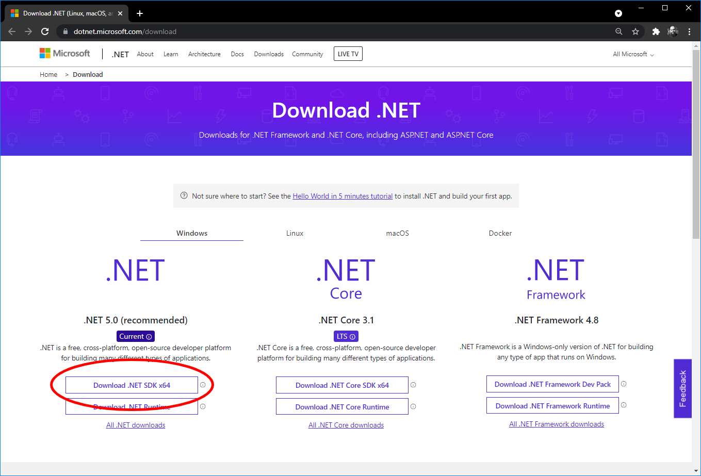
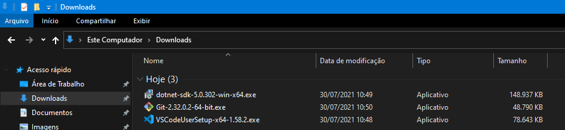
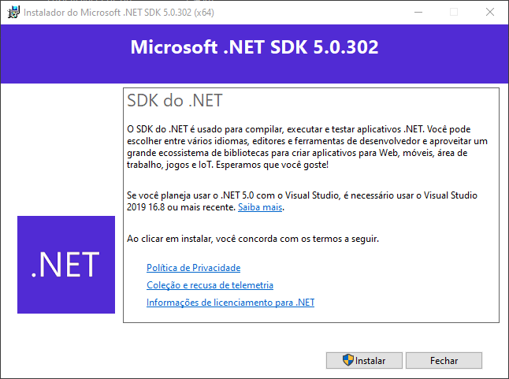
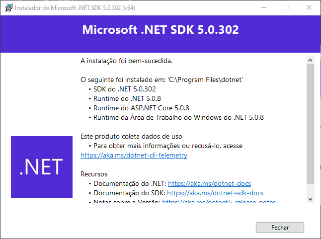
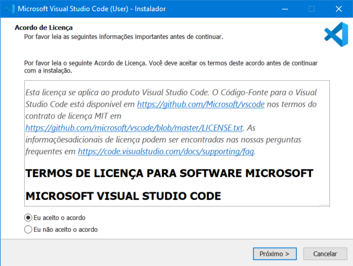
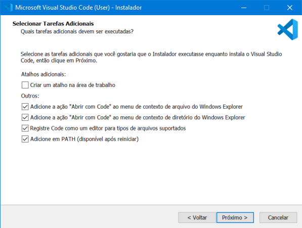
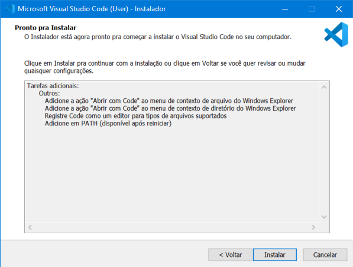
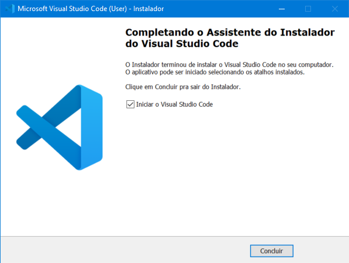

# Passo-a-passo para a criação do ambiente

[📽 Veja esta vídeo-aula no Youtube](https://youtu.be/QIK8Tt5m1v0)

## Baixe o .NET SDK

Escolha a opção recomendada.

[https://dotnet.microsoft.com/download](https://dotnet.microsoft.com/download)

😱 Está com dificuldade para baixar a versão Windows de 32 bits (x86)? Veja [este tutorial](DotNetCore_x86_install.pdf) do professor [Diego Neri](https://github.com/diegoneri).

## Baixe o Visual Studio Code

[https://code.visualstudio.com/download](https://code.visualstudio.com/download)

## Baixe o git

Baixe a versão mais atual.

[https://git-scm.com/downloads](https://git-scm.com/downloads)

## Instalações

Você terá os seguintes arquivos:

_As versões dos arquivos podem ser diferentes, mas verifique se são iguais ou superiores._

## Instale .NET SDK

## Instale o Visual Studio Code

## Instale o git

