# Passo-a-passo para a criação do ambiente

## Baixe o .NET Core SDK

https://dotnet.microsoft.com/download

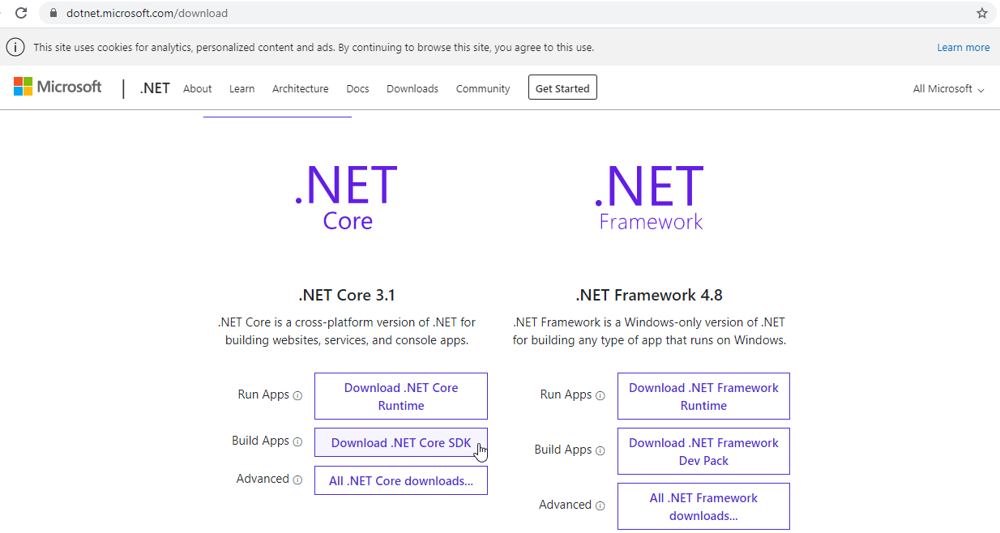

## Baixe o Visual Studio Code

https://code.visualstudio.com/download

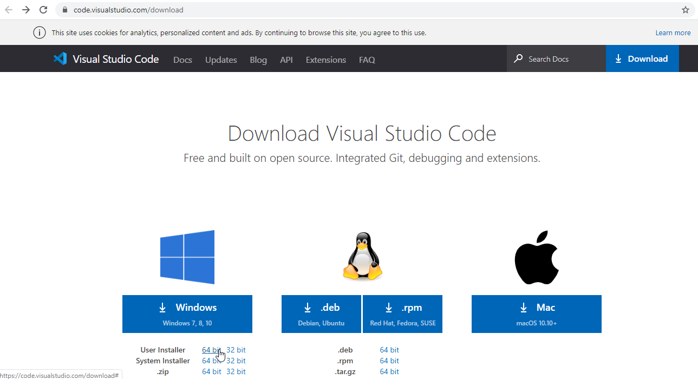

## Baixe o git

https://git-scm.com/downloads

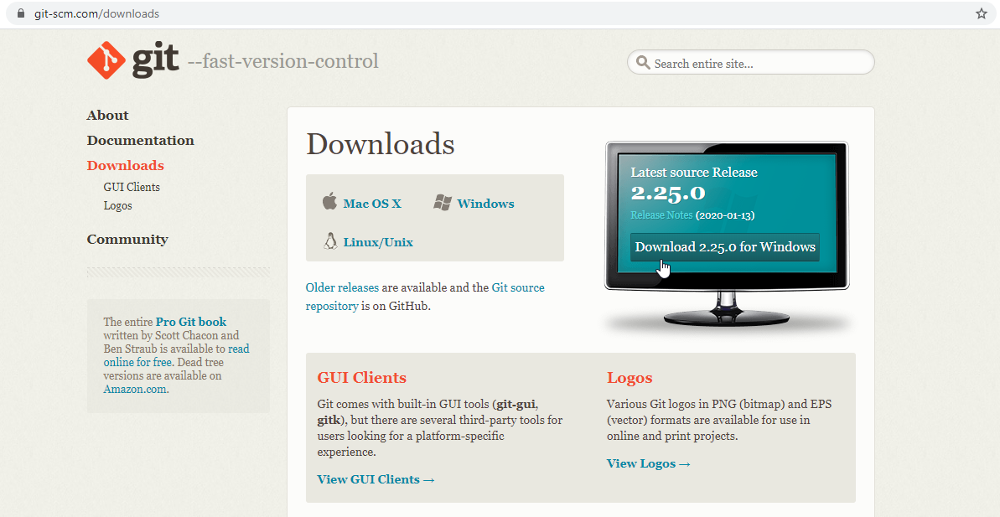

## Instalações

Você terá os seguintes arquivos:

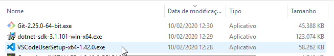

## Instale .NET Core SDK

_Nenhuma configuração a fazer._

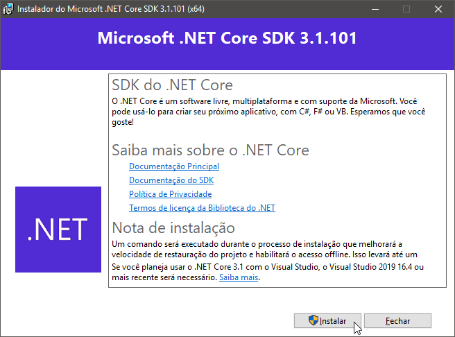
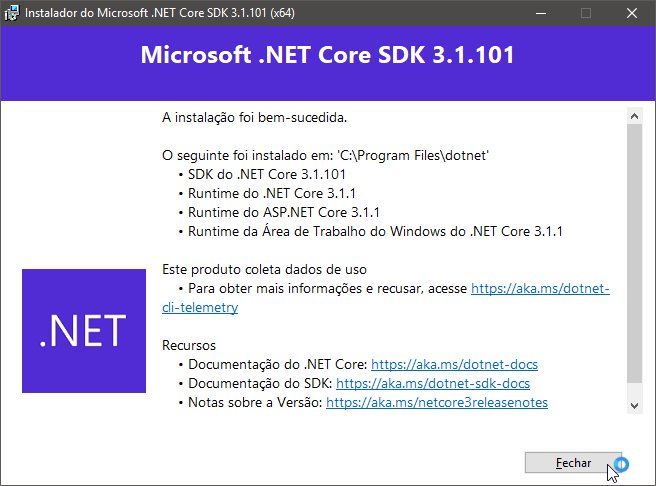

## Instale o Visual Studio Code

_A única configuração a fazer é selecionar as opções indicadas na 5ª imagem._

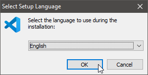
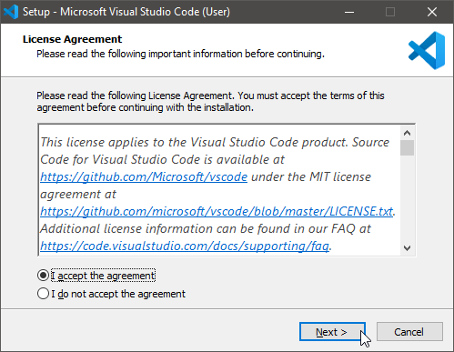
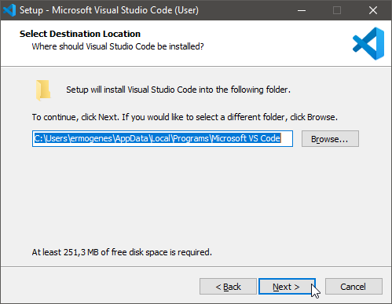
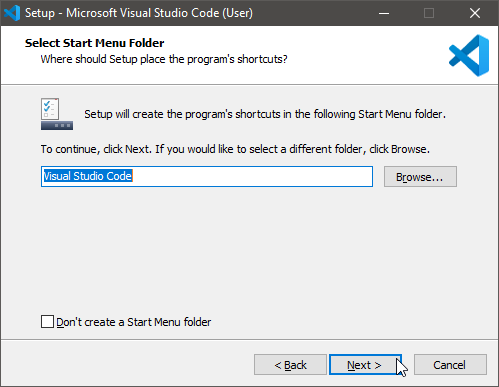

Marque as duas opções `Add "Open with Code"...`.

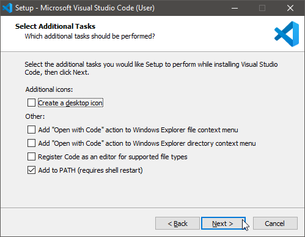
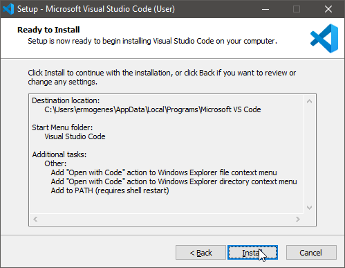
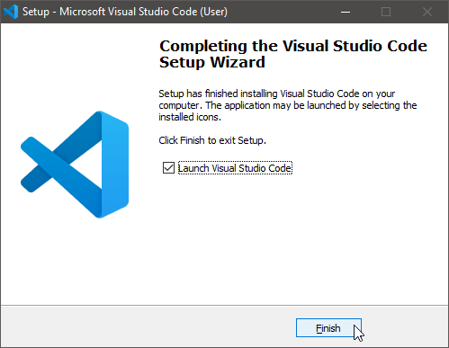

## Instale o git

_Nenhuma configuração a fazer._

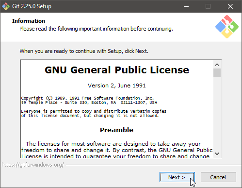

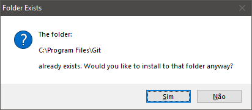
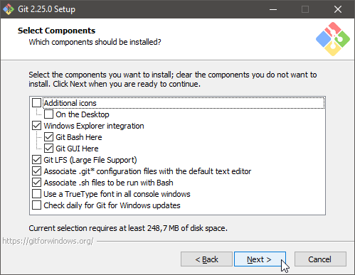
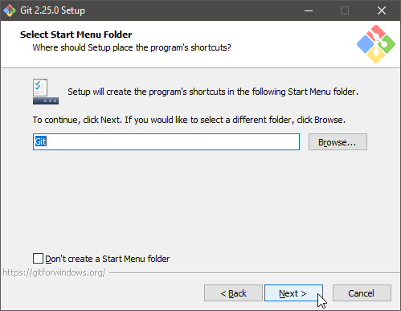
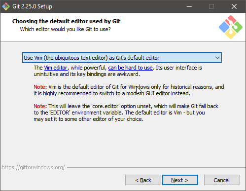
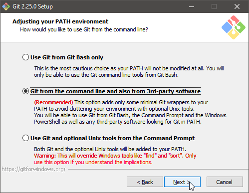
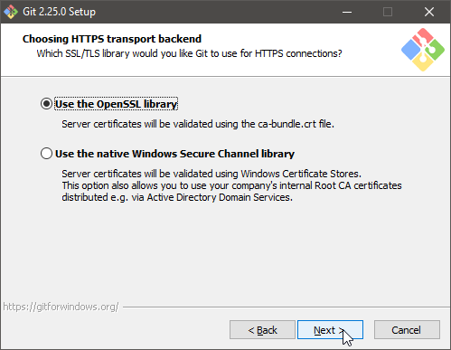
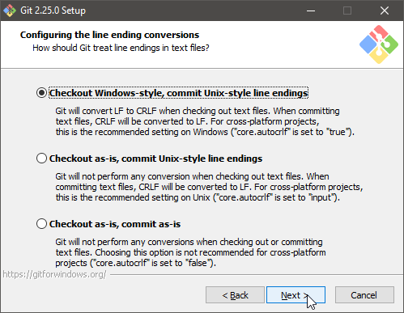
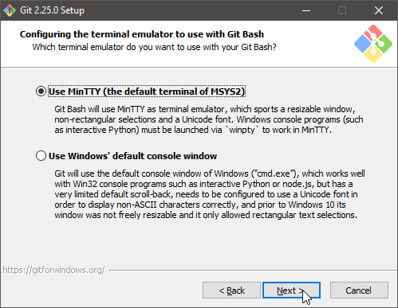
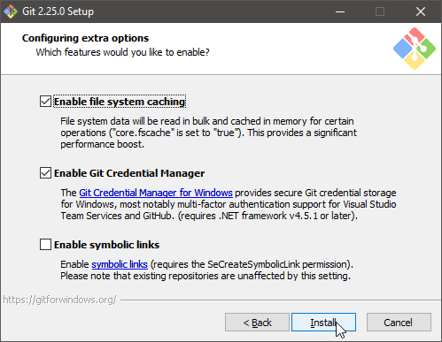
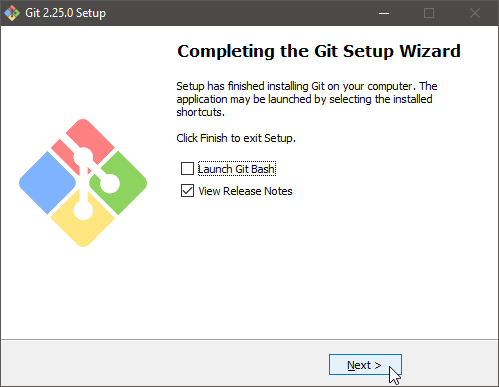

## Como desinstalar as versões antigas do .NET Core

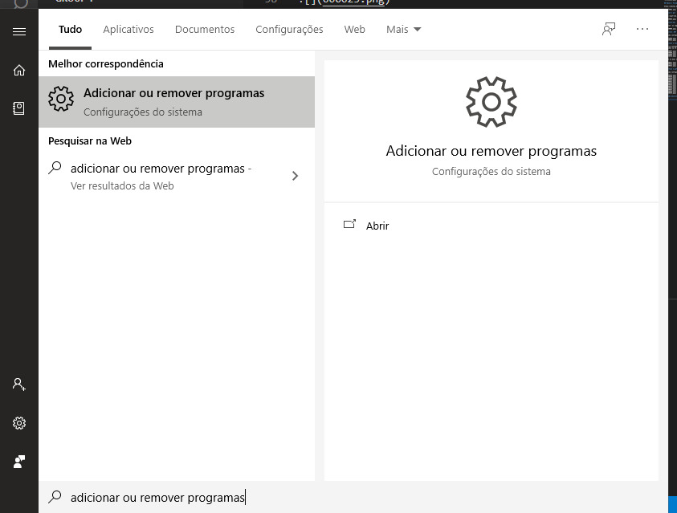
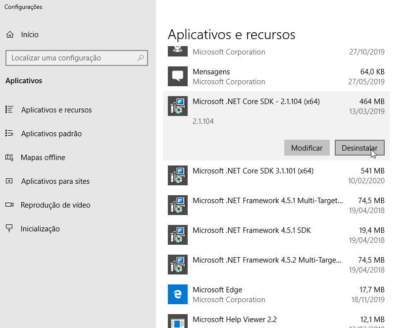
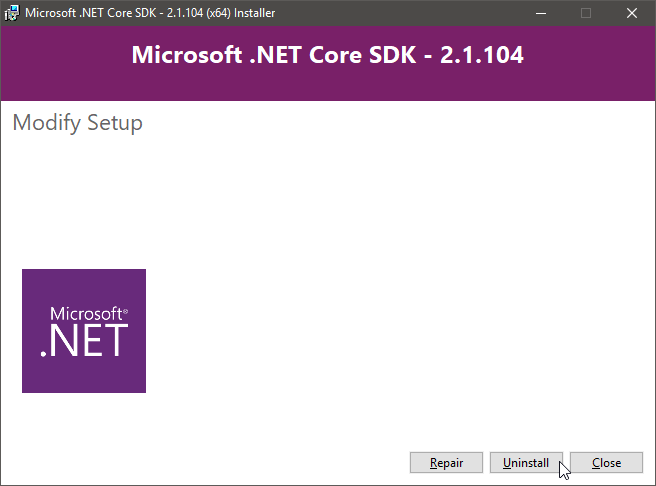

Deve permanecer somente a versão mais atual do .NET Core. As versões do .NET Framework podem continuar como estão. 