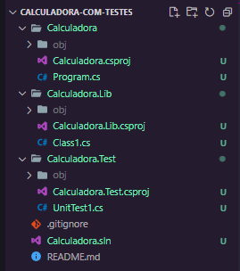
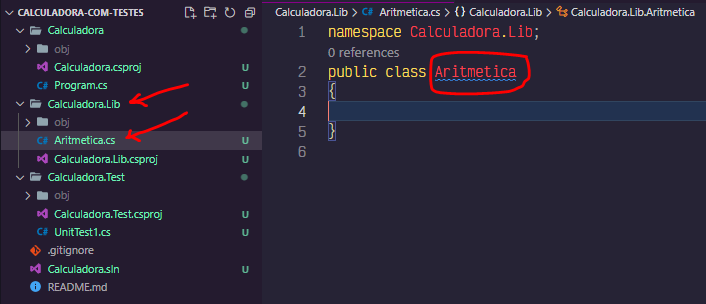
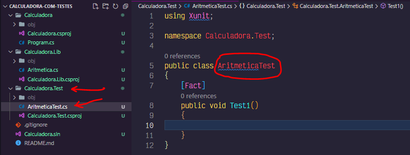
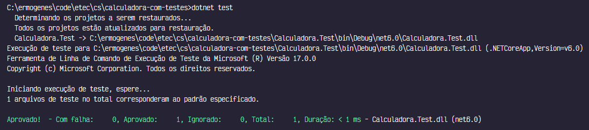
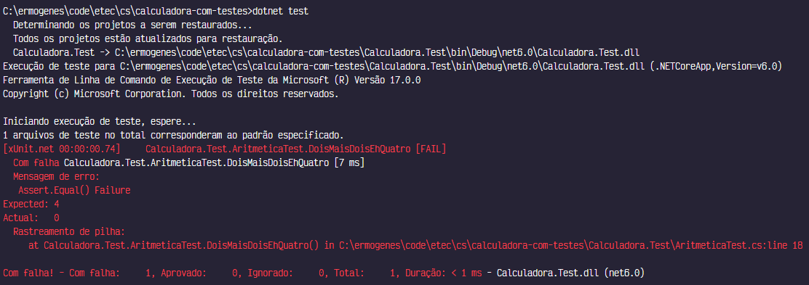
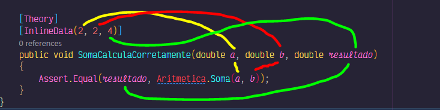

# Bibliotecas e Testes Automatizados

Vamos aprender a estruturar nossos projetos usando sub-rotinas de forma a permitir a automatização dos testes. 

## Descrição do problema

Imagine que vamos criar uma calculadora com as 4 operações aritméticas básicas. Queremos automatizar os testes do cálculo das operações, mas deixaremos os testes de interface para serem executados interativamente.

Há três grandes frameworks para testes no C#: MSTests, NUnit e XUnit. Usaremos o terceiro.

Vamos criar um projeto `console` para a aplicação, isolar os cálculos da interface usando um projeto `classlib`, criar um teste em um projeto `xunit` e juntar todos em uma solução.

## Trabalhando com soluções e projetos

Queremos ficar com a seguinte estrutura de pastas:

```
/Calculadora       // Projeto de interface do tipo console
/Calculadora.Lib   // Projeto de biblioteca do tipo classlib
/Calculadora.Test  // Projeto de teste do tipo xunit
Calculadora.sln    // Solução que une os projetos
.gitignore
README.md
```

Primeiro criamos a solução:

```
dotnet new sln
```

Depois, criamos os três projetos:

```
dotnet new console -o Calculadora
dotnet new classlib -o Calculadora.Lib
dotnet new xunit -o Calculadora.Test
```

E depois adicionamos os projetos na solução:

```
dotnet sln add ./Calculadora/Calculadora.csproj
dotnet sln add ./Calculadora.Lib/Calculadora.Lib.csproj
dotnet sln add ./Calculadora.Test/Calculadora.Test.csproj
```

No VsCode, aparecerá algo assim:



## Criando a biblioteca

Trabalharemos com os arquivos na pasta `Calculadora.Lib`.

Renomeie o arquivo `Class1.cs` para `Aritmetica.cs`. Renomeie a classe também. Deve ficar assim:



Vamos criar funções estáticas para cada uma das quatro operações aritméticas.

Ficaremos com algo assim:

```cs
namespace Calculadora.Lib;
public class Aritmetica
{
    public static double Soma(double parcela1, double parcela2)
    {
        double total = parcela1 + parcela2;
        return total;
    }

    public static double Subtracao(double minuendo, double subtraendo)
    {
        double diferenca = minuendo - subtraendo;
        return diferenca;
    }

    public static double Multiplicacao(double fator1, double fator2)
    {
        double produto = fator1 * fator2;
        return produto;
    }

    public static double Divisao(double dividendo, double divisor)
    {
        if (divisor == 0)
        {
            throw new System.DivideByZeroException("O divisor não pode ser zero.");
        }
        
        double quociente = dividendo / divisor;
        return quociente;
    }
}
```

Não temos como ver esse código sendo executado sem criar uma interface interativa ou um teste unitário.

Vamos começar pelo teste.

## Criando os testes unitários

Trabalharemos com os arquivos na pasta `Calculadora.Test`.

Renomeie o arquivo `UnitTest1.cs` para `AritmeticaTest.cs`. Renomeie a classe também. Deve ficar assim:



O padrão mais utilizado para testes é o AAA: Arrange (preparar), Act (agir), Assert (assegurar).

Em XUnit cada teste é uma sub-rotina com a anotação `[Fact]`, contendo um ou mais _asserts_. Por exemplo:

```cs
[Fact]
public void DoisMaisDoisEhQuatro()
{
    // Arrange
    int a = 2;
    int b = 2;

    // Act
    int soma = a + b;

    // Assert
    Assert.Equal(4, soma);
}
```

Este teste diz o seguinte:
- é fato que dois mais dois é quatro;
- como preparação eu crio duas variáveis `a` e `b`, ambas valendo 2;
- realizo a ação de soma entre elas;
- me asseguro que o resultado foi igual a 4.

Para executar esse teste, usamos:

```
dotnet test
```

Temos o seguinte resultado:



Perceba que do total de 1 teste, 1 foi aprovado.

Vamos fazer o teste falhar, trocando `int soma = a + b;` por `int soma = a - b;`.

Veremos então:



Veja que o teste `DoisMaisDoisEhQuatro` falhou no Assert.Equal, onde era esperado `4` foi encontrado `0`. No caso, o nosso _act_ está calculando errado, e podemos corrigí-lo.

Desta forma, porém, não estamos testando nossa função de soma. Vamos ajustar para utilizá-la.

Primeiro, vamos fazer nosso projeto de teste ter acesso ao projeto da biblioteca.

```
dotnet add Calculadora.Test/Calculadora.Test.csproj reference Calculadora.Lib/Calculadora.Lib.csproj
```

Vamos adicioná-la aos _usings_ no teste:

```cs
using Calculadora.Lib;
```

E vamos substituir `int soma = a + b;` por `double soma = Aritmetica.Soma(a, b);`:

```cs
using Xunit;
using Calculadora.Lib;

namespace Calculadora.Test;

public class AritmeticaTest
{
    [Fact]
    public void DoisMaisDoisEhQuatro()
    {
        double a = 2;
        double b = 2;

        double soma = Aritmetica.Soma(a, b);

        Assert.Equal(4, soma);
    }
}
```

Agora nosso teste avalia corretamente nossa função.

Não queremos testar somente 2+2, mas adicionar diversos outros casos. Para isso, vamos criar uma teoria. Ao usar as anotações `Theory` e `InlineData` podemos mapear as entradas com as saídas esperadas.



Vamos criar vários casos de teste, usando valores diferenciados (zero, positivos, negativos, inteiros e decimais)
.

```cs
using Xunit;
using Calculadora.Lib;

namespace Calculadora.Test;

public class AritmeticaTest
{
    [Theory]
    [InlineData(2, 2, 4)]
    [InlineData(0, 2, 2)]
    [InlineData(2, 0, 2)]
    [InlineData(0, 0, 0)]
    [InlineData(-2, -2, -4)]
    [InlineData(-2, 1, -1)]
    [InlineData(1, -2, -1)]
    [InlineData(2.5, 1, 3.5)]
    [InlineData(-2.5, 2, -0.5)]
    public void SomaCalculaCorretamente(double a, double b, double resultado)
    {
        Assert.Equal(resultado, Aritmetica.Soma(a, b));
    }
}
```

Ao testar, teremos:

```
Aprovado!  - Com falha:     0, Aprovado:     9, Ignorado:     0, Total:     9, Duração: 4 ms - Calculadora.Test.dll (net6.0)
```

Faça o mesmo para a subtração, a multiplicação e a divisão.

Para a divisão, devemos adicionar um teste para a divisão por zero.

```cs
[Theory]
[InlineData(2)]
[InlineData(-2)]
[InlineData(2.5)]
[InlineData(-2.5)]
[InlineData(0)]
public void DivisaoPorZeroGeraExcecao(double dividendo)
{
    Assert.Throws<System.DivideByZeroException>(() => Aritmetica.Divisao(dividendo, 0));
}
```

Este teste diz:
- minha teoria é que para os números indicados...
- ao executar a ação de divisão por 0 `() => Aritmetica.Divisao(dividendo, 0)`...
- será disparada uma exceção de divisão por zero `Assert.Throws<System.DivideByZeroException>(...)`.

Assim, temos no código final um total de 42 testes:

```cs
using Xunit;
using Calculadora.Lib;

namespace Calculadora.Test;

public class AritmeticaTest
{
    [Theory]
    [InlineData(2, 2, 4)]
    [InlineData(0, 2, 2)]
    [InlineData(2, 0, 2)]
    [InlineData(0, 0, 0)]
    [InlineData(-2, -2, -4)]
    [InlineData(-2, 1, -1)]
    [InlineData(1, -2, -1)]
    [InlineData(2.5, 1, 3.5)]
    [InlineData(-2.5, 2, -0.5)]
    public void SomaCalculaCorretamente(double a, double b, double resultado)
    {
        Assert.Equal(resultado, Aritmetica.Soma(a, b));
    }

    [Theory]
    [InlineData(2, 2, 0)]
    [InlineData(0, 2, -2)]
    [InlineData(2, 0, 2)]
    [InlineData(0, 0, 0)]
    [InlineData(-2, -2, 0)]
    [InlineData(-2, 1, -3)]
    [InlineData(1, -2, 3)]
    [InlineData(2.5, 1, 1.5)]
    [InlineData(-2.5, 2, -4.5)]
    public void SubtracaoCalculaCorretamente(double a, double b, double resultado)
    {
        Assert.Equal(resultado, Aritmetica.Subtracao(a, b));
    }

    [Theory]
    [InlineData(2, 2, 4)]
    [InlineData(0, 2, 0)]
    [InlineData(2, 0, 0)]
    [InlineData(0, 0, 0)]
    [InlineData(-2, -2, 4)]
    [InlineData(-2, 1, -2)]
    [InlineData(1, -2, -2)]
    [InlineData(2.5, 1, 2.5)]
    [InlineData(-2.5, 2, -5)]
    public void MultiplicacaoCalculaCorretamente(double a, double b, double resultado)
    {
        Assert.Equal(resultado, Aritmetica.Multiplicacao(a, b));
    }

    [Theory]
    [InlineData(2, 2, 1)]
    [InlineData(3, 2, 1.5)]
    [InlineData(0, 2, 0)]
    [InlineData(0, -2, 0)]
    [InlineData(0, 2.5, 0)]
    [InlineData(-2, -2, 1)]
    [InlineData(-2, 1, -2)]
    [InlineData(1, -2, -0.5)]
    [InlineData(2.5, 1, 2.5)]
    [InlineData(-2.5, 2, -1.25)]
    public void DivisaoCalculaCorretamente(double a, double b, double resultado)
    {
        Assert.Equal(resultado, Aritmetica.Divisao(a, b));
    }

    [Theory]
    [InlineData(2)]
    [InlineData(-2)]
    [InlineData(2.5)]
    [InlineData(-2.5)]
    [InlineData(0)]
    public void DivisaoPorZeroGeraExcecao(double dividendo)
    {
        Assert.Throws<System.DivideByZeroException>(() => Aritmetica.Divisao(dividendo, 0));
    }
}
```

Todos passando corretamente:

```
Aprovado!  - Com falha:     0, Aprovado:    42, Ignorado:     0, Total:    42, Duração: 37 ms - Calculadora.Test.dll (net6.0)
```

## Criando a aplicação

Agora que temos confiança que a nossa biblioteca está funcional, podemos utilizá-la em nosso projeto `console`.

Primeiro, vamos fazer nosso projeto de interface ter acesso ao projeto da biblioteca.

```
dotnet add Calculadora/Calculadora.csproj reference Calculadora.Lib/Calculadora.Lib.csproj
```

Vamos escrever um código bem simples:

```cs
using Calculadora.Lib;

Console.WriteLine($"3 + 2 = {Aritmetica.Soma(3, 2)}");
Console.WriteLine($"3 - 2 = {Aritmetica.Subtracao(3, 2)}");
Console.WriteLine($"3 * 2 = {Aritmetica.Multiplicacao(3, 2)}");
Console.WriteLine($"3 / 2 = {Aritmetica.Divisao(3, 2)}");
```

E executá-lo:

```
dotnet run --project Calculadora/Calculadora.csproj
```

E teremos:

```
C:\ermogenes\code\etec\cs\calculadora-com-testes>dotnet run --project Calculadora/Calculadora.csproj
3 + 2 = 5
3 - 2 = 1
3 * 2 = 6
3 / 2 = 1,5

C:\ermogenes\code\etec\cs\calculadora-com-testes>
```

## Repositório com o exemplo completo

Todo o código deste exemplo está disponível [neste repositório](https://github.com/ermogenes/calculadora-com-testes).
