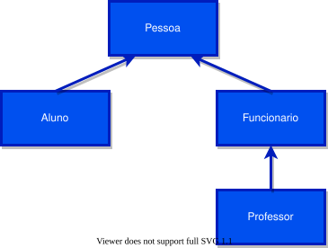

# Classes

[📽 Veja esta vídeo-aula no Youtube](https://youtu.be/r6EllahDrEQ)

Classes são estruturas de dados que agregam estado (dados) e comportamento (funcionalidades). Criando classes podemos criar programas que imitam a lógica de coisas do mundo real, permitindo que se transporte o conhecimento adquirido do problema de negócio diretamente para o código na linguagem de programação.

## Objetos

Uma _classe_ é um molde, uma planta, um esquema de abstração de uma ideia, implementada em linguagem de programação. Cada ocorrência, chamada _instância_, possui existência real na memória, no formato definido pela classe, e representa um _objeto_ real no nosso problema.

Por exemplo, a classe `Cachorro` define (usando C#) como um cachorro deve ser e se comportar (em nosso programa). Os objetos `c1` (personagem _Pluto_), `c2` (_Snoopy_) e `c3` (_Scooby-Doo_) seguem as regras da classe `Cachorro` e representam cada um, um cachorro específico.

## Estado

Em uma classe, o estado é mantido através de **atributos**, que são dados associados a uma instância. Cada objeto possui sua própria cópia dos dados.

No exemplo anterior, todo `Cachorro` possui um nome, uma raça e uma cor: Pluto é um _bloodhound_ amarelo, Snoopy é um _beagle_ branco e Scooby-Doo é um _dogue alemão_ marrom.


<!-- 

 -->

## Comportamento

Indica quais ações uma classe pode realizar ou quais mensagens um objeto daquela classe pode receber.

No exemplo anterior, todo `Cachorro` pode latir ou rosnar.

## Abstração

Conseguimos, então, escrever em C# um código que representa essas ideias.

Começamos definido a classe `Cachorro`:

```cs
public class Cachorro
{
    public string nome;
    public string raca;
    public string cor;

    public void Latir()
    {
        Console.WriteLine($"[{this.nome}] BARF! Barf! BARF!!!");
    }

    public void Rosnar()
    {
        Console.WriteLine($"[{this.nome}] GrrRRRRRrrrr!");
    }
}
```

Essa classe possui 5 membros:

- os atributos `Nome`, `Raca` e `Cor`;
- os métodos `Latir` e `Rosnar`.

Agora podemos criar instâncias de `Cachorro`:

```cs
Cachorro c1;
c1 = new Cachorro();
c1.nome = "Pluto";
c1.raca = "bloodhound";
c1.cor = "amarelo";
```

Podemos criar os demais objetos de outras maneiras igualmente válidas:

```cs
Cachorro c2 = new Cachorro();
c2.nome = "Snoopy";
c2.raca = "beagle";
c2.cor = "branco";
```

```cs
Cachorro c3 = new Cachorro {
    nome = "Scooby-Doo",
    raca = "dogue alemão",
    cor = "marrom"
};
```

Agora, por exemplo, se quisermos que o Pluto rosne e depois os demais latam:

```cs
c1.Rosnar();
c2.Latir();
c3.Latir();
```

Saída:

```
[Pluto] GrrRRRRRrrrr!
[Snoopy] BARF! Barf! BARF!!!
[Scooby-Doo] BARF! Barf! BARF!!!
```

## Acessando membros da instância com `this`

Usamos a palavra chave `this` para referenciar o objeto atual. Perceba como os métodos `Latir` e `Rosnar` conseguem obter corretamente o `nome` de cada instância usando `this`.

## Modificadores de acesso

- `public` indica que o membro está exposto, e acessível fora da classe;
- `private` indica que o membro está encapsulado, e acessível somente de dentro da classe;
- `protected`indica que o membro é acessível soemnte dentro de sua classe ou de classes derivadas.

Há outros modificadores, para saber mais consulte a [documentação](https://docs.microsoft.com/pt-br/dotnet/csharp/language-reference/keywords/access-modifiers).

## Construtores

Executado quando se instancia um objeto através da palavra `new`.

Podemos adicionar código a ser executado na criação de cada objeto utilizando um construtor. Ao definir, é só utilizar o mesmo nome da classe:

```cs
    public Cachorro()
    {
        // código a ser executado ao criar uma instância
    }
```

Podemos definir parâmetros obrigatórios ao se criar um objeto. No exemplo abaixo, só vamos permitir criar um novo `Cachorro` se a raça for informada:

```cs
    public Cachorro(string raca)
    {
        this.raca = raca;
    }
```

Perceba que já utilizamos o valor recebido para gravá-lo no atributo `raca`. Para instanciar:

```cs
Cachorro c4 = new Cachorro("vira-latas");
c4.nome = "Muttley";
c4.cor = "amarelo";
```

```cs
Cachorro c5 = new Cachorro("schnauzer") {
    nome = "Bidu",
    cor = "azul"
};
```

Ao se definir um construtor, impedimos o acesso à instanciação normal. No exemplo acima, não poderíamos mais chamar `new` sem indicar a raça. Podemos criar vários construtores para resolver esse problema, desde que cada um tenha uma assinatura diferente.

## Propriedades

Permitem que se encapsule um atributo mantendo-o privado, e ainda assim o exponha somente para leitura ou somente para gravação, ou ambos. Ainda podemos adicionar lógica a ser executada quando da leitura e/ou da gravação.

## Estático e não estático

Utilizando a palavra `static`, fazemos com que um membro seja acessível diretamente pela classe, sem necessitar de um objeto.

Exemplos, na classe `Cachorro`:

```cs
// ...
    private static string _nomePopular = "Cão doméstico";
    private static string _nomeCientifico = "Canis lupus familiaris";
// ...
    static string Especie()
    {
        return $"{_nomePopular} ({_nomeCientifico})";
    }
```

Não precisamos de um objeto `Cachorro` para obter a identificação da espécie, pois os membros estão ligado à classe, e não às suas instâncias.

---

Programa da [vídeo-aula](https://youtu.be/r6EllahDrEQ):

Arquivo `Cliente.cs`:

```cs
namespace MeuBanco
{
    class Cliente
    {
        public string Nome { get; set; }
        public string Sobrenome { get; set; }

        public Cliente(string nome, string sobrenome)
        {
            this.Nome = nome;
            this.Sobrenome = sobrenome;
        }
        public string NomeCompleto()
        {
            return $"{this.Nome} {this.Sobrenome}";
        }
    }
}
```

Arquivo `Conta.cs`:

```cs
using System;

namespace MeuBanco
{
    class Conta
    {
        private decimal _saldo;
        public Cliente Titular { get; private set; }
        public decimal Saldo
        {
            get
            {
                return this._saldo;
            }
            private set
            {
                if (value < 0)
                {
                    throw new ArgumentException("Saldo inválido.");
                }
                this._saldo = value;
            }
        }

        public Conta(Cliente titular, decimal saldo)
        {
            this.Titular = titular;
            this.Saldo = saldo;
        }

        public void Depositar(decimal valorADepositar)
        {
            if (valorADepositar <= 0)
            {
                throw new ArgumentException("Depósitos devem ser positivos.");
            }
            this.Saldo += valorADepositar;
        }

        public bool Sacar(decimal valorASacar)
        {
            if (valorASacar <= 0)
            {
                throw new ArgumentException("Saques devem ser positivos.");
            }

            bool possuiSaldo = (this.Saldo >= valorASacar);
            if (possuiSaldo)
            {
                this.Saldo -= valorASacar;
            }
            return possuiSaldo;
        }
    }
}
```

Arquivo `Program.cs`:

```cs
using System;
using MeuBanco;

namespace AulaClasses
{
    class Program
    {
        static void Main(string[] args)
        {
            Cliente t1 = new Cliente("Ermogenes", "Palacio");

            Conta c1;
            c1 = new Conta(t1, 100);

            c1.Depositar(10);
            c1.Depositar(500);

            Conta c2 = new Conta(new Cliente("Diego", "Neri"), 200);

            c2.Depositar(95);

            if (!c1.Sacar(20))
            {
                Console.WriteLine("20: Saldo insuficiente.");
            }

            Console.WriteLine($"{c1.Titular.NomeCompleto()} tem {c1.Saldo:C2} e {c2.Titular.NomeCompleto()} tem {c2.Saldo:c2}.");
        }
    }
}
```

**Saída**:

```
Ermogenes Palacio tem R$590,00 e Diego Neri tem R$295,00.
```

---

## Herança

Você pode criar hierarquias de classes, onde uma classe derivada _herda_ todos os membros de uma outra classe. De fato, toda classe em C# herda da classe `System.Object`, tendo assim membros comuns como `Equals`, `ToString` e `GetType`.

Usamos essa funcionalidade para reutilização de código.

Por exemplo, em uma escola pessoas são tradadas com diversos papéis distintos, como alunos, funcionários ou professores. Gostaríamos de programar os comportamentos compartilhados uma vez só, e só detalhar as diferenças em cada um deles.

Poderíamos modelar as classes assim:

- `Pessoa` representa um pessoa física, qualquer que seja seu papel.
  - `Funcionario` representa uma `Pessoa` que trabalha na escola.
    - `Professor` representa uma `Funcionario` cuja função é lecionar.
  - `Aluno` representa uma `Pessoa` que se matriculou em uma turma.



Assim teríamos algo como:

```cs
// Criando instâncias de alunos através do construtor
Aluno alunoCalouro = new Aluno("Eduardo", matricula: 9857, turma: "1I3");
Aluno alunoVeterano = new Aluno("Mônica", matricula: 9858, turma: "3I3");

// Instanciando um funcionário
Funcionario atendenteSecretaria = new Funcionario("Carlos", salario: 1200);

// Instanciando dois professores
Professor professorTI = new Professor("Camila", salario: 2000, "TI");
Professor professorAdm = new Professor("Cláudio", salario: 2000, "Administração");

// O funcionário do mês é um professor
Funcionario funcionarioDoMes = professorAdm;

// Ambos brigadistas são funcionários, mesmo um deles sendo professor
Funcionario brigadista1 = atendenteSecretaria;
Funcionario brigadista2 = professorTI;

// Todos são pessoas, inclusive os pais doas alunos (não modelados)
Pessoa paiDoVeterano = new Pessoa("Sebastião");

// Um time de futsal misto no interclasses
// pode ser formado por alunos, funcionários, professores e pais
Pessoa timeGoleiro = alunoCalouro;
Pessoa timeFixo = alunoVeterano;
Pessoa timeAlaDireito = atendenteSecretaria;
Pessoa timeAlaEsquerdo = professorTI;
Pessoa timePivo = professorAdm;
Pessoa timeTecnico = paiDoVeterano;

// O funcionário do mês foi promovido
// Recebe 5% de aumento. Se fosse outro tipo de funcionário receberia 30%.
funcionarioDoMes.Promover();

// Obter o nome (referente a pessoa) de um funcionário
string nomeDoAtendente = atendenteSecretaria.Nome;
// Obter o salário (referente ao funcionário) de um professor
decimal salarioDoClaudio = professorAdm.Salario;
// Obter a área de um professor
string areaDaCamila = professorTI.Area;

// // As linhas comentadas abaixo gerarão erros

// // Pessoas não possuem salário se não forem funcionários
// decimal salarioDoSebastiao = paiDoVeterano.Salario;
// // Somente funcionários podem ser promovidos
// alunoVeterano.Promover();
// // Somente professores lecionam
// atendenteSecretaria.Lecionar();


public class Pessoa
{
    public string Nome { get; private set; }

    public Pessoa(string nome)
    {
        this.Nome = nome;
    }
}

public class Aluno : Pessoa
{
    public int Matricula { get; private set; }
    public string Turma { get; set; }

    public Aluno(string nome, int matricula, string turma) : base(nome)
    {
        this.Matricula = matricula;
        this.Turma = turma;
    }
}

public class Funcionario : Pessoa
{
    public decimal Salario { get; set; }

    public Funcionario(string nome, decimal salario) : base(nome)
    {
        this.Salario = salario;
    }

    public virtual void Promover()
    {
        this.Salario *= 1.3m;
    }
}

public class Professor : Funcionario
{
    public string Area { get; private set; }

    public Professor(string nome, decimal salario, string area) : base(nome, salario)
    {
        this.Area = area;
    }

    public override void Promover()
    {
        this.Salario *= 1.05m;
    }

    public void Lecionar()
    {
        Console.WriteLine($"{this.Nome} escreve coisas bacanas sobre {this.Area} na lousa.");
    }
}
```
