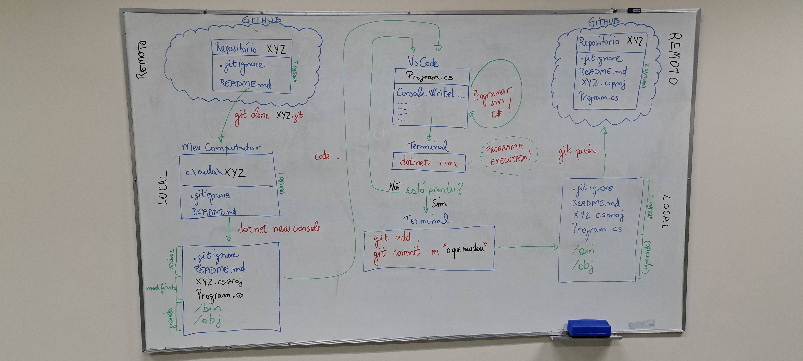

# Cola (Cheatsheet) do processo para criação de repo com programa C#

Se necessário, [configure o git](#configurar-o-git) antes de começar.

## Criar o repositório remoto

- Acessar https://github.com/ e fazer o login (_Sign In_).
- Criar um repositório usando a opção _new repository_.
- Colocar o nome (obrigatório) e a descrição (opcional).
- Deixar público.
- Não selecionar Template (opção _No Template_)
- Adicionar o README.
- Adicionar o `.gitignore` do tipo _VisualStudio_.
- Não adicionar uma licença.

_Obs.: Mantenha a janela do github aberta para facilitar o processo de envio das alterações locais para o github (último passo desta cola)._

## Inicie seu ambiente de desenvolvimento

- Abra o VsCode.
- Abra o terminal integrado usando _Terminal_ > _New Terminal_ (ou <kbd>Ctrl</kbd>+<kbd>'</kbd>).

## Clonar o repositório no computador local

- No navegador, acesse seu repositório.
- Copie o URL de clonagem na opção _Code_ > _Clone (HTTPS)_.

- No VsCode: 
- Vá em _File_ > _Open Folder_ (_Arquivo_ > _Abrir Pasta_).
- Acesse a pasta onde você guardará seus arquivos (ex. pasta _Documentos_). Acesse a sua pasta de trabalho (ex. `Aula PC1`). Se não existir, crie-a antes de acessar.
- Abra o terminal integrado usando _Terminal_ > _New Terminal_ (ou <kbd>Ctrl</kbd>+<kbd>'</kbd>).
- Faça a clonagem do repositório usando a URL copiada:
```
git clone URL-COPIADA
```
- Caso apareça a janela do _proxy_ chamada `Git Credential Manager` solicitando senha para o usuário `etecadolphoberezin`, clique em _Continue_ (é um botão azul).
- A mensagem que indica sucesso começa com `Cloning into...` e termina com  `...Receiving objects: 100%, done.`. Caso não seja essa mensagem, recomece.
- Será criada uma pasta com o nome do seu repositório.
- 🚨📢🔔⚠️ Abra a pasta criada, usando _File_ > _Open Folder_ (_Arquivo_ > _Abrir Pasta..._) (ou use `cd NOME-DO-REPOSTITORIO` no terminal).
- Verifique se você está na pasta certa:
```
git status
```
- Se aparecer `not a git repository` você não está na pasta certa, portanto repita o item anterior.

## Escreva seu programa

- No VsCode, com o repositório aberto, abra um terminal usando _Terminal_ > _New Terminal_.
- Crie um projeto C# em branco:
```
dotnet new console
```
- Faça o programa desejado e salve usando <kbd>Ctrl</kbd>+<kbd>S</kbd>.
- Execute e teste:
```
dotnet run
```

## Guardando a versão localmente

Use o comando a seguir a qualquer momento para entender a situação atual.
```
git status
```

- Adicione todas as alterações à versão a ser guardada usando:
```
git add .
```
- Efetive as alterações. Troque `xxx` por uma mensagem explicando o que foi alterado nesta versão.
```
git commit -m "xxx"
```

Você pode repetir esse processo quantas vezes quiser.

## Enviando as alterações para o repositório remoto

- Envie todas as versões locais para a nuvem:
```
git push
```
 
- Clique em _Sign in with your browser_ na janela do GitHub que aparecer (é um botão azul).



----

## Configurar o git

No Terminal:

- Configure o acesso à rede via _proxy_ (**somente se estiver presencialmente na Etec Adolpho Berezin**):
```
git config --global http.proxy http://etecadolphoberezin@17.1.0.1:3128
```
O _login_ pode ser efetuado sem a necessidade de senha (clique no botão azul)


- Altere seu nome e email.
```
git config --global user.name "Meu Nome" 
```
```
git config --global user.email "meu-email@meu-servidor.com"
```


