# Bancos de dados com MySQL

[📽 Veja esta vídeo-aula no Youtube](https://youtu.be/JI1-f04navk)

No objetivo é acessar bancos de dados no C#. Há uma infinidade de maneiras de se fazer isso; nesse curso optaremos pela seguinte combinação:

- Modelo de armazenamento de dados: [Modelo relacional](https://pt.wikipedia.org/wiki/Modelo_relacional)
- Sistema de banco de dados: [MySQL](https://dev.mysql.com/), com a IDE padrão MySQL Workbench
- Técnica de desenvolvimento: [ORM (_Object-Relational Mapping_)](https://pt.wikipedia.org/wiki/Mapeamento_objeto-relacional)
- _Framework_ de ORM para C#: [Microsoft Entity Framework Core](https://docs.microsoft.com/pt-br/ef/core/)
- Provedor de dados do MySQL para o EF Core: [Pomelo](https://github.com/PomeloFoundation/Pomelo.EntityFrameworkCore.MySql) 

Está fora do escopo desse curso ensinar bancos de dados. Há diversos cursos na Internet sobre o assunto. Infelizmente isso é um pré-requisito necessário.

💡 _Se você é um aluno de curso presencial de Etec, você certamente cursou ou está cursando componentes que tratam de bancos de dados relacionais._

## Preparando um banco de dados

Precisamos de uma instância de MySQL em execução com um banco de dados para ser acessado, e credenciais válidas com permissões suficientes.

💡 _Caso você ainda não saiba instalar o MySQL, veja [este passo-a-passo](https://github.com/ermogenes/aulas-programacao-web/blob/master/content/ambiente-mysql.md)._

Nos exemplos abaixo consideraremos uma instalação padrão do MySQL, com as seguintes configurações:

- Servidor local (`localhost`) na porta `3306`;
- Credenciais `root`, senha `root`.

Vamos usar um banco de dados de exemplo constante na documentação do MySQL chamado `employees`. Você pode usar um outro banco de dados qualquer, se preferir.

Baixe o `Employees` no site do MySQL, _Documentation_, [_More_](https://dev.mysql.com/doc/index-other.html). Em _Example Databases_, você verá um link para o [repositório no GitHub](https://github.com/datacharmer/test_db), e um para a [_documentação_](https://dev.mysql.com/doc/employee/en/). Na documentação há várias informações úteis, como por exemplo, o [seu diagrama entidade-relacionamento](https://dev.mysql.com/doc/employee/en/sakila-structure.html).

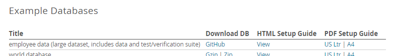

DER:

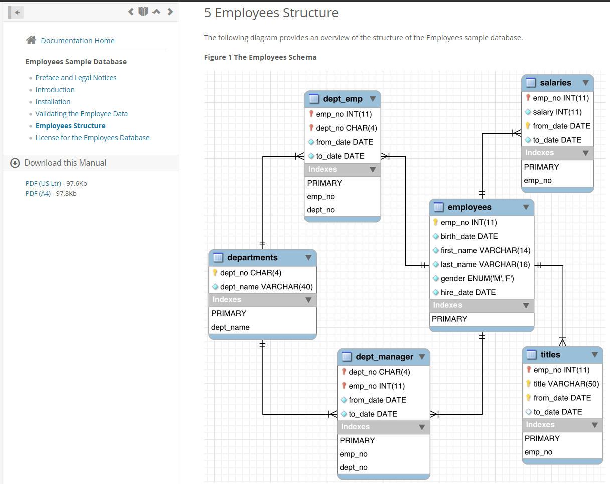

No GitHub, baixe o repositório e extraia o conteúdo para uma pasta temporária (pode clonar, se preferir).

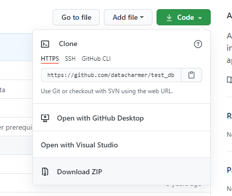

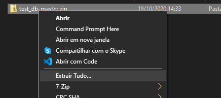

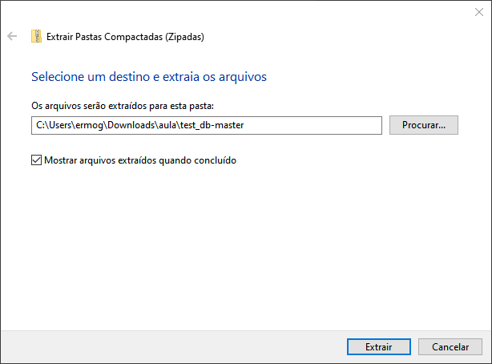

Você deverá possui os seguintes arquivos:

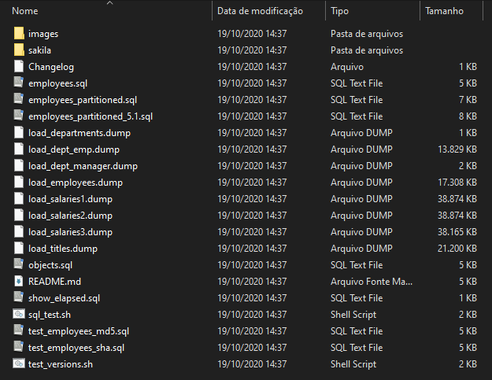

Abra o Workbench, e conecte-se ao seu banco de dados:

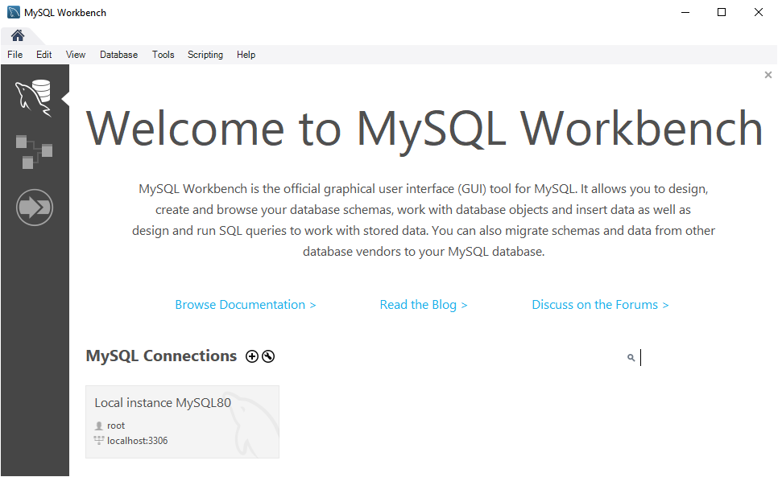

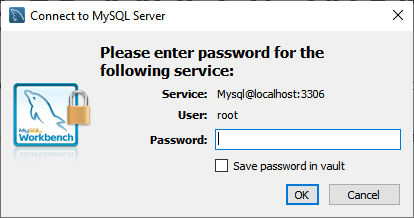

Execute o script `employees.sql` usando a opção _File_, _Run SQL Script..._.

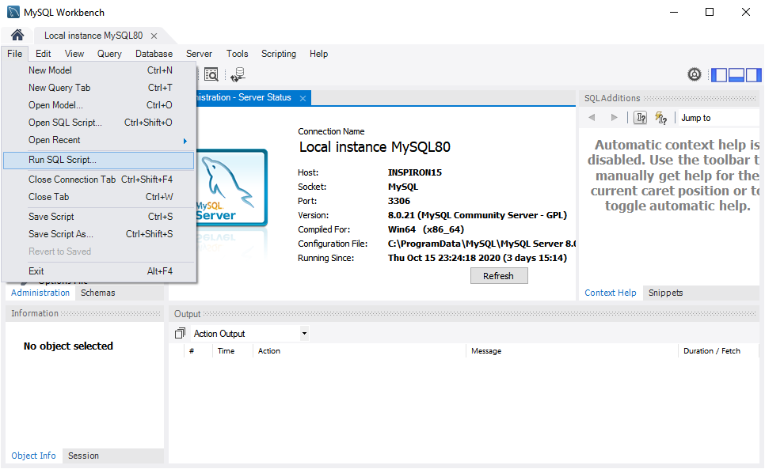


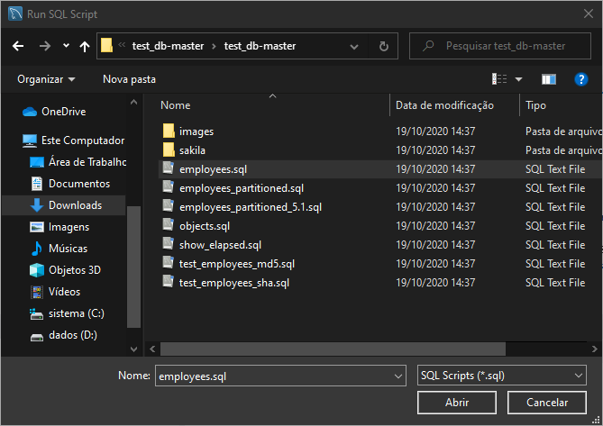

Confirme a execução e aguarde.

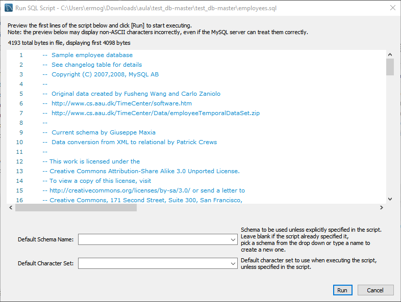

Ao final, na janela _Navigator_, aba _Schemas_, atualize clicando no botão no canto superior direito. Seu banco de dados deve aparecer na lista. Abra a lista de tabelas e verifique se elas estão lá.

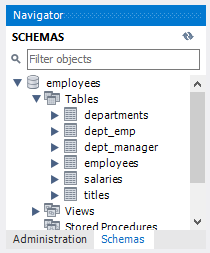

Feito isso, seu servidor possui um banco de dados carregado e _online_. Você pode apagar os arquivos baixados do GitHub, se quiser.

## Conectando um projeto C# `console` com o MySQL

Crie seu projeto console, normalmente.

Agora, vamos adicionar em seu projeto, via NuGet, os pacotes do Entity Framework (EF).

```
dotnet add package Microsoft.EntityFrameworkCore
dotnet add package Microsoft.EntityFrameworkCore.Design
```

Também precisamos do pacote do provedor de dados do MySQL:

```
dotnet add package Pomelo.EntityFrameworkCore.MySql
```

Como vamos usar ORM, precisaremos de classes em nosso programa equivalentes às tabelas no banco de dados. Podemos criá-las automaticamente, com ferramentas. Esse processo de criar código usando ferramentas é chamado _scaffolding_.

Primeiro, vamos instalar a ferramenta _Entity Framework Core .NET Command-line Tools_, que nos traz diversas facilidades para trabalhar com EF. Você so fará isso uma vez em seu computador, não precisando repetir todas as vezes.

```
dotnet tool install --global dotnet-ef
```

Para testar se ela já está instalado, digite `dotnet ef --version`.

Instalada:

```
C:\Users\ermog\Documents\code>dotnet ef --version
Entity Framework Core .NET Command-line Tools
3.1.9
```

Não-instalada:

```
C:\Users\ermog\Documents\code>dotnet ef --version
Não foi possível executar porque o comando ou o arquivo especificado não foi encontrado.
Possíveis motivos para isso incluem:
 * Você digitou incorretamente um comando de dotnet embutido.
 * Você pretendia executar um programa .NET Core, mas dotnet-ef não existe.
 * Você pretendia executar uma ferramenta global, mas não foi possível encontrar um executável com prefixo de dotnet com esse nome no CAMINHO.
```

Já estando instalada anteriormente, assegure-se de que está utilizando a versão mais atualizada:

```
dotnet tool update --global dotnet-ef
```

Agora podemos realizar o _scaffolding_, passando a string de conexão para o seu banco:

```
dotnet ef dbcontext scaffold "server=___;port=___;user=___;password=___;database=___" Pomelo.EntityFrameworkCore.MySql -o ___ -f
```

- Em `server` passe o endereço do servidor (ex.: `localhost`)
- Em `port` passe a porta do servidor (ex.: `3306`)
- Em `user` e `password` passe o seu usuário e senha;
- Em `database` passe o nome do banco  (ex.: `employees`)
- Em `-o` indique a pasta onde as classes serão criadas

_A opção `--no-pluralize` faz o scaffolding sem tentar gerar plurais automaticamente. É especialmente útil quando o banco foi modelado com termos em português._

Exemplo:

```
dotnet ef dbcontext scaffold "server=localhost;port=3306;user=root;password=root;database=employees" Pomelo.EntityFrameworkCore.MySql -o db -f
```

Saída:

```
Build started...
Build succeeded.
```

Seu projeto ficará parecido com isso:

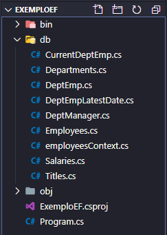

Este texto continua [aqui](crud-efcore.md).
