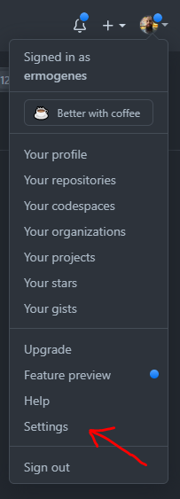
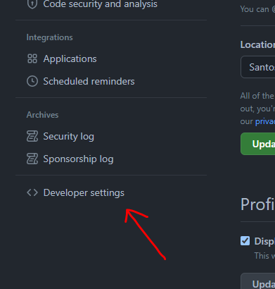
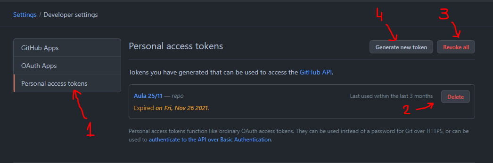
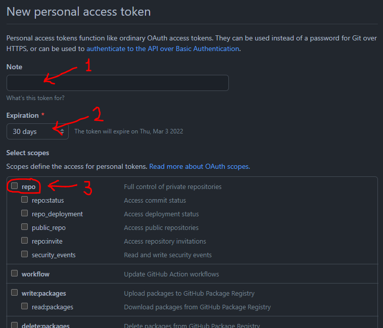
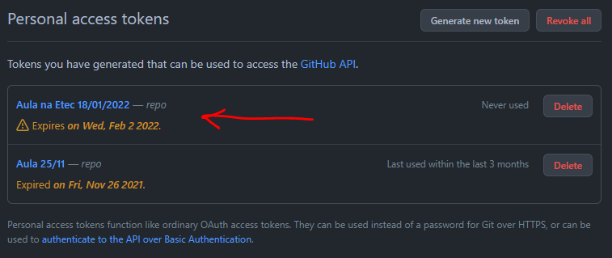
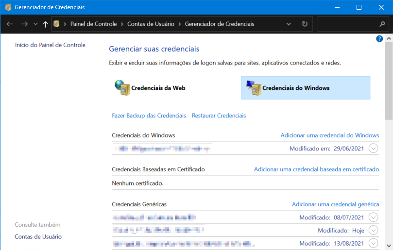
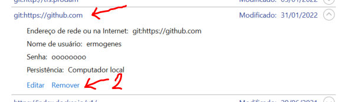
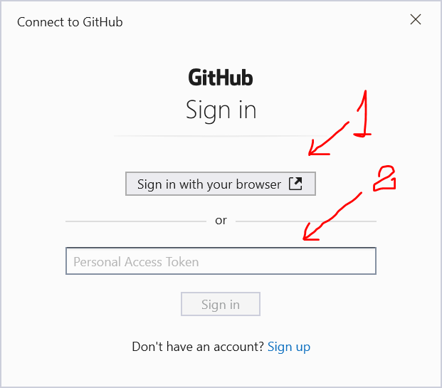
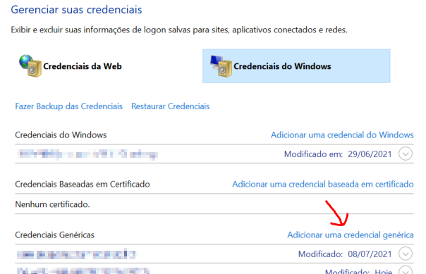
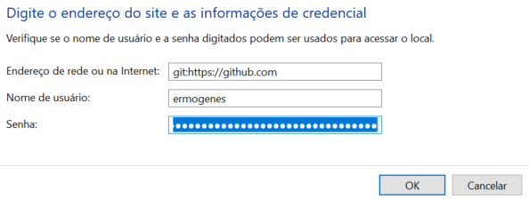

# GitHub em computadores compartilhados

No seu computador, as credenciais ficarão salvas após o primeiro login feito com sucesso, e você não será mais perguntado por usuário e senha.

Porém, quando utilizado em computadores compartilhados (na sua escola, por exemplo), você deve logar a cada uso e excluir as credenciais assim que parar de usar (para ir embora, ou para deixar outro colega efetuar o login).

Por segurança, o GitHub não permite que isso seja feito utilizando sua senha. Ele exige que seja usada uma senha temporária, específica para isso, chamada _Personal Access Token_ (PAT). Você irá criá-la a cada uso, indicando um prazo de expiração o mais curto possível. Ela substituirá a senha sempre que necessário.

## Criando o _Personal Access Token_

Abra o [GitHub](https://github.com/login) em seu navegador e efetue o login normalmente, com seu usuário e senha. No canto superior direito, acesse suas configurações (opção _Settings_). A última opção do menu à esquerda é a opção [_Developer settings_](https://github.com/settings/apps).




Selecione _Personal access tokens_ (1). Você verá essa tela.



Opções disponíveis:

- (2) Exclui um _token_.
- (3) Exclui todos os _tokens_.
- (4) Cria um novo _token_.

Use a opção _Generate new token_ (4) para criar uma senha temporária.



Informe um lembrete (1) para ajudar a identificar o uso do _token_ (por exemplo `Aula na Etec 18/01/2022` ou `Trabalho de PC-I no laptop do Pedrinho`). Indique uma data de expiração (2), a partir da qual o _token_ não mais funcionará, a menor possível (na escola, use `Custom...` e selecione o dia seguinte).

Selecione o escopo da permissão. Quanto menos permissões, melhor. Se não souber o que selecionar, marque a opção `repo` (3) para permitir trabalhar com repositórios.

Salve seu _token_ clicando em _Generate token_. Será listado seu _token_.


Use o botão indicado para copiar seu _token_. _Faça isso agora, pois não será possível nunca mais._ Esse _token_ será usado como se fosse sua senha ao logar no GitHub.

Caso volte posteriormente, somente será possível excluir o _token_ e criar outro.



## Configuração do ambiente

Três coisas devem ser feitas para garantir que você tem um ambiente funcional para trabalho:

1. Seu usuário deve estar configurado no `git`;
2. Não deve haver outra credencial do GitHub ativa no Windows;
3. Sua credencial deve ser criada usando o _token_ criado.

### Configuração do _git_

Os comando abaixo podem ser utilizados para verificar as configurações globais (que valem para todos os repos no dispositivo):

Nome:
```cmd
git config --global user.name
```

E-mail:
```cmd
git config --global user.email
```

Por exemplo:
```cmd
C:\>git config --global user.name
Ermogenes Palacio

C:\>git config --global user.email
exxxxxxxx@xxxxxxxxx.br
```

Garanta que o e-mail configurado seja o mesmo que você usa para logar (ou esteja [cadastrado na sua conta](https://github.com/settings/emails)).

Use os comandos abaixo para efetuar a configuração:

Alterar nome:
```cmd
git config --global user.name "INSIRA SEU NOME AQUI"
```

Alterar e-mail:
```cmd
git config --global user.email "INSIRA SEU E-MAIL AQUI"
```

Exemplo:
```cmd
C:\>git config --global user.name "João das Couves"

C:\>git config --global user.email "joao@couves.com"

C:\>git config --global user.name
João das Couves

C:\>git config --global user.email
joao@couves.com
```

Para remover as configurações, use:

```cmd
git config --global --unset user.name
```

```cmd
git config --global --unset user.email
```

### Gerenciador de Credenciais do Windows

O Windows armazena credenciais de maneira segura no Gerenciador de Credenciais (_Credential Manager_). Você pode acessá-lo pelo Painel de Controle, pelo menu Iniciar (digitando 'credenciais') ou executando o comando abaixo em um terminal ou na opção _Executar_ (`Win+R`).

```cmd
control /name Microsoft.CredentialManager
```

Selecione a opção _Credenciais do Windows_. Você verá algo como:



#### Removendo credenciais

Procure em _Credenciais Genéricas_ por alguma credencial do GitHub, como essa:



Clique em _Remover_ (2). Faça isso ANTES de criar outra, e DEPOIS de utilizá-la (por exemplo, antes de ir embora da escola ao final da aula). Não é necessário fazer isso em seu computador pessoal, no qual somente você tem acesso.

Você também pode fazer isso pelo terminal usando o comando `cmdkey`:

Listar as credenciais salvas:
```
cmdkey /list
```

Excluir a credencial do git:
```
cmdkey /delete git:https://github.com
```

#### Criando credenciais

Quando uma credencial for necessária, alguma forma de login será apresentada. O mais comum é a apresentação de uma tela como essa:



São oferecidas duas opções:

- (1) Usar o navegador para fazer login com usuário/senha, normalmente. Essa credencial não expira.
- (2) Utilizar um _Personal Access Token_. Essa credencial dura até a expiração do _token_.

Caso uma tela dessas não apareça, é possível criar a credencial manualmente. Clique em _Adicionar credencial genérica_.



Use as seguintes informações:

Endereço:
```
git:https://github.com
```

Usuário:

<_seu usuário do GitHub_>

Senha:

<_seu Personal Access Token gerado no GitHub_>



