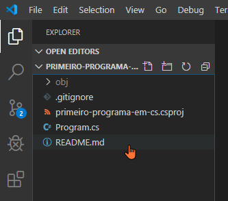
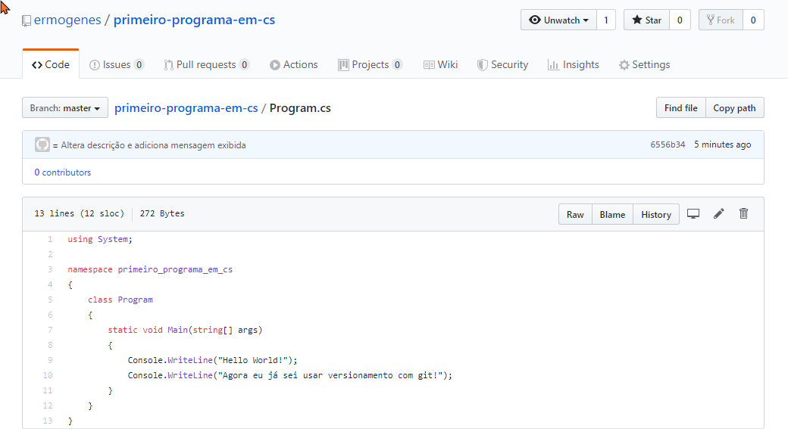
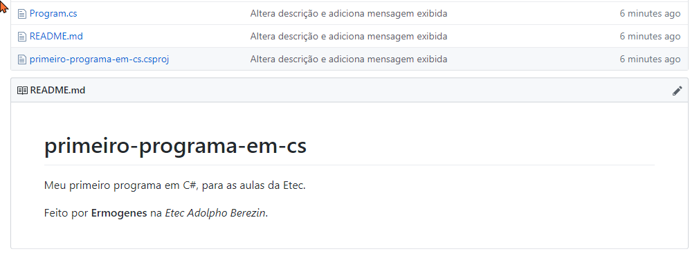

# Programas C# com Git e GitHub

[📽 Veja esta vídeo-aula no Youtube](https://youtu.be/3MrhMXNvLvQ)

## Meu primeiro programa em C# versionado no GitHub

Crie um repositório no GitHub. Nesse exemplo, chamarei de `primeiro-programa-em-cs`, e adicionarei os arquivos `README` e `.gitignore`.


Copie o endereço do repositório:


Abra a pasta base do seu projeto no terminal do VsCode:

```powershell
PS C:\Users\ermogenes> cd desktop\code
PS C:\Users\ermogenes\desktop\code> 
```

Veja que o projeto não existe localmente.

```powershell
PS C:\Users\ermogenes\desktop\code> ls        


    Diretório: C:\Users\ermogenes\desktop\code


Mode                LastWriteTime         Length Name
----                -------------         ------ ----
d-----       03/02/2020     16:32                aulas-programacao-csharp


PS C:\Users\ermogenes\desktop\code> 
```

Vamos criar um repositório local com uma cópia do repositório remoto.

```powershell
PS C:\Users\ermogenes\desktop\code> git clone https://github.com/ermogenes/primeiro-programa-em-cs.git
Cloning into 'primeiro-programa-em-cs'...
remote: Enumerating objects: 8, done.
remote: Counting objects: 100% (8/8), done.
remote: Compressing objects: 100% (6/6), done.
remote: Total 8 (delta 1), reused 5 (delta 1), pack-reused 0
Unpacking objects: 100% (8/8), done.
PS C:\Users\ermogenes\desktop\code> 
```

Veja que uma pasta foi criada com o conteúdo do repositório.

```powershell
PS C:\Users\ermogenes\desktop\code> ls


    Diretório: C:\Users\ermogenes\desktop\code


Mode                LastWriteTime         Length Name
----                -------------         ------ ----
d-----       03/02/2020     16:32                aulas-programacao-csharp
d-----       04/02/2020     14:21                primeiro-programa-em-cs


PS C:\Users\ermogenes\desktop\code> 
```

Acesse a pasta e abra no VsCode.

```powershell
PS C:\Users\ermogenes\desktop\code> cd primeiro-programa-em-cs   
PS C:\Users\ermogenes\desktop\code\primeiro-programa-em-cs> code -r .
```


Crie um novo projeto na pasta atual.

```powershell
PS C:\Users\ermogenes\desktop\code\primeiro-programa-em-cs> dotnet new console
O modelo "Console Application" foi criado com êxito.

Processando ações de pós-criação...
Executando o 'dotnet restore' em C:\Users\ermogenes\desktop\code\primeiro-programa-em-cs\primeiro-programa-em-cs.csproj...
  Restauração concluída em 220,56 ms para C:\Users\ermogenes\desktop\code\primeiro-programa-em-cs\primeiro-programa-em-cs.csproj.

A restauração foi bem-sucedida.

PS C:\Users\ermogenes\desktop\code\primeiro-programa-em-cs> 
```

Vamos alterar a descrição no arquivo `README`.



```markdown
# primeiro-programa-em-cs
Meu primeiro programa em C#, para as aulas da Etec.

Feito por **Ermogenes** na _Etec Adolpho Berezin_.
```

Salve e altere a mensagem exibida em `Program.cs`.

```cs
using System;

namespace primeiro_programa_em_cs
{
    class Program
    {
        static void Main(string[] args)
        {
            Console.WriteLine("Hello World!");
            Console.WriteLine("Agora eu já sei usar versionamento com git!");
        }
    }
}
```

Salve o arquivo.

Vamos consultar o estado do repositório local:

```powershell
PS C:\Users\ermogenes\desktop\code\primeiro-programa-em-cs> git status
On branch master
Your branch is up to date with 'origin/master'.

Changes not staged for commit:
  (use "git add <file>..." to update what will be committed)
  (use "git checkout -- <file>..." to discard changes in working directory)

        modified:   README.md

Untracked files:
  (use "git add <file>..." to include in what will be committed)

        Program.cs
        primeiro-programa-em-cs.csproj

no changes added to commit (use "git add" and/or "git commit -a")
PS C:\Users\ermogenes\desktop\code\primeiro-programa-em-cs> 
```

* `On branch master` significa que estamos olhando para o branch chamado `master`.
* `Your branch is up to date with 'origin/master'.` significa que não há nenhuma alteração salva localmente que não foi enviada para o repositório remoto.
* `Changes not staged for commit` indica em `modified:   README.md` que o arquivo `README.md` foi modificado mas as alterações não foram confirmadas para se manter no versionamento.
* `Untracked files` indica em que os arquivos `Program.cs` e `primeiro-programa-em-cs.csproj` ainda não estão sendo versionados.
* `no changes added to commit` indica que não há nenhuma alteração pendente confirmada para ser versionada.

Vamos confirmar todas as alterações, para que elas entrem no versionamento.

```powershell
PS C:\Users\ermogenes\desktop\code\primeiro-programa-em-cs> git add .
PS C:\Users\ermogenes\desktop\code\primeiro-programa-em-cs> 
```

Vejamos novamente o status:

```powershell
PS C:\Users\ermogenes\desktop\code\primeiro-programa-em-cs> git status
On branch master
Your branch is up to date with 'origin/master'.

Changes to be committed:
  (use "git reset HEAD <file>..." to unstage)

        new file:   Program.cs
        modified:   README.md
        new file:   primeiro-programa-em-cs.csproj

PS C:\Users\ermogenes\desktop\code\primeiro-programa-em-cs> 
```

* `Changes to be committed` indica que as alterações `new file:   Program.cs`, `modified:   README.md` e `new file:   primeiro-programa-em-cs.csproj` estão esperando para serem salvas no versionamento.

Vamos salvá-las no versionamento local.

```powershell
PS C:\Users\ermogenes\desktop\code\primeiro-programa-em-cs> git commit -m "Altera descrição e adiciona mensagem exibida"  
[master 6556b34] Altera descrição e adiciona mensagem exibida
 3 files changed, 23 insertions(+), 1 deletion(-)
 create mode 100644 Program.cs
 create mode 100644 primeiro-programa-em-cs.csproj
PS C:\Users\ermogenes\desktop\code\primeiro-programa-em-cs> 
```

Perceba que a mensagem utilizada descreve brevemente o que foi feito nesse _commit_.

Vejamos novamente o status.

```powershell
PS C:\Users\ermogenes\desktop\code\primeiro-programa-em-cs> git status
On branch master
Your branch is ahead of 'origin/master' by 1 commit.
  (use "git push" to publish your local commits)

nothing to commit, working tree clean
PS C:\Users\ermogenes\desktop\code\primeiro-programa-em-cs> 
```

* `On branch master` `Your branch is ahead of 'origin/master' by 1 commit.` indica que a versão local do branch `master` local está uma versão à frente da versão remota `origin` do branch `master`.

Precisamos enviar essa versão ao repositório remoto.

```powershell
PS C:\Users\ermogenes\desktop\code\primeiro-programa-em-cs> git push origin master
Enumerating objects: 7, done.
Counting objects: 100% (7/7), done.
Delta compression using up to 4 threads
Compressing objects: 100% (5/5), done.
Writing objects: 100% (5/5), 816 bytes | 272.00 KiB/s, done.
Total 5 (delta 0), reused 0 (delta 0)
To https://github.com/ermogenes/primeiro-programa-em-cs.git
   82d191c..6556b34  master -> master
PS C:\Users\ermogenes\desktop\code\primeiro-programa-em-cs> 
```

Feito. Vejamos o status do repositório local.

```powershell
PS C:\Users\ermogenes\desktop\code\primeiro-programa-em-cs> git status                                                    
On branch master
Your branch is up to date with 'origin/master'.

nothing to commit, working tree clean
PS C:\Users\ermogenes\desktop\code\primeiro-programa-em-cs> 
```

Vejamos agora o repositório remoto, no GitHub.

`Program.cs`



`README.md`



Pronto!

Para abrir esse projeto em outra máquina, ou baixar novamente na mesma máquina, refaça os primeiros passos desse processo (exceto a criação do repositório remoto).
