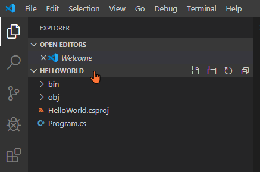
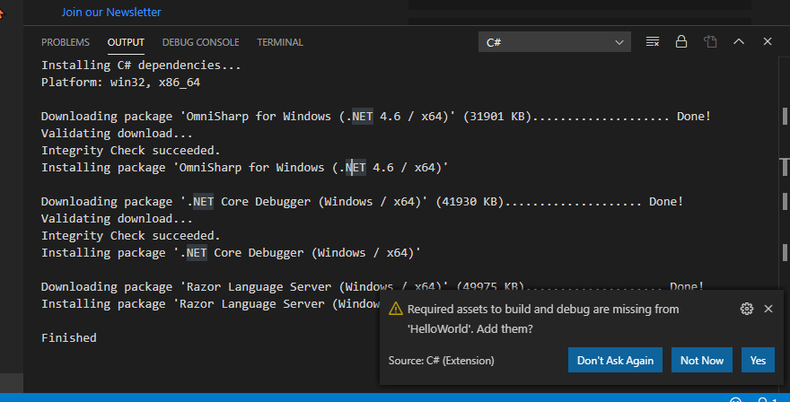
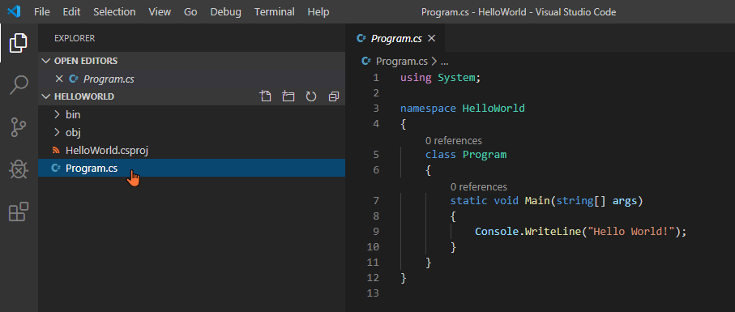
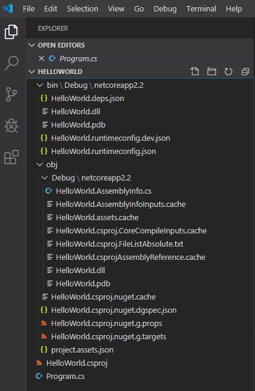

# Meu primeiro programa em C#

📽 https://youtu.be/ersRRa5ymfo

Primeiro você deve escolher uma pasta base onde a pasta do seu projeto ficará.

Neste exemplo, a pasta base é `C:\Users\ermogenes\Desktop\code`, o projeto se chamará `HelloWorld` e a pasta final será `C:\Users\ermogenes\Desktop\code\HelloWorld`.

Em um terminal (do Windows ou do VsCode), acessamos a pasta base:

```powershell
PS C:\Users\ermogenes> cd C:\Users\ermogenes\Desktop\code
PS C:\Users\ermogenes\Desktop\code> 
```

Veja que o projeto ainda não existe na pasta:

```powershell
PS C:\Users\ermogenes\Desktop\code> ls


    Diretório: C:\Users\ermogenes\Desktop\code


Mode                LastWriteTime         Length Name
----                -------------         ------ ----
d-----       03/02/2020     16:32                aulas-programacao-csharp


PS C:\Users\ermogenes\Desktop\code> 
```

Agora, criamos um projeto novo usando o utilitário `dotnet`:

```powershell
PS C:\Users\ermogenes\Desktop\code> dotnet new console -o HelloWorld
O modelo "Console Application" foi criado com êxito.

Processando ações de pós-criação...
Executando o 'dotnet restore' em HelloWorld\HelloWorld.csproj...
  Restauração concluída em 203,04 ms para C:\Users\ermogenes\Desktop\code\HelloWorld\HelloWorld.csproj.

A restauração foi bem-sucedida.

PS C:\Users\ermogenes\Desktop\code> 
```

Agora a pasta do projeto já existe:

```powershell
PS C:\Users\ermogenes\Desktop\code> ls


    Diretório: C:\Users\ermogenes\Desktop\code


Mode                LastWriteTime         Length Name
----                -------------         ------ ----
d-----       03/02/2020     16:32                aulas-programacao-csharp
d-----       04/02/2020     13:51                HelloWorld


PS C:\Users\ermogenes\Desktop\code> 
```

Podemos acessar a pasta e abrir no VsCode.

```powershell
PS C:\Users\ermogenes\Desktop\code> cd HelloWorld
PS C:\Users\ermogenes\Desktop\code\HelloWorld> code .
```

O VsCode abrirá a pasta e automaticamente efetuará o download de todas as dependências.




```
Installing C# dependencies...
Platform: win32, x86_64

Downloading package 'OmniSharp for Windows (.NET 4.6 / x64)' (31901 KB).................... Done!
Validating download...
Integrity Check succeeded.
Installing package 'OmniSharp for Windows (.NET 4.6 / x64)'

Downloading package '.NET Core Debugger (Windows / x64)' (41930 KB).................... Done!
Validating download...
Integrity Check succeeded.
Installing package '.NET Core Debugger (Windows / x64)'

Downloading package 'Razor Language Server (Windows / x64)' (49975 KB).................... Done!
Installing package 'Razor Language Server (Windows / x64)'

Finished
```

Clique em `Yes`.



Veja que um programa simples já foi adicionado na pasta. Clique em `Program.cs` para abrir o código-fonte.



Este programa exibe a frase `Hello World!` na saída padrão.

Agora vamos compilar e executar o programa pelo terminal do VsCode.

```powershell
PS C:\Users\ermogenes\Desktop\code\HelloWorld> dotnet run
Hello World!
PS C:\Users\ermogenes\Desktop\code\HelloWorld> 
```

Parabéns, você criou o seu primeiro programa em C#.

Os binários e os assemblies foram criados pelo compilador nas pastas `obj` e `bin`.


