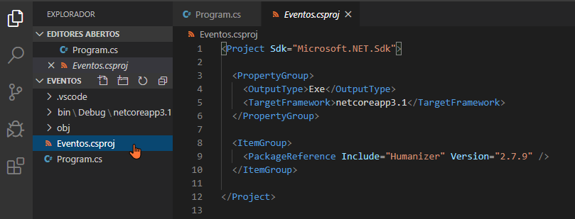

# Utilizando pacotes de terceiros

Podemos incluir referência a pacotes (bibliotecas) disponibilizadas por terceiros. O principal repositório de pacotes para .NET é o [NuGet](https://www.nuget.org/).

Agora um exemplo.

Digamos que temos um trecho de programa que exibe um evento, que possui um nome e a data/hora que ocorreu armazenada em um `DateTime`.

```cs
DateTime evento = new DateTime(2001, 9, 11, 8, 46, 0);
Console.Write("Ataque ao WTC: ");
Console.WriteLine(evento);
```

A saída será:

```
Ataque ao WTC: 11/09/2001 08:46:00
```

Digamos que para o progama desejado seja mais interessante saber a quanto tempo se passou o evento, e não a data e a hora específica, exatamente como em linhas do tempo de redes sociais.

O problema é que o .NET não disponibiliza ferramentas para isso. Poderíamos fazê-lo, mas buscamos por uma saída mais rápida.

Há um pacote gratuito chamado `Humanizer` disponível no NuGet que, entre outras coisas, faz exatamente isso para nós. Vamos instalar o pacote em nosso projeto.

## Verificando os pacotes já instalados

```
PS C:\Users\ermogenes\Desktop\code\Eventos> dotnet list package
O projeto 'Eventos' tem as seguintes referências de pacote
   [netcoreapp3.1]: Nenhum pacote foi encontrado para essa estrutura.
```

Percebe-se que nenhum pacote ainda foi incluído.

## Instalando um pacote

```
PS C:\Users\ermogenes\Desktop\code\Eventos> dotnet add package Humanizer
  Writing C:\Users\ermogenes\AppData\Local\Temp\tmp1C33.tmp
info : Adicionando PackageReference do pacote 'Humanizer' ao projeto 'C:\Users\ermogenes\Desktop\code\Eventos\Eventos.csproj'.
info : Restaurando pacotes para C:\Users\ermogenes\Desktop\code\Eventos\Eventos.csproj...
info :   GET https://api.nuget.org/v3-flatcontainer/humanizer/index.json
info :   OK https://api.nuget.org/v3-flatcontainer/humanizer/index.json 568ms
info : O pacote 'Humanizer' é compatível com todas as estruturas especificadas no projeto 'C:\Users\ermogenes\Desktop\code\Eventos\Eventos.csproj'.
info : PackageReference do pacote 'Humanizer' versão '2.7.9' adicionada ao arquivo 'C:\Users\ermogenes\Desktop\code\Eventos\Eventos.csproj'.
info : Confirmando restauração...
info : Gravando o arquivo de ativos no disco. Caminho: C:\Users\ermogenes\Desktop\code\Eventos\obj\project.assets.json
log  : Restauração concluída em 1,54 sec para C:\Users\ermogenes\Desktop\code\Eventos\Eventos.csproj.
```

Conferindo se a instalação funcionou:

```
PS C:\Users\ermogenes\Desktop\code\Eventos> dotnet list package
O projeto 'Eventos' tem as seguintes referências de pacote
   [netcoreapp3.1]: 
   Pacote de Nível Superior      Solicitado   Resolvido
   > Humanizer                   2.7.9        2.7.9
```

Também podemos conferir a referência através do arquivo `.csproj` do projeto:



## Utilizando o pacote em nosso código

No início de cada arquivo C# devemos adicionar todas as referências a serem utilizadas pelo código desse arquivo.

Para disponibilizar as funcionalidades de `Humanizer` nesse arquivo, adicionamos o seguinte comando:

```cs
using Humanizer;
```

Antes tínhamos somente referência a `System`, que nos permite, por exemplo, utilizar `Console.WriteLine`.

`Humanizer` adiciona a objetos do tipo `DateTime` o método `Humanize`, que retorna um texto amigável exatamente como desejamos.

Vamos utilizá-lo:

```cs
Console.WriteLine(evento.Humanize());
```

O resultado agora será:

```
PS C:\Users\ermogenes\Desktop\code\Eventos> dotnet run
Ataque ao WTC: 18 anos atrás
```

Nosso código completo será:
```cs
using System;
using Humanizer;

namespace Eventos
{
    class Program
    {
        static void Main(string[] args)
        {
            DateTime evento = new DateTime(2001, 9, 11, 8, 46, 0);
            Console.Write("Ataque ao WTC: ");
            Console.WriteLine(evento.Humanize());
        }
    }
}
```

Esse pacote contém muitas funcionalidades incrivelmente úteis. Mais detalhes sobre o `Humanizer` [aqui](https://github.com/Humanizr/Humanizer).