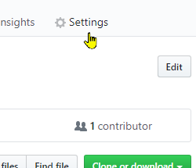
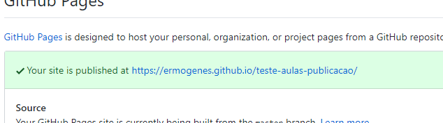
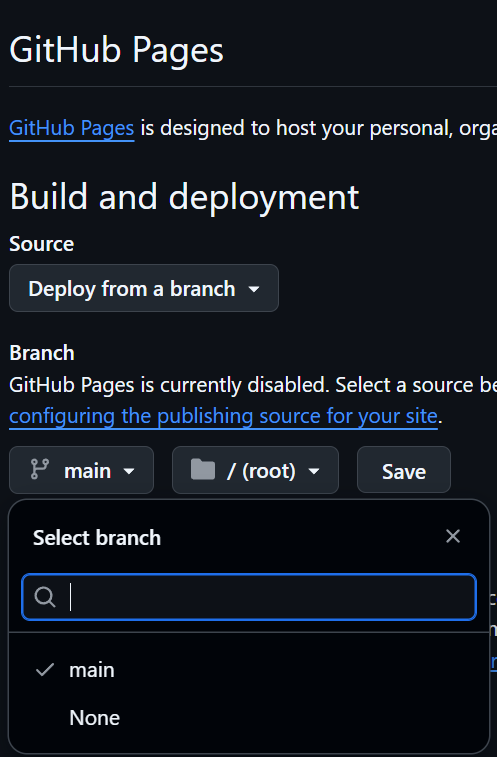
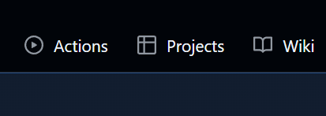
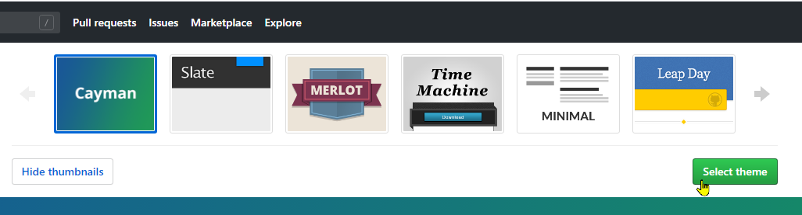
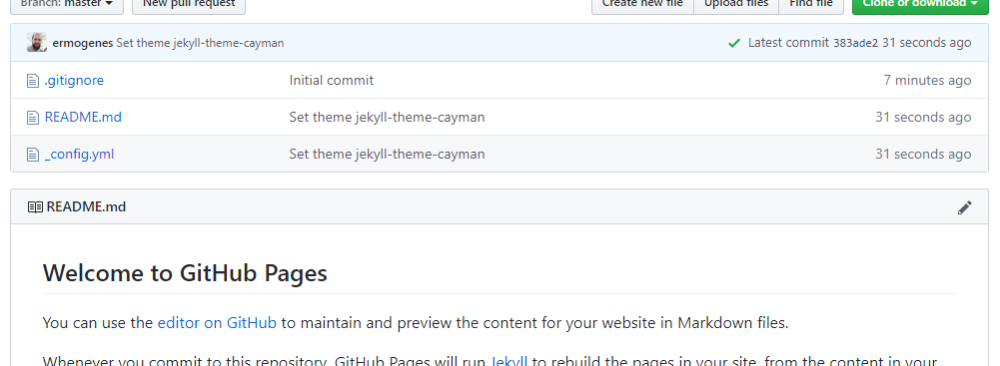
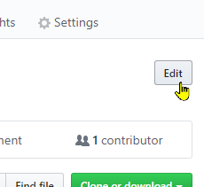
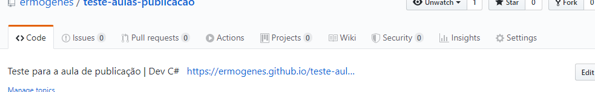

# Publicação

[📽 Veja esta vídeo-aula no Youtube](https://youtu.be/k_pH9sWxyTc)

Para publicar a versão atual do projeto use:

```
dotnet publish -c Release
```

Será criada uma pasta em `bin\Release\net9.0\publish` com o conteúdo a ser distribuído.

Para executar, acessa essa pasta e digite:

```
dotnet NomeDoProjeto.dll
```

No Windows você pode digitar somente `NomeDoProjeto`, ou dar duplo clique arquivo `.exe`.

Essa versão será portátil, ou seja, poderá ser executada em qualquer sistema operacional que suporte .NET, como Windows, Linux, MacOS, etc. desde que instalado o .NET Core Runtime.

# Distribuição

Uma maneira de distribuir seu projeto é criando um site para que se possa fazer o download. Podemos fazer isso utilizando o GitHub Pages.

* Crie um `.zip` com o conteúdo da pasta `publish`.
* Salve esse arquivo em uma pasta `dist`, na raiz do seu projeto.
* Escreva um arquivo README bacana, incluindo link de download (apontando para o `.zip` em `dist`).
* Publique como um site usando o GitHub Pages.

## GitHub Pages

Entre em _Settings_:



Depois em _Pages_



Ative o GitHub Pages para a _branch_ `main`:



Clique em _Save_. 

Clique em _Actions_.



Clique em _Deployments_.



Guarde o link abaixo de All _deployments_



Edite a descrição para incluir o link:




Ficará assim:



**Altere o arquivo `README.md` livremente. Ele será convertido para HTML e será sua _home-page_**

[Dicas de Markdown](https://docs.github.com/pt/get-started/writing-on-github/getting-started-with-writing-and-formatting-on-github/basic-writing-and-formatting-syntax)

Você pode divulgar somente o link do seu site, sem que a pessoa precise conhecer o GitHub.

## Editando o tema do seu projeto

- Escolha um dos temas a seguir: https://pages.github.com/themes/
- Adicione um arquivo _config.yml com as instruções do seu tema.
  - Exemplo do tema [Hacker](https://pages-themes.github.io/hacker/) - https://github.com/pages-themes/hacker

```yml
remote_theme: pages-themes/hacker@v0.2.0
plugins:
- jekyll-remote-theme
```

## Projeto criado na vídeo-aula

https://ermogenes.github.io/ObrigadoDevCSharp/
