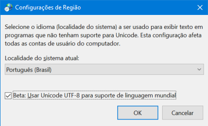

# Saída em console

[📽 Veja esta vídeo-aula no Youtube](https://youtu.be/zRzLq1zzb5M)

Comandos disponíveis na classe `System.Console`.

## Exibir um texto, sem quebrar linha

`Console.Write`

```cs
Console.Write("Primeiro texto");
Console.Write("Segundo texto");
```

Resultado:

```
Primeiro textoSegundo texto
```

## Exibir um texto, com quebra de linha no final

`Console.WriteLine`

```cs
Console.Write("Primeiro texto");
Console.WriteLine("Segundo texto");
Console.Write("Terceiro texto");
```

Resultado:

```
Primeiro textoSegundo texto
Terceiro Texto
```

## Limpar todos os textos da tela

`Console.Clear`

```cs
Console.Clear();
```

## Tocar um sinal sonoro

`Console.Beep`

```cs
Console.Beep();
```

⚠ _`Beep` é dependente de plataforma, ou seja, só funciona em ambiente Windows. Isso causa uma aviso do compilador, em amarelo. Para desativar esse aviso, marque o trecho com a notação `pragma`:_

```cs
// ...
// a partir daqui o aviso não será dado pelo compilador
#pragma warning disable CA1416
// ...
Console.Beep();
// ...
#pragma warning restore CA1416
// reativa o aviso daqui em diante
// ...
```

Para alterar a frequência e o tempo do sinal sonoro, passamos dois argumento à `Beep`. No exemplo, tocamos a nota _dó_ por 200 milésimos de segundo:

```cs
Console.Beep(1320, 200);
```

Algumas notas:

| Nota | Frequência |
| ---- | ---------- |
| Dó   | 1320       |
| Ré   | 1485       |
| Mi   | 1650       |
| Fá   | 1759       |
| Sol  | 1980       |
| Lá   | 2200       |
| Si   | 2475       |

Saiba mais [aqui](http://www.das.inpe.br/~alex/FisicadaMusica/fismus_escalas.htm), [aqui](https://docs.microsoft.com/pt-br/dotnet/api/system.console.beep?view=net-6.0), [aqui](https://pages.mtu.edu/~suits/notefreqs.html) e [aqui](https://www.codeproject.com/Tips/438519/Console-BEEP-Methods-Notation-and-Generation).

## Fazer uma pausa na execução do programa

`Thread.Sleep`

É necessário passar a duração da pausa em milésimos de segundo (use 1000 para 1 segundo).

```cs
Thread.Sleep(1000);
```

## Mudar a cor da letra

`Console.ForegroundColor`

Cores disponíveis no enumerador `System.ConsoleColor`:

| Constante     | Valor | Cor                                               |
| ------------- | ----- | ------------------------------------------------- |
| `Black`       | 0     | A cor preta.                                      |
| `Blue`        | 9     | A cor azul.                                       |
| `Cyan`        | 11    | A cor ciano (verde-azul).                         |
| `DarkBlue`    | 1     | A cor azul-escuro.                                |
| `DarkCyan`    | 3     | A cor ciano-escuro (azul escuro-verde).           |
| `DarkGray`    | 8     | A cor cinza-escuro.                               |
| `DarkGreen`   | 2     | A cor verde-escuro.                               |
| `DarkMagenta` | 5     | A cor magenta-escuro (arroxeado-escuro-vermelho). |
| `DarkRed`     | 4     | A cor vermelho-escuro.                            |
| `DarkYellow`  | 6     | A cor amarelo-escuro (ocre).                      |
| `Gray`        | 7     | A cor cinza.                                      |
| `Green`       | 10    | A cor verde.                                      |
| `Magenta`     | 13    | A cor magenta (arroxeado-vermelho).               |
| `Red`         | 12    | A cor vermelha.                                   |
| `White`       | 15    | A cor branca.                                     |
| `Yellow`      | 14    | A cor amarela.                                    |

Usando o enumerador:

```cs
Console.ForegroundColor = ConsoleColor.Red;
```

Usando o código numérico:

```cs
Console.ForegroundColor = (ConsoleColor)12;
```

## Mudar a cor do fundo

`Console.BackgroundColor`

Cores disponíveis no enumerador `System.ConsoleColor`:

Usando o enumerador:

```cs
Console.BackgroundColor = ConsoleColor.Blue;
```

Usando o código numérico:

```cs
Console.BackgroundColor = (ConsoleColor)9;
```

## Voltar para a cor padrão

`Console.ResetColor`

```cs
Console.ResetColor();
```

## Cursor

Esconder/mostrar o cursor:

```cs
Console.CursorVisible = false; // Esconder
Console.CursorVisible = true; // Mostrar
```

Posição atual do cursor:

- Linha: `Console.CursorTop`
- Coluna: `Console.CursorLeft`

Reposicionar o cursor:

```cs
Console.SetCursorPosition(10, 15); // linha 10, coluna 15
```

---

## Pacotes para renderização em terminal

Caso busque algo com mais recursos, tente:

- https://spectreconsole.net/
- https://github.com/gui-cs/Terminal.Gui
- https://github.com/Thraka/SadConsole
- https://bitbucket.org/clarktravism/rlnet
- https://docs.monogame.net/

## Codificação de caracteres (_avançado_)

Os sistemas operacionais em suas diferentes versões possuem diversas configurações diferentes. Para que recursos avançados (caracteres internacionais, emojis, sublinhados, etc.) sejam utilizados corretamente, precisamos garantir que a codificação UTF-8 esteja ativada, o que não é o caso em sistemas Windows até a versão 10.

Abaixo, um exemplo de como testar e mudar a codificação via código C#:

```cs
// Exibe emoji na codificação padrão do terminal
Console.WriteLine($"🤯 em codificação {Console.OutputEncoding}");

// Salva a codificação padrão
var codificacaoAnterior = Console.OutputEncoding;

// Muda a codificação para UTF-8
Console.OutputEncoding = System.Text.Encoding.UTF8;

// Exibe emoji na codificação UTF-8
Console.WriteLine($"🤯 em codificação {Console.OutputEncoding}");

// Volta a codificação para a codificação padrão
Console.OutputEncoding = codificacaoAnterior;

// Exibe novamente na codificação padrão
Console.WriteLine($"🤯 em codificação {Console.OutputEncoding}");
```

No Windows 10 você terá algo como:

```
?? em codificação System.Text.OSEncoding
🤯 em codificação System.Text.UTF8Encoding
?? em codificação System.Text.OSEncoding
```

Esta abordagem não é recomendada, pois caso seu programa seja interrompido antes de voltar a codificação para o padrão, isso pode interferir em outros programas.

Para mudar essa configuração globalmente, faça (usando um usuário com permissões de administrador):

- execute `intl.cpl` para abrir a configuração de Região;
- mude para a aba 'Administrativo';
- clique em 'Alterar localidade do sistema';
- ative 'Usar Unicode UTF-8 para suporte de linguagem mundial';
- reinicie o computador.



Se preferir, pode fazer isso em linha de comando abrindo um Powershell com privilégios de administrador e executar:

```powershell
'ACP', 'OEMCP', 'MACCP' | Set-ItemProperty HKLM:\SYSTEM\CurrentControlSet\Control\Nls\CodePage -Name { $_ } 65001
```

Para funcionar no Powershell, é necessário adicionalmente configurar em seu `profile.ps1`:

```powershell
[console]::InputEncoding = [console]::OutputEncoding = [System.Text.UTF8Encoding]::new()
```
