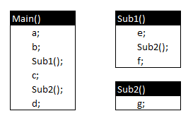
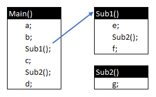
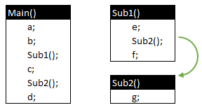
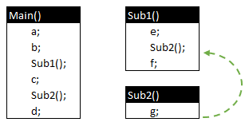
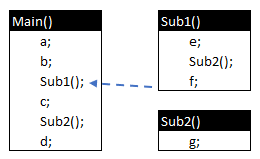
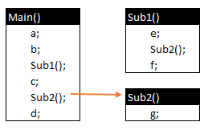
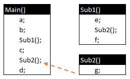
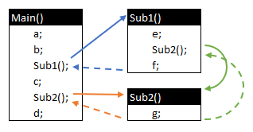

# Sub-rotinas

[📽 Veja esta vídeo-aula no Youtube](https://youtu.be/fIkw8BTA800)

Sub-rotinas são trechos de código que recebem um nome identificador e que podem ser executados diversas vezes em diferentes pontos do seu programa, permitindo assim uma melhor organização e a não repetição de comandos.

Todo programa possui ao menos uma sub-rotina. Em aplicações console, ela se chama `Main`. Você pode definir quantas sub-rotinas quiser.

Nesse exemplo, `Main`, `Sub1` e `Sub2` são sub-rotinas, e `a` ... `g` são comandos quaisquer.



Ao executar o comando `Sub1()`, o programa passa o controle para `Sub1`, que é executada completamente antes de retornar para o chamador. Isso pode acontecer sucessivamente, de forma que os retornos sejam executados um a um, do último para o primeiro. Esse comportamento de pilha (_o último a ser concluído é o primeiro a retornar_) é chamado `Call Stack` (pilha de execução).

Exemplo:













O grafo completo da sequência de execução é:



Dessa forma, os comandos executados serão, na sequência:

- `a`, em `Main()`;
- `b`, em `Main()`;
- `e`, em `Main()` → `Sub1()`;
- `g`, em `Main()` → `Sub1()` → `Sub2()`;
- `f`, em `Main()` → `Sub1()`;
- `c`, em `Main()`;
- `g`, em `Main()` → `Sub2()`;
- `d`, em `Main()`.

Em C# (e na maioria das linguagens orientadas a objetos) uma sub-rotina é chamada de **método**.

## Tipos de sub-rotinas

Um método pode ou não retornar um resultado. Um exemplo de método que não retorna resultado é `Console.WriteLine`. Ele exibe algo na saída padrão e pronto, não há mais nada a fazer. Uma situação totalmente diferente acontece com `Console.ReadLine` onde o seu processamento requer o retorno de um resultado: a string digitada pelo usuário.

- Sub-rotinas _sem_ retorno são chamadas de **procedimentos**.
- Sub-rotinas _com_ retorno são chamadas de **funções**.
- Ambas são criadas em C# utilizando **métodos**.

## Assinatura

Um método é definido a partir de uma assinatura. Analisemos a assinatura dos dois métodos citados.

A assinatura do método `Clear` na classe `System.Console` é:

```cs
public static void Clear ();
```

- `public` indica que o método pode ser acessado por qualquer arquivo que faça referência a `System` (através do comando `using`);
- `static` indica é um método de classe e não de objeto (conceitos que serão tratados na aula sobre classes);
- `void` indica que não haverá retorno, ou seja, se trata de um procedimento;
- `Clear` é o nome identificador do método;
- `()` indica a lista de parâmetros esperados pela sub-rotina; nesse caso, nenhum.

Uma das assinaturas do método `WriteLine` na classe `System.Console` é:

```cs
public static void WriteLine (string value);
```

- `string value` define um parâmetro de entrada que deve ser informado ao executar o método. Nesse caso, deve-se indicar um argumento do tipo string que será acessível dentro do método através do identificador `value`.

## Métodos estáticos e não-estáticos

Métodos estáticos (que incluem o modificador `static`) não necessitam de uma instância da classe para serem executados, diferentemente de métodos não-estáticos.

Exemplo de método estático:

```cs
Console.WriteLine("Olá, usuário.");
```

O método `WriteLine` é executado diretamente via a classe `Console`.

Exemplo de método não-estático:

```cs
Random gerador = new Random();
gerador.Next(7);
```

Para executar o método `Next` necessitamos de um objeto da classe `Random`.

Métodos não estáticos serão tratados no tópico sobre classes.

## Criando um procedimento

O exemplo abaixo mostra um procedimento estático `ExibeHoraAtual` criado na classe padrão `Program` sendo executado duas vezes.

```cs
// Usando procedimentos para não repetir código
ExibeHoraAtual();
Console.WriteLine("Pressione uma tecla...");
Console.ReadKey();
ExibeHoraAtual();

void ExibirHoraAtual()
{
    Console.ForegroundColor = ConsoleColor.Red;
    Console.WriteLine(DateTime.Now.ToLongTimeString());
    Console.ResetColor();
}
```

Com isso evitamos a duplicidade de código e facilitamos a manutenção do programa.

## Funções

Estudemos agora o exemplo abaixo:

```cs
double a = 3, b = 4, c = 5;

double area = AreaTriangulo(a, b, c);
Console.WriteLine($"O triângulo possui área de {area:N2}.");

double AreaTriangulo(double lado1, double lado2, double lado3)
{
    double s = (lado1 + lado2 + lado3) / 2;
    return Math.Sqrt(s * (s - lado1) * (s - lado2) * (s - lado3));
}
```

São criadas 3 variáveis `double`, `a`, `b` e `c`, com os valores `3`, `4` e `5`, respectivamente. Os valores dessas variáveis são passados como argumentos para a função `AreaTriangulo` que exige três parâmetros do tipo `double` chamados `lado1`, `lado2` e `lado3` para retornar um resultado também do tipo `double`. Esse retorno será gravado na variável `area` e exibido ao usuário.

Quando chamada, a função terá os valores dos argumentos acessíveis através dos parâmetros `lado1`, `lado2` e `lado3`. Ela trabalha com essas variáveis normalmente, executa o cálculo do resultado e o retorna ao chamador através do comando `return`.

`AreaTriangulo` permite que seja calculada a área de um triângulo a partir de quaisquer valores de lados informados. Essa é uma forma de se reaproveitar código e tornar seu programa mais legível e manutenível.

## Funções de seta (_arrow functions_) / expressões _lambda_

Provêm uma sintaxe simplificada para funções que retornam valore a partir de cálculos simples.

```cs
int Soma(int a, int b) => a + b;
```

Para saber mais, veja [expressões lambda](https://docs.microsoft.com/pt-br/dotnet/csharp/language-reference/operators/lambda-expressions) na documentação oficial.

## Escopo de variáveis

Uma variável declarada dentro de um bloco só é visível em seu contexto. Use a estrutura de parâmetros/argumentos para transferir valores entre métodos.

No exemplo acima:

- `a`, `b`, `c` e `area` só estão disponíveis em `Main`;
- `lado1`, `lado2`, `lado3` e `s` só estão disponíveis em `AreaTriangulo`.

## Valores padrão para parâmetros

Você pode indicar um valor padrão para um parâmetro quando nenhum argumento é indicado.

Exemplo:

```cs
int atual = Proximo();
// atual vale 1
atual = Proximo(atual);
// atual vale 2

int Proximo(int posicao = 0) => posicao + 1;
```

## Passagem nomeada de parâmetros

Podemos incluir o nome do parâmetro nas chamadas de sub-rotinas. Isso é especialmente útil quando não fica claro pelo contexto o que significa aquele argumento.

Por exemplo, no comando:

```cs
Console.ReadKey(true);
```

Não fica claro o que significa o argumento `true`. Usando o nome do parâmetro, fica muito mais evidente que queremos que a função intercepte a tecla não a exibindo na saída.

```cs
Console.ReadKey(intercept: true);
```

## Recursividade

Uma função pode chamar a si mesma quando necessário. Essa funcionalidade chama-se recursividade. Nesse caso, certifique-se que a função chegará ao fim, ou você entrará em uma situação similar a um laço infinito.

Exemplo de função recursiva:

```cs
Console.WriteLine($"Fatorial de 1 = {Fatorial(1)}");
Console.WriteLine($"Fatorial de 5 = {Fatorial(5)}");
Console.WriteLine($"Fatorial de 7 = {Fatorial(7)}");
Console.WriteLine($"Fatorial de 13 = {Fatorial(13)}");

int Fatorial (int n)
{
    if (n == 1)
    {
        return 1;
    }
    return n * Fatorial(n - 1);
}
```

💡 Dica: Use o depurador do VsCode para entender como essa função consegue chegar no resultado desejado.

De maneira geral, tudo que é feito com recursividade pode ser feito com técnicas iterativas utilizando laços.

Há uma excelente explicação sobre o tema em https://www.embarcados.com.br/recursividade/. Apesar de não tratar de C#, os conceitos são válidos para qualquer linguagem.
