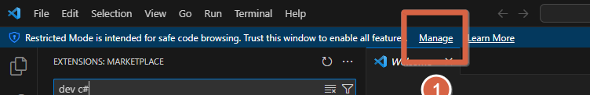
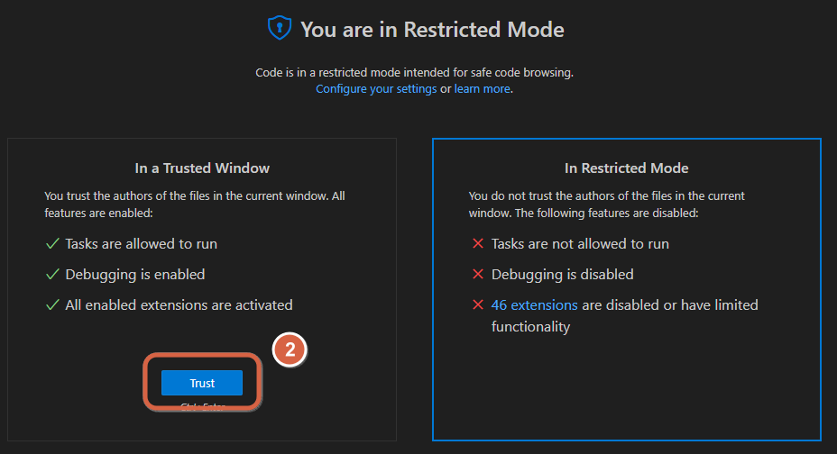
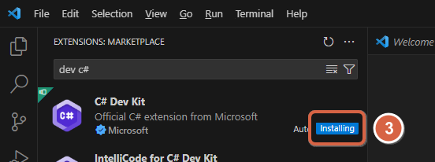
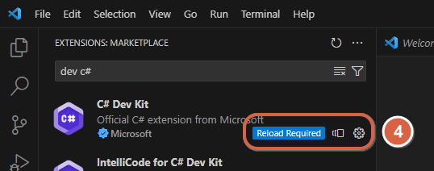
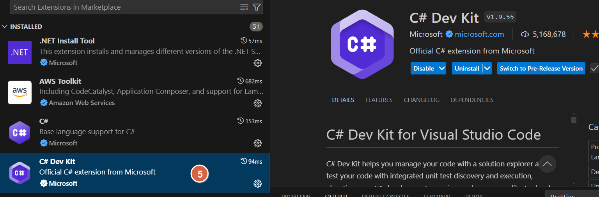
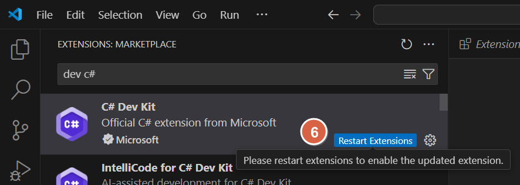
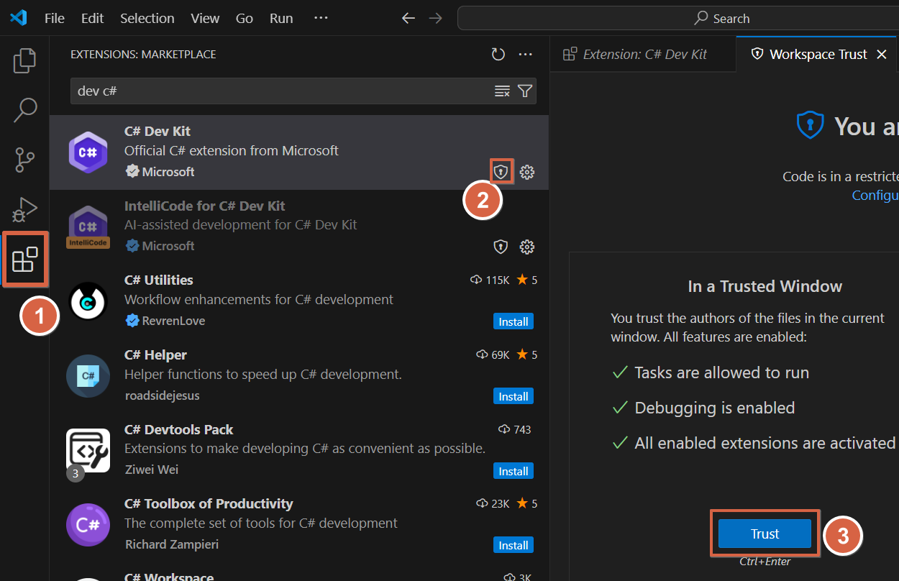
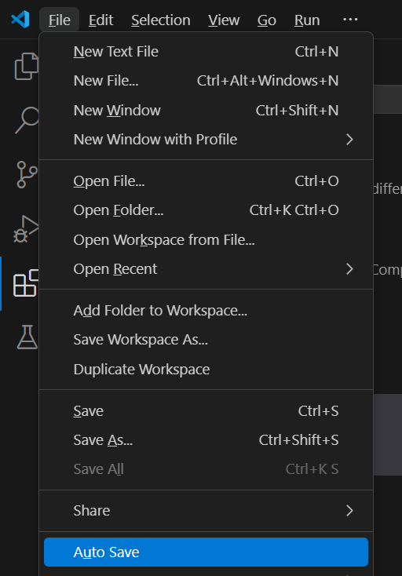

# Usando o Visual Studio Code

[📽 Veja esta vídeo-aula no Youtube](https://youtu.be/mOtSc3SbavY)

## Tela inicial


## Como abrir uma pasta

**Método 1**: Pelo explorador


**Método 2**: Pelo menu 'Abrir'


**Método 3**: Pelo menu de contexto do Windows


**Método 4**: Pelo terminal do Windows


**Método 5**: Pelo terminal do VsCode

```powershell
code .
```

Para forçar a abrir na mesma janela

```powershell
code -r .
```

Para forçar a abrir em uma nova janela

```powershell
code -n .
```

## Como utilizar o terminal integrado


## Como navegar entre arquivos na pasta aberta

Através da aba `Explorer`


## Como instalar extensões

Através da aba `Extensions`


Algumas extensões notáveis:

- Pacote de Idioma Português Brasileiro - `ms-ceintl.vscode-language-pack-pt-br`
- C# Dev Kit - `ms-dotnettools.csdevkit` - kit de extensões oficiais da Microsoft para C#
    - C# - `ms-dotnettools.csharp` - extensão oficial da Microsoft para C#
    - .NET Install Tool - `ms-dotnettools.vscode-dotnet-runtime` - extensão para gerenciamento das SDK's
- Dracula Official - `dracula-theme.theme-dracula` - Tema Dracula [https://draculatheme.com/](https://draculatheme.com/)
- Material Icon Theme - `pkief.material-icon-theme` - Pacote de ícones para diferentes tipos de arquivos
- Power Mode - `hoovercj.vscode-power-mode` - Efeitos ao digitar

## Configurando o C# Dev Kit

O VS Code estará no modo restrito. Para resolver:

1. Clique em _Manage_



2. Clique em _Trust_



_Com isso, você diz ao VSCode que esta pasta é segura para seus artefatos_

3. As extensões serão automaticamente atualizadas (_Installing_)



4. Clique em _Reload Required_



5. Aguarde alguns instantes e a instalação será concluída



6. Em algumas situações, clique em _Restart Extensions_



### Caso o _Manage_ esteja indisponível

Através da Aba `Extensions`

1. Digite `dev c#`
1. Clique no cadeado que aparece em `C# Dev Kit`
1. CLique em _Trust_



## Desabilite o _Auto Save_

Menu _File_ --> Desmarque _Auto Save_



## Como mudar a língua do VsCode para português (pt-br)

Dentro do VsCode, pressione `CTRL+SHIFT+P` (ou `F1`), digite `Configure Display Language` e confirme.


Caso não apareça `pt-br` na lista, escolha `Install Additional Languages...`:


Selecione a língua desejada e clique em `Install`.


Surgirá uma notificação avisando que o VsCode será reiniciado. Confirme.


