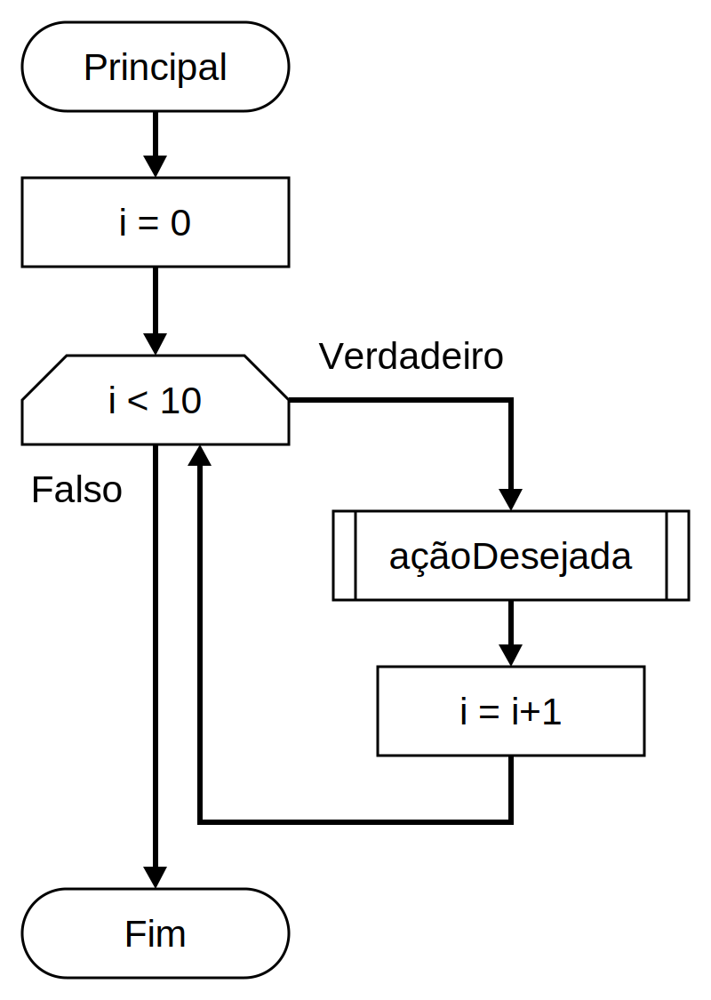

# Laços de repetição

[📽 Veja esta vídeo-aula no Youtube](https://youtu.be/X1Tuuci9VAo)

Permitem que comandos sejam executados repetidamente. Por exemplo, desejo aguardar até que o usuário pressione uma tecla específica, calcular uma sequência numérica, avaliar uma lista de valores, etc.

## Laços condicionais

São laços que permitem controlar a execução utilizando um teste. A linguagem C# permite três construções:

- Laços pré-testados ou "faça enquanto": comandos `while` e `do`
- Laços com variável de controle ou "faça para": comando `for`
- Laços para iteração em coleções: comando `foreach`

### Laço "faça enquanto"

Repete um comando enquanto uma condição se mantenha verdadeira.

#### Comando `while`:

```cs
while (testeExecucao)
    comandoCondicaoVerdadeira
```



- Se `testeExecucao` for avaliado como falso, `comandoCondicaoVerdadeira` nunca será executado.
- Após executar `comandoCondicaoVerdadeira`, o programa volta para avaliar novamente `testeExecucao`, como no passo acima.
- Se `comandoCondicaoVerdadeira` nunca alterar o resultado de `testeExecucao`, o programa entrará em um _loop infinito_.

Exemplos:

Repetir um bloco até que seja selecionada uma opção:

```cs
string tecla = "";
while(tecla != "S")
{
    Console.WriteLine("Digite S para sair, qualquer outra tecla para continuar: ");
    tecla = Console.ReadLine()!;
}
```

Repetir um bloco 10 vezes:

```cs
int contador = 1;
while(contador <= 10)
{
    Console.WriteLine(contador);
    contador = contador + 1;
}
```

Entrar em loop infinito:

```cs
while (true);
```

#### Laço `do`

Executa um comando, e o repete enquanto uma condição se mantenha verdadeira.

Comando `do`:

```cs
do
    comandoAExecutar
while (testeRepeticao);
```


- Sempre executa a primeira iteração, fazendo uma vez `comandoAExecutar`.
- Se `testeRepeticao` for avaliado como verdadeiro, `comandoAExecutar` será executado novamente.
- Se `comandoAExecutar` nunca alterar o resultado de `testeRepeticao`, o programa entrará em um _loop infinito_.

Exemplos:

Repetir um bloco até que seja selecionada uma opção:

```cs
string tecla = "";
do
{
    Console.WriteLine("Digite S para sair, qualquer outra tecla para continuar: ");
    tecla = Console.ReadLine()!;
}
while(tecla != "S");
```

## Aplicações de laços

Um laço pode ser aplicado em diversas situações, sendo algumas delas comuns, listadas abaixo.

### Laços infinitos

Seu teste deliberadamente manterá a execução indefinidamente. É usado em casos de programas que serão executados até que o dispositivo seja desligado, como um sistema operacional ou um sistema embarcado (o software de uma calculadora, relógio de pulso ou forno de microondas, por exemplo).

```cs
while (condicaoSempreVerdadeira)
    comandoQueNaoAlteraCondicao
```

Exemplos:

```cs
while(true)
{
    comandoASerRepetido;
}
```

```cs
do
{
    comandoASerRepetido;
}
while(true);
```

Apesar de pouco comum, podemos também usar uma condição para forçar uma saída do laço usando `break`:

```cs
while (true)
{
    // faça algo
    if (condicaoDeSaida)
    {
        break;
    }
}
```

### Laços utilizando contadores e incrementos/decrementos

O laço executa uma tarefa e acrescenta (ou reduz) o valor de uma variável com o papel de contador de iterações. O teste verifica a condição de parada, geralmente associada à quantidade de iterações.

```cs
int contador = 0; // não executou nenhuma vez

while (contador <= MAX_EXECUCOES)
{
    tarefaAExecutar
    contador = contador + 1; // executou mais uma vez
}
```

Exemplos:

```cs
int i = 1;
while (i <= 5)
{
    Console.WriteLine($"Essa é a {i}ª execução.");
    i +=1;
}
```

```
Essa é a 1ª execução.
Essa é a 2ª execução.
Essa é a 3ª execução.
Essa é a 4ª execução.
Essa é a 5ª execução.
```

```cs
int i = 5;
while (i > 0)
{
    Console.WriteLine($"Faltam {i} execuções.");
    i -= 1;
}
```

```
Faltam 5 execuções.
Faltam 4 execuções.
Faltam 3 execuções.
Faltam 2 execuções.
Faltam 1 execuções.
```

### Laços com sinalizador

Podemos utilizar uma variável - chamada de _flag_ (bandeira em inglês) - para controlar a repetição. Essa variável será testada no laço, e deve ser alterada no interior do bloco.

Por exemplo, queremos que o usuário digite números inteiros positivos não-nulos até que sua soma ultrapasse 20. Também queremos que o programa seja interrompido em caso de entradas zero ou negativas.

```cs
int total = 0;
bool terminar = false; // essa é nossa flag

while (!terminar) // meu laço repete enquanto o flag não for verdadeiro
{
    int valor = 0;

    Console.WriteLine("Valor a adicionar: ");
    valor = Convert.ToInt32(Console.ReadLine());

    if (valor > 0)
    {
        total += valor;
    }
    else // essa é uma das condições de saída, portanto ativo o flag
    {
        Console.WriteLine("---- Valor inválido. ----");
        terminar = true;
    }

    if (total > 20)  // essa é a outra condição de saída
    {
        terminar = true;
    }

    Console.WriteLine($"   Total: {total}");
}

Console.WriteLine("Fim!");
```

Uma das condições de saída:

```
Valor a adicionar: 1
   Total: 1

Valor a adicionar: 2
   Total: 3

Valor a adicionar: 0
---- Valor inválido. ----

   Total: 3

Fim!
```

A outra:

```
Valor a adicionar: 1
   Total: 1

Valor a adicionar: 7
   Total: 8

Valor a adicionar: 4
   Total: 12

Valor a adicionar: 10
   Total: 22

Fim!
```

## Comandos `break` e `continue`

Você pode interferir no controle de um laço finalizando uma iteração ou finalizando a execução do laço.

- `break` finaliza o laço como um todo.
- `continue` finaliza a iteração atual, mas segue para a próxima iteração.

```cs
while (condicao)
{
    comandoSempreExecutado;
    break; // sai do laço
    comandoNuncaExecutado;
}
```

```cs
do
{
    comandoSempreExecutado;
    continue; // termina essa iteração, mas continua a avaliar o laço
    comandoNuncaExecutado;
}
while (condicao);
```

## Material oficial

Faça também o [tutorial interativo oficial](https://learn.microsoft.com/pt-br/dotnet/csharp/tour-of-csharp/tutorials/branches-and-loops).
