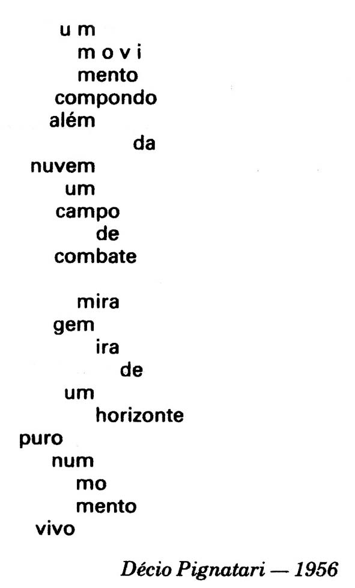
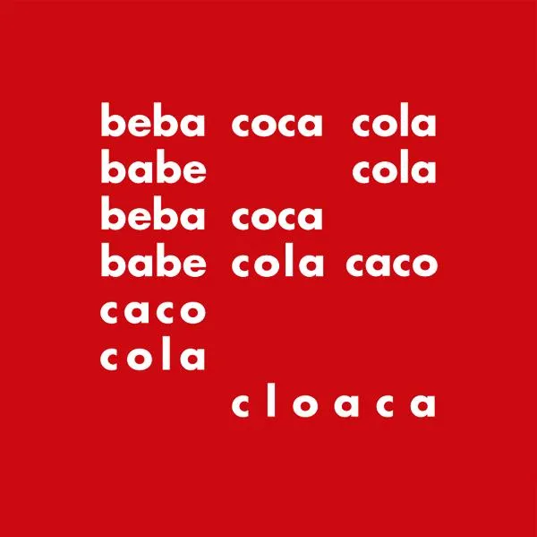
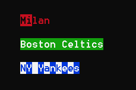
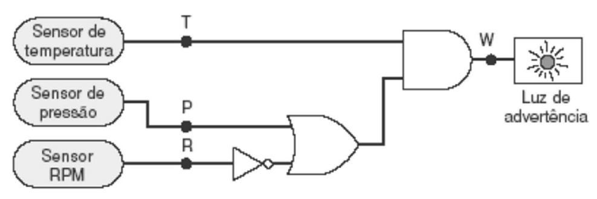
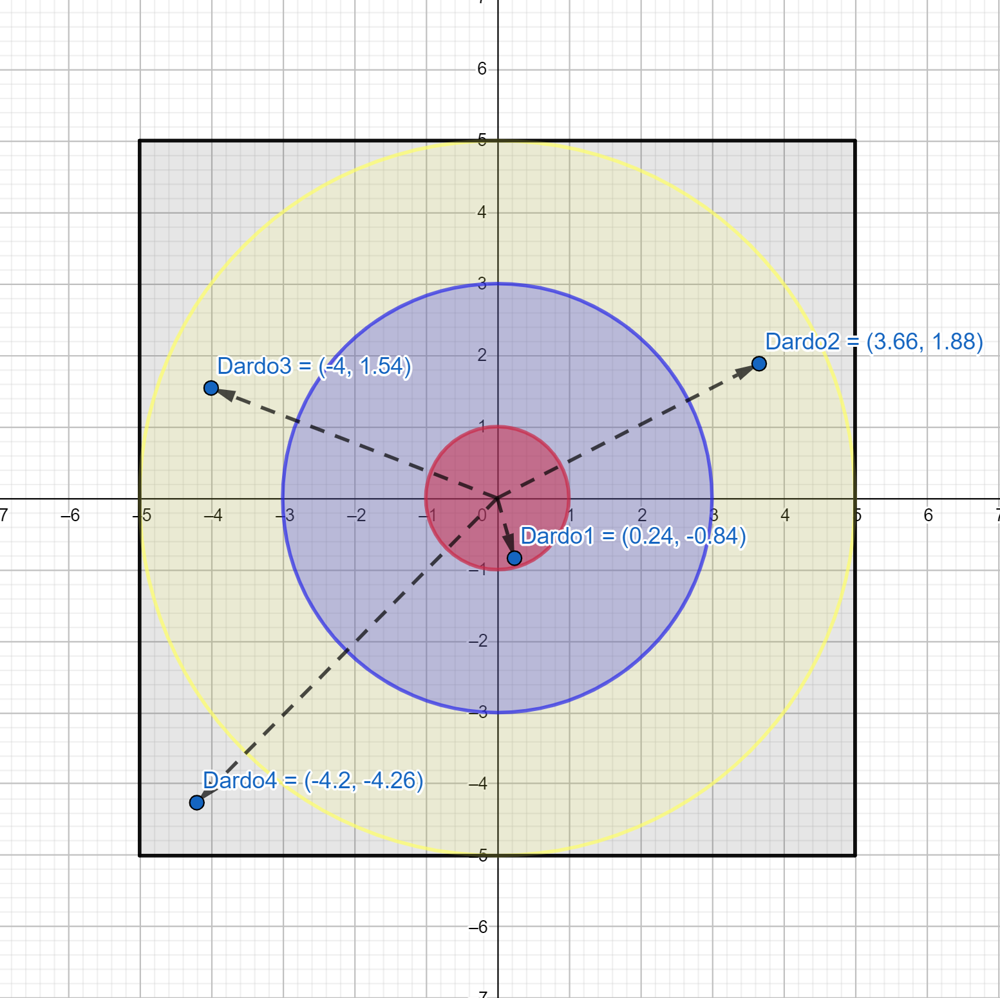
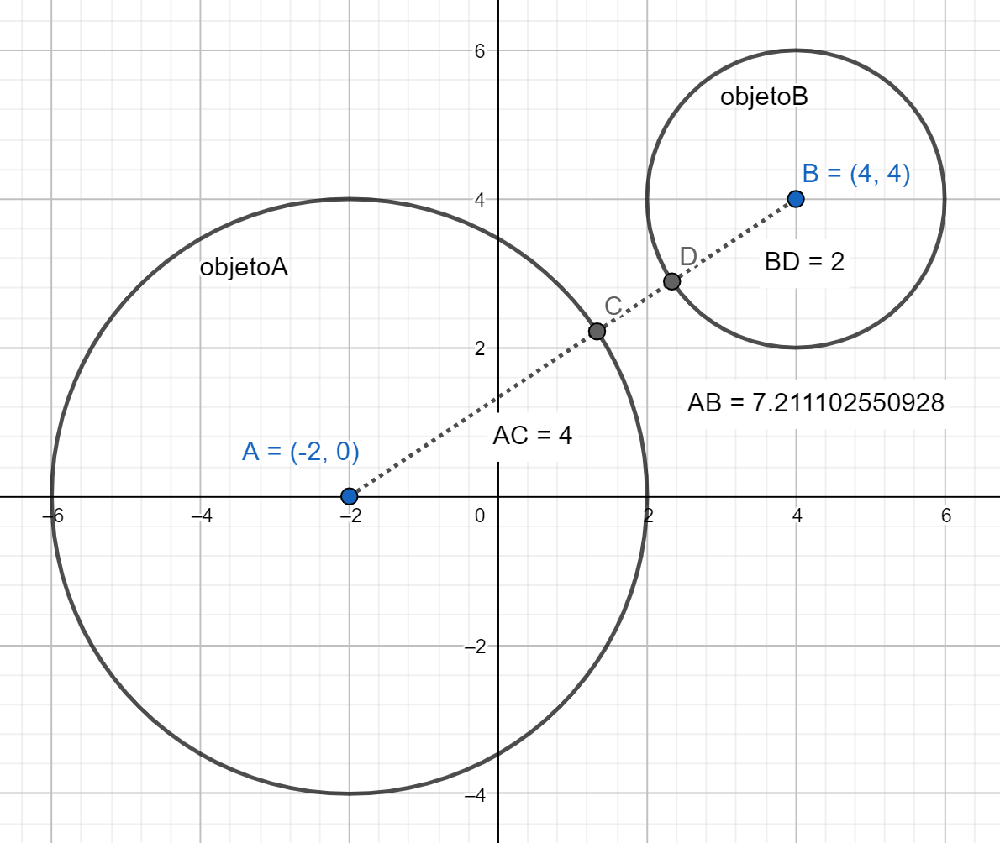
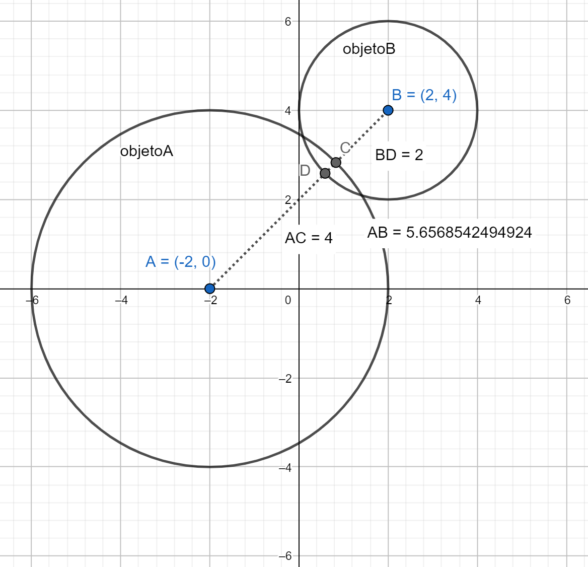
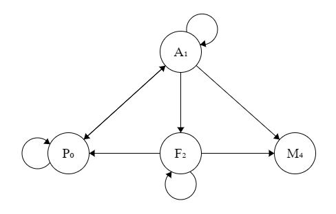

# Índice Geral

- [Saída em console](#Exercícios-Saída-em-console) x 10
- [Entrada de dados e Strings](#Exercícios-Entrada-de-dados-e-Strings) x 10
- [Números e Operadores](#Exercícios-Números-e-Operadores) x 12
- [Decisão e operações lógicas](#Exercícios-Decisão-e-operações-lógicas) x 14
- [Sub-rotinas](#Exercícios-Sub-rotinas) x 7
- [Laços](#Exercícios-Laços) x 11
- [Arranjos](#Exercícios-Arranjos) x 15
- [Classes e Listas](#Exercícios-Classes-e-Listas) x 8

# Ideias

classes e listas
- viloes dmg pg 94
- paradas no metro
--- falta 1

---
outros
- explosão em bolha jogos
- pacote ip

- Água
- Cervejaria
- 3 desejos
- comparacao de preços em quantidades diferentes

livros e afins
- unidade dezena centena --- numeros
- nyquist, shannon redes --- numeros

- bayes falso positivo --- numeros
- intervalo em lista de valores (max menos min) --- numeros
- polinomio y dado x --- funcao

- dv mod11 --- laços
- iniciais do nome --- laços
- divisores --- laços
- raiz quad via heron --- laços
- multiplicação egípcia etíope --- laços

- soletrar --- laços
- benford --- arranjos
- campo minado https://www.puzzle-minesweeper.com/minesweeper-5x5-easy/ --- arranjos
- nonograma https://www.puzzle-nonograms.com/ --- arranjos
- firewall tabela --- arranjo

- queridos (???)

--- sons

https://dfilitto.com.br/desenvolvimento/c-sharp/c-modo-console-musicas-com-o-console-beep/
http://www.dsc.ufcg.edu.br/~jacques/cursos/p2/html/listaexer.htm

************************************** adicionar Thread.Sleep em console

************* Adicionar Substring em https://github.com/ermogenes/aulas-programacao-csharp/blob/master/content/string.md

*********************** IsNullOrEmpty 

******************** adicionar Array.Sort

# Exercícios: Saída em console

Para cada exercício abaixo crie um repositório no GitHub contendo uma aplicação console com o nome indicado.

Correção no [GitHub](https://github.com/ermogenes/correcoes-dev-cs).

Enunciado | Correção | Extras
--- | --- | ---
[Continue](#Exercício-Continue) | _em breve_ | 
[DezSegundos](#Exercício-DezSegundos) | _em breve_ | 
[Haikai](#Exercício-Haikai) | _em breve_ | 
[FrutasPreferidas](#Exercício-FrutasPreferidas) | _em breve_ | 
[Piada](#Exercício-Piada) | _em breve_ | 
[Adivinha](#Exercício-Adivinha) | _em breve_ | 
[TimeDoCoracao](#Exercício-TimeDoCoracao) | _em breve_ | 
[PoemaConcreto](#Exercício-PoemaConcreto) | _em breve_ | 
[BebaCocaCola](#Exercício-BebaCocaCola) | _em breve_ | 
[Pastorzinho](#Exercício-Pastorzinho) | _em breve_ | 

---
## Exercício `Continue`

Faça um programa que exiba a seguinte mensagem:

```
Pressione uma tecla para continuar...
```

Após o usuário pressionar uma tecla, agradeça e finalize o programa.

---
## Exercício `DezSegundos`

Faça um programa que exiba uma contagem de 0 a 10 na mesma linha, aguardando um segundo entre cada número.

Exemplo:
```
Contando até dez: 0
```

(um segundo depois)

```
Contando até dez: 0 1
```

(um segundo depois)

```
Contando até dez: 0 1 2
```

... e assim sucessivamente.

---
## Exercício `FrutasPreferidas`

Faça um programa que exiba as suas 5 frutas preferidas.

Exemplo:
```
--- Minhas frutas preferidas ---

1. Pitaia
2. Mirtilo
3. Atemoia
4. Ingá
5. Araçá
```

---
## Exercício `Piada`

Faça um programa que exiba uma piada à sua escolha.

Exemplo:
```
O professor:
– Quem se acha burro fique em pé.
Joãozinho se levanta:
– Você se acha burro, Joãozinho?
– Não, mas fiquei com dó de ver o senhor em pé sozinho.
```

---
## Exercício `Adivinha`

Faça um programa que exiba um adivinha no formato "_o que é, o que é?_". Faça uma pausa de 5 segundos para que usuário possa pensar na resposta.

Exemplo:
```
O que é, o que é... 
... que o nadador faz para bater o recorde?

Nada.
```

---
## Exercício `PoemaConcreto`

Faça um programa que exiba o seguinte poema concreto:



Saiba mais [aqui](https://www.todamateria.com.br/poesia-concreta/) e [aqui](https://mundoeducacao.uol.com.br/literatura/poesia-concreta.htm).

---
## Exercício `BebaCocaCola`

Faça um programa que exiba o poema concreto _Beba Coca-Cola_, de Décio Pignatari.



---
## Exercício `TimeDoCoracao`

Faça um programa que exiba o nome do seu time do coração (ou um time qualquer, independente do esporte). Utilize as cores do time.

Exemplos:



---
## Exercício `Pastorzinho`

Faça um programa que emita _beeps_ no tom da canção citada em "O Pastorzinho".

```
Dó, ré, mi, fá, fá, fá,
Dó, ré, dó, ré, ré, ré,
Dó, sol, fá, mi, mi, mi,
Dó, ré, mi, fá, fá, fá.
```

Exiba a nota que está sendo tocada no momento.

Ref.: [aqui](https://www.youtube.com/watch?v=gAu7PphBIRU) e [aqui](https://www.youtube.com/watch?v=S9UwYm3hJ7o)

# Exercícios: Entrada de dados e Strings

Para cada exercício abaixo crie um repositório no GitHub contendo uma aplicação console com o nome indicado.

Correção no [GitHub](https://github.com/ermogenes/correcoes-dev-cs).

Enunciado | Correção | Extras
--- | --- | ---
[PrimeroCaractere](#Exercício-PrimeroCaractere) | _em breve_ | 
[PhoneWords](#Exercício-PhoneWords) | _em breve_ | 
[NomeNinja](#Exercício-NomeNinja) | _em breve_ | 
[TextoVazio](#Exercício-TextoVazio) | _em breve_ | 
[AlinhamentoDireita](#Exercício-AlinhamentoDireita) | _em breve_ | 
[Forca](#Exercício-Forca) | _em breve_ | 
[PetHotel](#Exercício-PetHotel) | _em breve_ | 
[TrocaVariaveis](#Exercício-TrocaVariaveis) | _em breve_ | 
[RolagemComposta](#Exercício-RolagemComposta) | _em breve_ | 
[ImitandoDory](#Exercício-ImitandoDory) | _em breve_ | 

---
## Exercício `PrimeroCaractere`

Faça um programa que exiba o primeiro caractere digitado, ignorando espaços em branco.

Digitação | Resultado esperado
--- | ---
`abc` | `a`
`!235` | `!`
`···xyz·····` | `x`

---
## Exercício `PhoneWords`

_Phone words_ são palavras ou frases representadas com caracteres alfanuméricos em substituição aos seus números equivalentes em um teclado telefônico. Tem a função de facilitar a memorização.

Exemplo: Um hotel _Holiday Inn_ com o número `1-800-HOLIDAY` (equivalente a `1-800-465-4329`).

Faça um programa que receba um número telefônico. Converta as _phone words_ nos números equivalentes.

Teclado telefônico padrão ITU-T E.161:


Exemplo:
```
--- Conversor de Phone Words ---

Telefone...: 555-PIZZA

O número digitado é 555-74992.
```

---
## Exercício `NomeNinja`

Receba o nome do usuário. Escreva seu nome ninja:


Exemplo:
```
--- Nome Ninja ---

Digite seu nome: Ermogenes

Seu nome ninja é Kushirinmojikutokuari.
```

---
## Exercício `TextoVazio`

Receba um texto via teclado. Avalie se o texto é vazio ou não.

Exemplos:
```--- Texto Vazio ---

Digite um texto qualquer:    um texto qualquer
False
```

```
--- Texto Vazio ---

Digite um texto qualquer:             
True
```

---
## Exercício `AlinhamentoDireita`

Receba três palavras via teclado. Exiba uma em cada linha, todas alinhadas à direita no 20 caractere.

Exemplo:
```
--- Alinhamento à direita ---

Digite a primeira palavra...: batata
Digite a segunda palavra....: intransigente
Digite a terceira palavra...: caramelo

              batata
       intransigente
            caramelo
```

---
## Exercício `Forca`

No jogo de Forca uma palavra é mantida secreta e tenta-se adivinhar quais letras compõem a palavra.

Faça um programa que receba a palavra secreta e uma letra. Avalie se a letra existe ou não na palavra secreta.

Exemplos:
```
--- Forca ---

Qual a palavra secreta? Jabuticaba
Qual a letra? j

A letra "j" existe na palavra secreta => True 
```

```
--- Forca ---

Qual a palavra secreta? Jabuticaba
Qual a letra? e

A letra "e" existe na palavra secreta => False
```

---
## Exercício `PetHotel`

Faça um programa que receba dados de um _pet_ ao dar entrada em um _pet_ hotel. Exiba os dados ao final do cadastro, seguindo o exemplo.

```
+=========================================================+
|                 Pet Hotel "Nem um pio"                  |
+=========================================================+
| Espécie: ............CÃO | Raça: ............INDEFINIDA |
+=========================================================+
| Atende pela alcunha de: ...........................ZECA |
| Idade: 03 ano(s) | Pelagem/cor: ...............CARAMELO |
+=========================================================+
```

Use cores destacadas para o título e para os dados do _pet_, e cores neutras para as bordas.

---
## Exercício `TrocaVariaveis`

Faça um programa que armazene em duas variáveis os nomes de pessoas fornecidos pelo usuário. Troque os nomes contidos nas variáveis (o primeiro nome vira o segundo e _vice-versa_).

Exiba as variáveis na ordem que foram digitadas de forma a mostrar os nomes em ordem inversa.

Exemplo:
```
--- Troca de Valores ---

Nome 1...: Barbie
Nome 2...: Polly

Após trocar os valores temos:

Nome 1 = Polly
Nome 2 = Barbie
```

---
## Exercício `RolagemComposta`

Na pesquisa do Google podemos efetuar rolagens aleatórias de dados usando a sintaxe `NdF+X`, sendo `N` a quantidade de dados a rolar, `F` a quantidade de faces em cada dado e `X` o valor a acrescentar à soma dos dados.

Por exemplo, digite `2d20+3` para [rolar 2 dados de 20 lados, somá-los e acrescentar 3 ao resultado](https://www.google.com/search?q=2d20%2b3).

Faça um programa que receba uma string nesse formato e grave em variáveis a quantidade de dados, de faces e o valor a acrescentar. Exiba os valores ao usuário.

Exemplo:
```
--- Rolagem de Dados ---

Digite a rolagem desejada...: 4d6+1

4 dado(s) de 6 face(s) mais 1
```

---
## Exercício `ImitandoDory`

Em [uma cena antológica](https://www.youtube.com/watch?v=UjWFVm1loPQ) de "Procurando Nemo" (Pixar, 2003), a personagem Dory (uma cirurgião-patela) tenta se comunicar com uma baleia falando "_baleiês_".


Faça um programa que traduza o texto digitado pelo usuário em _baleiês_, substituindo cada vogal por 3 cópias dela mesma.

Exemplo:
- Em português: "Procurando Nemo"
- Em _baleiês_: "Prooocuuuraaandooo Neeemooo"

# Exercícios: Números e Operadores

Para cada exercício abaixo crie um repositório no GitHub contendo uma aplicação console com o nome indicado.

Correção no [GitHub](https://github.com/ermogenes/correcoes-dev-cs).

Enunciado | Correção | Extras
--- | --- | ---
[InteiroEDecimal](#Exercício-InteiroEDecimal) | _em breve_ | 
[RolagemDeDado](#Exercício-RolagemDeDado) | _em breve_ | 
[TempoDownload](#Exercício-TempoDownload) | _em breve_ | 
[Troco](#Exercício-Troco) | _em breve_ | 
[IndependenciaFinanceira](#Exercício-IndependenciaFinanceira) | _em breve_ | 
[GinasticaArtistica](#Exercício-GinasticaArtistica) | _em breve_ | 
[CustoEnergia](#Exercício-CustoEnergia) | _em breve_ | 
[CreditoRotativo](#Exercício-CreditoRotativo) | _em breve_ | 
[Churrasco](#Exercício-Churrasco) | _em breve_ | 
[HorasDecimais](#Exercício-HorasDecimais) | _em breve_ | 
[FormulaDoPadeiro](#Exercício-FormulaDoPadeiro) | _em breve_ | 
[ColoniaDeBacterias](#Exercício-ColoniaDeBacterias) | _em breve_ | 

---
## Exercício `InteiroEDecimal`

Solicite que o usuário digite um valor real. Exiba separadamente os valores dos componentes inteiro e decimal do número digitado.

Exemplos:
```
--- Inteiro e Decimal ---

Digite um número: 4,0

Parte inteira: 4
Parte decimal: 0,0
```

```
--- Inteiro e Decimal ---

Digite um número: 4,5

Parte inteira: 4
Parte decimal: 0,5
```

---
## Exercício `RolagemDeDado`

Um dado comum possui seis faces numeradas de 1 a 6. Existem dados poliédricos com as mais diversas contagens de faces, sendo as mais comuns 4, 6, 8, 10, 12, e 20.

Faça um programa que receba a quantidade de faces do dado e sorteie aleatoriamente um valor entre 1 e a quantidade de faces informada, simulando uma rolagem.

Exemplos:
```
--- Rolagem de Dado ---

Quantas faces? 12

Rolagem: 11
```

```
--- Rolagem de Dado ---

Quantas faces? 12

Rolagem: 3
```

---
## Exercício `TempoDownload`

Calcule o tempo estimado para _download_ de um arquivo. Para isso, receba o tamanho do arquivo em _megabytes_ (MB) e a velocidade da conexão em _megabits_ por segundo (Mbps). Exiba o tempo em minutos.

Lembre-se que 1 byte = 8 bits (e 1MB = 8Mb).

Exemplo:
```
--- Tempo de Download ---

Tamanho do arquivo em MB........: 105
Velocidade da conexão em Mbps...: 4

Tempo estimado de download: 3,5 minutos
```

---
## Exercício `Troco`

Solicite que o usuário digite o valor da compra e o valor pago. Exiba o valor do troco.

---
## Exercício `IndependenciaFinanceira`

Faça um programa que calcule quanto dinheiro é necessário possuir em um investimento para conseguir sua independência financeira com dividendos (ou seja, os dividendos deverão pagar todos os seus custos). Receba os gastos mensais e o rendimento dos dividendos (_dividend yield_). O valor necessário investido para receber `X` reais de dividendo todo mês com `Y`% de _dividend yield_ é `X ÷ (Y ÷ 100)`.

Valores para teste:
Para receber mensalmente | com _dividend yield_ de | é necessário investir 
--- | --- | ---
R$ 1.000,00 | 1,0% | R$ 100.000,00
R$ 1.000,00 | 0,5% | R$ 200.000,00
R$ 3.500,00 | 1,0% | R$ 350.000,00
R$ 3.500,00 | 0,5% | R$ 700.000,00
R$ 5.000,00 | 1,0% | R$ 500.000,00
R$ 5.000,00 | 0,5% | R$ 1.000.000,00

Exemplo:
```
--- Vivendo de dividendos ---

Gastos mensais (em R$)....: 3500
Rendimentos mensais (%)...: 0,5

Para receber R$ 3.500,00 por mês com rendimentos de 0,5% você precisa ter investido R$ 700.000,00.
```

---
## Exercício `GinasticaArtistica`

Em uma competição de ginástica artística a pontuação de um(a) ginasta é dada pela soma de sua nota de partida com a nota de execução dada pela banca de jurados.

Faça um programa que receba o nome do(a) ginasta, a nota de partida e a nota de execução. Exiba a nota final.

Exemplo:
```
--- Ginástica Artística ---

Ginasta............: Rebeca Andrade
Nota de Partida....: 5,7
Nota de Execução...: 8,366

A nota de Rebeca Andrade foi 14,066.
```

---
## Exercício `CustoEnergia`

Um aparelho _Ar Condicionado Split LG DUAL Inverter 9.000 Frio_ consome 17,1 kWh/mês de energia enquanto ligado, [segundo seu fabricante](https://www.lg.com/br/ar-condicionado-residencial/lg-S4-Q09WA5WB#).


Isso significa que, se utilizado 8h por dia, consome 136,8 kWh/mês. Considerando o custo por kWh de R$0,62258, teríamos um custo estimado de R$85,168944.

Faça um programa que estime o custo de consumo de energia de um aparelho elétrico dado o seu consumo em kWh/mês e o uso diário (em horas).

- `Tempo de uso diário (h)` x `Consumo do aparelho (kWh/mês)` x `Custo da energia (R$/kWh)` = `Custo de um mês de uso (R$)`

```
--- Custo de Energia ---

Consumo do aparelho (em kWh/mês)...: 17,1
Horas de uso por dia...............: 8
Custo da energia (em R$/kWh).......: 0,62258

Custo estimado: R$85,17
```

¹ NeoEnergia, B1-Residencial, Consumo Ativo, sem considerar bandeira tarifária e impostos ([acessado em 04/07/2022](https://www.neoenergiaelektro.com.br/Media/Default/pdf/ELEKTRO_TARIFAS_ENERGIA_ELETRICA_GRUPO_B_27_AGOSTO_2021_REH_N%C2%BA_2.927.pdf)).

---
## Exercício `CreditoRotativo`

Em uma fatura de cartão de crédito a operadora oferta um crédito rotativo, permitindo que o cliente efetue um pagamento inferior ao valor total, mas cobrando o restante na próxima fatura com juros.

Faça um programa que receba o valor total da fatura, o percentual para o pagamento mínimo e a taxa de juros mensais. Exiba o valor do pagamento mínimo, o valor não pago, os juros sobre o rotativo, o valor a ser pago na próxima fatura e o custo do crédito rotativo (valor excedente em relação ao pagamento na fatura corrente). Considere os custos de IOF (Imposto sobre Operações Financeiras) de 0,38% ao mês e 0,0082% ao dia (use 30 dias).

Exemplo:
```
--- Crédito Rotativo de Cartão de Crédito ---

Valor total da fatura (R$)...: 1000
Pagamento mínimo (%).........: 15
Taxa de juros mensais (%)....: 9

Pagamento mínimo..................: R$150,00

Caso seja pago o valor mínimo:

Valor não pago....................: R$850,00
Juros.............................: R$76,50
IOF mensal........................: R$3,23
IOF diário........................: R$2,09

Valor a pagar na próxima fatura...: R$931,82
Custo do crédito rotativo.........: R$81,82
```

---
## Exercício `Churrasco`

Faça um programa que calcule a quantidade de itens necessários para um churrasco a partir da quantidade de adultos (que consomem e que não consomem bebidas alcoólicas) e de crianças.

Item | Por adulto | Por criança
--- | --- | ---
Carne | 400g | 200g
Acompanhamentos | 200g | 200g
Cerveja | 2l | --
Refrigerante | 500ml | 500ml
Água | 400ml | 400ml

Estime cerveja e refrigerantes de acordo com a indicação de consumo dos adultos. Estime refrigerante para todas as crianças. Estime água para todos.

Exemplo:
```
--- Churrasco ---

Adultos (que consomem bebidas alcoólicas).......: 5
Adultos (que não consomem bebidas alcoólicas)...: 3
Crianças........................................: 6

Carne.............: 4,4kg
Acompanhamentos...: 2,8kg
Cerveja...........: 10,0l
Refrigerante......: 4,5l
Água..............: 5,6l
```

Fonte: [Sociedade da Carne](https://www.sociedadedacarne.com.br/blog/como-calcular-quantidade-de-carne-para-churrasco/)

---
## Exercício `HorasDecimais`

Faça um programa que receba um valor decimal de horas e exiba a quantidade de horas, minutos e segundos.

Uma hora possui 60 minutos, e um minuto possui 60 segundos. Exiba os segundos na forma decimal, sem subdividir.

Exemplos:
Horas (com decimais) | Saída
--- | ---
1 | 1h 0min 0,00s
0,5 | 0h 30min 0,00s
2,75 | 2h 45min 0,00s
0,9 | 0h 54min 0,00s
1,51 | 1h 30min 36,00s
1,3253 | 1h 19min 31,24s

Cálculo:
- `Horas Inteiras` = parte inteira de `Entrada`
- `Minutos Restantes` = (parte decimal da `Entrada`) * 60
- `Minutos Inteiros` =  parte inteira de `Minutos Restantes`
- `Segundos Restantes` = (parte decimal de `Minutos Restantes`) * 60

---
## Exercício `FormulaDoPadeiro`

Em panificação, as receitas são geralmente formuladas em razão da quantidade de farinha (chamada de _cem porcento_).

Considere, por exemplo, a seguinte receita de pão italiano:

Ingrediente | Quantidade (em gramas) | Fórmula do Padeiro
--- | --- | ---
Farinha | 500 g | 100%
Água | 350 g | 70%
Fermento | 200 g | 40%
Sal | 10 g | 2%

Faça um programa que calcule a quantidade de ingredientes necessários para a confecção de um pão italiano (a partir da receita acima) para que o peso obtido ao final coincida com o peso desejado.

- `Percentual do pão em relação ao peso da farinha` = soma dos percentuais da receita (no exemplo, 1 + 0,7 + 0,4 + 0,02 = 2,12)
- `Quantidade de farinha` (o chamado  _cem porcento_) = `Peso desejado` / `Percentual do pão em relação ao peso da farinha`
- Demais quantidades = `Quantidade de farinha` x `Percentual do ingrediente na receita`

Exemplos:
```
--- Padaria ---

Peso desejado de pão italiano (em gramas)...: 5000

Ingredientes:
Farinha....: 2.358 g
Água.......: 1.651 g
Fermento...: 943 g
Sal........: 47 g
```

```
--- Padaria ---

Peso desejado de pão italiano (em gramas)...: 1060

Ingredientes:
Farinha....: 500 g
Água.......: 350 g
Fermento...: 200 g
Sal........: 10 g
```

---
## Exercício `ColoniaDeBacterias`

Um grupo de biólogos está estudando o desenvolvimento de uma determinada colônia de bactérias e descobriu que, sob condições ideais, o número de bactérias `n` existente na colônia, considerando uma população inicial de 2000 indivíduos, pode ser encontrado através da expressão `n = 2000 . 2^(0,5t)`, com `t` em horas.

Busca-se saber em quanto tempo a colônia atinge um certo número de indivíduos `n`. Isolando a variável `t`, obtemos a relação `t = 2 . log2( n / 2000 )`.

Faça um programa que receba `n` e exiba `t`.

Exemplo:
```
--- Colônia de Bactérias ---

Qual o número de indivíduos? 8192000

A colônia atingirá 8.192.000 indivíduos em 24,0 horas.
```

# Exercícios: Decisão e operações lógicas

Para cada exercício abaixo crie um repositório no GitHub contendo uma aplicação console com o nome indicado.

Correção no [GitHub](https://github.com/ermogenes/correcoes-dev-cs).

Enunciado | Correção | Extras
--- | --- | ---
[PescaAmadora](#Exercício-PescaAmadora) | _em breve_ | 
[CasaDeTintas](#Exercício-CasaDeTintas) | _em breve_ | 
[MaiorDeTres](#Exercício-MaiorDeTres) | _em breve_ | 
[Multiplo](#Exercício-Multiplo) | _em breve_ | 
[Bissexto](#Exercício-Bissexto) | _em breve_ | 
[FluxogramaDaEngenharia](#Exercício-FluxogramaDaEngenharia) | _em breve_ | 
[Estacionamento](#Exercício-Estacionamento) | _em breve_ | 
[CaixaEletronico](#Exercício-CaixaEletronico) | _em breve_ | 
[DiabetesGestacional](#Exercício-DiabetesGestacional) | _em breve_ | 
[TriagemCovid](#Exercício-TriagemCovid) | _em breve_ | 
[GeneticaMendeliana](#Exercício-GeneticaMendeliana) | _em breve_ | 
[LuzDeAdvertencia](#Exercício-LuzDeAdvertencia) | _em breve_ | 
[NaMosca](#Exercício-NaMosca) | _em breve_ | 
[MesExtenso](#Exercício-MesExtenso) | _em breve_ | 

---
## Exercício `PescaAmadora`

Um pescador amador solicita um software para avaliação da legalidade de sua pesca. Faça um programa que receba o peso do pescado em kg e o local da pesca (`C` ou `M`) e exiba, conforme o caso:

 - `Pescaria dentro dos limites legais.`, ou
 - `Pescaria excede os limites legais em XXX kg. Sujeito a multa de R$ YYY.`

Limites de peso para pesca amadora:
Local | Limites
--- | ---
Águas continentais e estuarinas | 10kg
Águas marinhas | 15kg

Multa prevista em caso de excesso de peso: R$1000,00, com acréscimo de R$20,00 por quilo excedido.

Exemplos:
```
--- Pesca Amadora ---

Peso (em kg)...: 50
Águas [c]ontinentais ou [m]arinhas? m

Pescaria excede os limites legais em 35kg.
Sujeito a multa de R$ 1.700,00.
```

```
--- Pesca Amadora ---

Peso (em kg)...: 5
Águas [c]ontinentais ou [m]arinhas? c

Pescaria dentro dos limites legais.
```

```
--- Pesca Amadora ---

Peso (em kg)...: 15,5
Águas [c]ontinentais ou [m]arinhas? m

Pescaria excede os limites legais em 0,5kg.
Sujeito a multa de R$ 1.010,00.
```

```
--- Pesca Amadora ---

Peso (em kg)...: 5666
Águas [c]ontinentais ou [m]arinhas? x

Local não reconhecido.
```

---
## Exercício `CasaDeTintas`

Faça uma calculadora para uma casa de tintas. O usuário fornecerá a área a ser pintada (em m²) e será informado sobre a quantidade de produtos necessários para cobrir a área indicada.

Acrescente 10% à tinta necessária, como margem para erros.

As tintas são vendidas em dois tipos de recipientes:

Recipiente | Conteúdo
--- | ---
Lata | 18 litros
Galão | 3,6 litros

Considere um rendimento fixo de 3m²/l de tinta.

Exemplo:
```
--- Casa de Tintas ---

Área a ser pintada (m²)...: 60

Total de 22,0 litro(s) de tinta.

Distribuição:
Latas...: 1 unidade(s)
Galões..: 2 unidade(s)
```

---
## Exercício `MaiorDeTres`

Receba três números inteiros. Exiba somente o maior dos 3.


---
## Exercício `Multiplo`

Determine se um número é múltiplo de outro.

Exemplos:
```
--- Múltiplo ---

Digite um número...........: 187
Avaliar se é múltiplo de...: 11

187 é múltiplo de 11
```

```
--- Múltiplo ---

Digite um número...........: 188
Avaliar se é múltiplo de...: 11

188 não é múltiplo de 11
```

---
## Exercício `Bissexto`

Determine se um ano fornecido pelo usuário [é ou não bissexto](https://escolakids.uol.com.br/matematica/calculo-do-ano-bissexto.htm).

[Regra para o cálculo dos anos bissextos](https://pt.wikipedia.org/wiki/Ano_bissexto):

1. A cada 400 anos temos com certeza um ano bissexto.
2. A cada 100 anos o ano não é bissexto, exceto quando é bissexto pela regra 1.
3. A cada 4 anos o ano é bissexto, exceto quando não é bissexto pela regra 2.

Exemplos de valores para teste:
- Bissextos pela regra 1: 400, 800, 1200, 1600, 2000, 2400
- Não bissextos pela regra 2: 100, 200, 300, 500, 600,... , 1500, 1700, 1800, 1900, 2100
- Bissextos pela regra 3: 4, 8, 12, ..., 1992, 1996, 2004, ..., 2092, 2096, 2104

---
## Exercício `FluxogramaDaEngenharia`

Faça um programa que implemente o meme _Fluxograma da Engenharia_.


Exemplos:
```
--- Fluxograma da Engenharia ---

O objeto está se movendo (S/N)? N
Deveria? S

Use WD-40.
```

```
--- Fluxograma da Engenharia ---

O objeto está se movendo (S/N)? S
Deveria? N

Use Silver Tape.
```

```
--- Fluxograma da Engenharia ---

O objeto está se movendo (S/N)? N
Deveria? N

Ótimo!
```

---
## Exercício `Estacionamento`

Um estacionamento possui a seguinte política de preços:

- Primeira hora: R$ 20,00
- Horas adicionais:
	- Carros grandes: R$ 20,00/hora adicional
	- Carros pequenos: R$ 10,00/hora adicional
- Diária (5 horas ou mais):
	- Carros grandes: R$ 80,00
	- Carros pequenos: R$ 50,00
- Tolerância (na saída): 5min
- _Valet_ (manobrista): 20% adicional no valor do estacionamento
- Lavagem:
	- Carros grandes: R$ 100,00
	- Carros pequenos: R$ 50,00

Faça um programa que receba o tamanho do veículo (P/G), o total de minutos que o veículo ficou estacionado, se foi utilizado o serviço de _valet_ (S/N) e a inclusão de serviço de lavagem (S/N). Exiba o valor final a ser pago, com os valores parciais.

_Não aceite tempos de permanência maiores do que 12 horas._ 

Exemplos:
```
--- Estacionamento ---

Tamanho do veículo (P/G).....: p
Tempo de permanência (min)...: 473
Serviço de valet (S/N).......: n
Serviço de lavagem (S/N).....: n

Estacionamento..:       R$ 50,00
Valet...........:        R$ 0,00
Lavagem.........:        R$ 0,00
--------------------------------
Total...........:       R$ 50,00
```

```
--- Estacionamento ---

Tamanho do veículo (P/G).....: g
Tempo de permanência (min)...: 123
Serviço de valet (S/N).......: s
Serviço de lavagem (S/N).....: s

Estacionamento..:       R$ 40,00
Valet...........:        R$ 8,00
Lavagem.........:      R$ 100,00
--------------------------------
Total...........:      R$ 148,00
```

---
## Exercício `CaixaEletronico`

Ao realizar um saque um caixa eletrônico calcula a quantidade de notas a entregar ao solicitante. Faça um programa que dado um valor desejado para saque (o número deve ser positivo e não pode conter centavos), calcule a quantidade de cada nota a ser entregue. Dê preferência para notas de valor mais alto.

Notas disponíveis: 1, 2, 5, 10, 20, 50, 100 e 200 reais

Exemplo:
```
--- Caixa Eletrônico ---

Digite o valor a ser sacado...: 298,00

O caixa deve entregar:
1 nota(s) de R$200,00
1 nota(s) de R$50,00
2 nota(s) de R$20,00
1 nota(s) de R$5,00
1 nota(s) de R$2,00
1 nota(s) de R$1,00
```

---
## Exercício `DiabetesGestacional`

Segundo a Sociedade Brasileira de Diabetes¹, a avaliação de Diabetes em grávidas é realizada através de um exame de glicemia comparado com a tabela abaixo:

```
< 92 mg/dL (reavaliar entre 24 e 28 semanas com TTOG 75g de glicose)
= ou > 92 mg/dL e < 126 mg/dL = Compatível com Diabetes Gestacional
= ou > 126 mg/dL = Diabetes Mellitus na Gravidez
```

Faça um programa que receba o valor de glicemia (em mg/dL) e exiba o diagnóstico adequado.

¹ _International Association of the Diabetes and Pregnancy Study Groups_ (IADPSG), OMS Diretrizes da Sociedade Brasileira de Diabetes 2017-2018.

---
## Exercício `TriagemCovid`

Um possível procedimento¹ para triagem de pacientes com COVID-19:

Pacientes que não apresentem febre², tosse² ou outros sintomas respiratórios² não recebem nenhuma recomendação específica.

Avalia-se a presença de fatores de risco ou sinais de alarme. Caso presentes, são encaminhados para o sistema de saúde ou para uma ambulância de acordo com a gravidade². Caso contrário, recomenda-se isolamento domiciliar.

- Sinais de alarme: falta de ar², aumento de frequência respiratória², dor torácica² e sensação de desmaio².
- Fatores de risco para menores: hipertensão arterial sistêmica², diabetes melito² e outras doenças crônicas².
- Fatores de risco para maiores: 65 anos ou mais, doença coronariana prévia², doença crônica descompensada² e aumento de frequência respiratória².

Faça um programa que conduza um operador ao telefone a efetuar as perguntas necessárias para realização da triagem. Comece pela idade, e faça perguntas diretas que possam ser respondidas com [S]im ou [N]ão (itens sinalizados com a marcação ²). Evite duplicar perguntas.

Exiba um dos resultados abaixo:
- _Nenhuma recomendação específica_ (em verde)
- _Recomendar isolamento domiciliar_ (em amarelo)
- _Encaminhar para o sistema de saúde_ (em magenta)
- _Encaminhar ambulância para o local_ (em vermelho)

¹ Adaptado de https://www.slmandic.edu.br/tudo-sobre-coronavirus/.

---
## Exercício `GeneticaMendeliana`

A lei da dominância de Mendel afirma que todos os descendentes de progenitores que diferem em uma característica terão o fenótipo de apenas um deles, o dominante (expressado comumente pelo alelo `A`). A característica preterida é chamada recessiva (`a`), e só se manifesta caso ambos os fatores sejam recessivos.

Considere dois tipos de dominância:
- dominância completa: há duas possibilidades, e a característica só ocorre em indivíduos `aa` (ex.: o albinismo em humanos).
- dominância incompleta: há três possibilidades, sendo uma delas intermediária (ex.: a coloração da boca-de-leão (_Antirrhinum majus_) é vermelha quando `AA`, branca quando `aa` e rosa quando `Aa`).


Faça um programa que receba os alelos de dois indivíduos e as probabilidades da característica se manifestar em seus descendentes diretos. Considere o caso como dominância completa ou incompleta, conforme seleção do usuário.

Exemplos:
```
--- Genética Mendeliana ---

Alelos do indivíduo 1 (AA, Aa ou aa)...: Aa
Alelos do indivíduo 2 (AA, Aa ou aa)...: aa
Tipo de dominância (C/I)...............: C

  | A  |  a
-----------
a | Aa | aa
-----------
a | Aa | aa

AA:   0% - não apresenta a característica recessiva
Aa:  50% - não apresenta a característica recessiva
aa:  50% - apresenta a característica recessiva
``` 

```
--- Genética Mendeliana ---

Alelos do indivíduo 1 (AA, Aa ou aa)...: Aa
Alelos do indivíduo 2 (AA, Aa ou aa)...: Aa
Tipo de dominância (C/I)...............: I

  | A  |  a
-----------
A | AA | Aa
-----------
a | Aa | aa

AA:  25% - apresenta a característica de `A`
Aa:  50% - apresenta característica distinta de `A` e de `a`
aa:  25% - apresenta a característica de `a`
```

---
## Exercício `LuzDeAdvertencia`

Uma luz de advertência `W` é acessa no painel de um automóvel somente quando:
- o sensor `T` de temperatura está ativado, e...
- ...pelo menos uma das duas situações seguintes ocorrem:
	- o sensor `P` de pressão está ativado.
	- o sensor `R` de rotação está desativado.



Faça um simulador do circuito que controla a luz `W`. Receba o estado de cada um dos sensores ([A]tivado, [D]esativado) e calcule o estado da luz de advertência.

Exemplo:
```
--- Simulador de Luz de Advertência ---

[A]tivado, [D]esativado

Sensor de temperatura...: A
Sensor de pressão.......: D
Sensor de rotação.......: D

A luz de advertência estará ATIVADA.
```

Imagem: [lbertini@UFF](https://www.professores.uff.br/lbertini/wp-content/uploads/sites/108/2017/08/Capitulo-3-Portas-Logicas-e-Algebra-Booleana.pdf)

---
## Exercício `NaMosca`

[Dardos](https://pt.wikipedia.org/wiki/Dardos) é um esporte em que se arremessam pequenas flechas contra um alvo circular com pontuações específicas atribuídas ao acerto em cada região.

Implemente um programa em que o usuário informe o ponto de acerto do dardo através de sua coordenada cartesiana (com o centro do alvo em `(0, 0)`). Calcule a distância em relação ao centro (utilizando o [teorema de Pitágoras](https://pt.wikipedia.org/wiki/Teorema_de_Pit%C3%A1goras)).
- Arremessos distantes `[0, 1]` acertam "na mosca" (exemplo: o `Dardo1`);
- Arremessos distantes `]1, 3]` são "bons" (exemplo: um dardo na área azul);
- Arremessos distantes `]3, 5]` são "ruins" (exemplo: os `Dardo2` e `Dardo3`);
- Arremessos a distâncias maiores que 5 são considerados "erros" (exemplo: o `Dardo4`).



Exemplos:
```
--- Dardos ---

Digite a coordenada X..: 0,24
Digite a coordenada Y..: -0,84

Distância do centro: 0,87

Acertou na mosca!
```

```
--- Dardos ---

Digite a coordenada X..: -4
Digite a coordenada Y..: 1,54

Distância do centro: 4,28

Arremesso ruim...
```

---
## Exercício `MesExtenso`

Faça um programa que receba um número de 1 a 12 e exiba o nome do mês correspondente.

Exemplo:
```
--- Mês por extenso ---

Digite o número do mês...: 9

Setembro
```

# Exercícios: Sub-rotinas

Para cada exercício abaixo crie um repositório no GitHub contendo uma aplicação console com o nome indicado.

Correção no [GitHub](https://github.com/ermogenes/correcoes-dev-cs).

Enunciado | Correção | Extras
--- | --- | ---
[AlarmeFalso](#Exercício-AlarmeFalso) | _em breve_ | 
[Escada](#Exercício-Escada) | _em breve_ | 
[HorasExtras](#Exercício-HorasExtras) | _em breve_ | 
[ColisaoCircular2D](#Exercício-ColisaoCircular2D) | _em breve_ | 
[RaioETrovao](#Exercício-RaioETrovao) | _em breve_ | 
[Granizo](#Exercício-Granizo) | _em breve_ | 
[AlcoolOuGasolina](#Exercício-AlcoolOuGasolina) | _em breve_ | 
<!-- [ParadoxoDoAniversario](#Exercício-ParadoxoDoAniversario) | _em breve_ |  -->

<!--
---
## Exercício `ParadoxoDoAniversario`

O paradoxo do aniversário afirma que dado um grupo de 23 pessoas escolhidas aleatoriamente, a chance de que duas pessoas terão a mesma data de aniversário é de mais de 50%. Para 57 ou mais pessoas, a probabilidade é maior do que 99%, entretanto, ela não pode ser exatamente 100% exceto que se tenha pelo menos 367 pessoas. Calcular essa probabilidade (e as relacionadas a ela) é o problema do aniversário, apresentado pela primeira vez pelo matemático polonês Richard von Mises (irmão mais novo do famoso economista Ludwig von Mises).

Escreva uma função que calcule a probabilidade de um grupo de tamanho `n` possuir duas ou mais pessoas com a mesma data de aniversário. Desconsidere variações como anos bissextos e gêmeos.

Essa probabilidade é dada por:


Valores para teste:
`n` | `f(n)`
--- | ---
10 | 12%
20 | 41%
23 | 50.7%
30 | 70%
50 | 97%
100 | 99.99996%
200 | 99.9999999999999999999999999998%
367 | 100%
-->

---
## Exercício `AlarmeFalso`

Imagine que um paciente faz um exame para uma doença e recebe um resultado positivo. Tal exame apresenta uma precisão de 87% e a doença incide em 1% da população. O médico, conhecedor de estatística, diz ao paciente que não se preocupe, já que provavelmente é um alarme falso (chances de exatamente 93.7%).

A intuição errada de resultados sem levar em consideração a base de incidência é conhecida como _mito de probabilidade de base_.

Escreva uma função que calcule a probabilidade de um exame médico positivo indicar um alarme falso `f` dados a precisão do exame `p` e a incidência na população `i`.

Usando o [teorema de Bayes](https://pt.wikipedia.org/wiki/Teorema_de_Bayes), temos que `f = (1-p)(1-i) / ( pi + (1-p)(1-i) )`.

Valores para teste:
`p` | `i` | `f`
--- | --- | ---
0,87 | 0,01 | 0,937
0,999 | 0,01 | 0,09
0,999 | 0,0001 | 0,91

---
## Exercício `Escada`

Uma escada ficará enconstada em uma parede caso forme entre ela e o chão um ângulo menor do que 90˚.

Escreva uma função que calcule a altura alcançada pela escada dados o comprimento da escada (em m) e o ângulo em relação ao chão (em graus).

_Converta o ângulo em graus para radianos, fazendo `(π graus) / 180`._

Para calcular a altura, saiba que o comprimento da escada equivale à razão entre a altura e o seno do ângulo.

Em , `b = c.senβ`.

Valores para teste:
escada | ângulo | parede
--- | --- | ---
4 | 70 | 3,76
4 | 45 | 2,83
5 | 70 | 4,70

Mais valores de teste [aqui](https://www.calculat.org/pt/area-perimetro/triangulo-retangulo.html).

---
## Exercício `HorasExtras`

Escreva uma função que calcule o salário de um funcionário a partir salário-hora base, o total de horas trabalhadas e número de horas-extras executadas. Considere que cada hora-extra é paga com acréscimo de 40%.

---
## Exercício `ColisaoCircular2D`

Chamamos de algoritmos de detecção de colisão 2D os procedimentos que permitem avaliar se dois objetos em um mesmo plano se sobrepõem. A principal aplicação é a computação gráfica, em especial para simulações de física em jogos.

Escreva uma função que recebe as coordenadas cartesianas e o raio de duas circunferências, que representam o espaço ocupado por dois objetos. Retorne um _booleano_ indicando se os objetos colidem ou não.

Exemplos com os objetos `A` de raio 4 e `B` de raio 2:
 
Com `A` centrado em `(-2,0)` e `B` centrado em `(4,4)` não há colisão.


Com `A` centrado em `(-2,0)` e `B` centrado em `(2,4)` há colisão.


Saiba mais [aqui](https://developer.mozilla.org/pt-BR/docs/Games/Techniques/2D_collision_detection).

---
## Exercício `RaioETrovao`

Escreva uma função que retorne a distância (em km) entre um observador e o local de queda de um raio. Receba como entrada o tempo decorrido entre o raio e o trovão (em segundos).

Aproxime a velocidade do som para 340,29m/s.

Valores para teste

Tempo (s) | Distância (km)
--- | ---
3 | 1,02087
6 | 2.04174

---
## Exercício `Granizo`

Em 1937, o matemático alemão Lothar Collatz propôs uma [sequência numérica](https://pt.wikipedia.org/wiki/Conjectura_de_Collatz) que seria conhecida posteriormente como __números de granizo__, pois "_como o granizo nas nuvens antes de cair, os números saltam de um lugar ao outro antes de chegar ao 4, 2, 1_". O problema chega sempre ao mesmo ponto, não importa como.

Escreva uma sub-rotina que receba um número inteiro `x` e exiba a sequência de Collatz iniciando em `x`.

- Se `x` é par, divida-o por 2;
- Se `x` é ímpar, multiplique-o por 3 e some 1;
- Repita o processo enquanto `x` for maior que 1.

Saiba mais [aqui](https://www.bbc.com/portuguese/geral-36702054).

## Exercício `AlcoolOuGasolina`

Um automóvel _flex_ pode ser abastecido com gasolina ou com etanol (_álcool_). O senso comum diz que é mais vantajoso abastecer com gasolina caso a relação entre os preços seja maior do que 70%. [Esta pesquisa](https://autopapo.uol.com.br/noticia/porcentagem-gasolina-ou-etanol/) diz que o percentual ideal deve ser próximo de 73%.

Escreva uma sub-rotina que retorne a razão entre o preço do etanol e da gasolina (etanol ÷ gasolina). Escreva outra sub-rotina que utilize o resultado da primeira para retornar um booleano indicando se vale a pena ou não abastecer com gasolina (_considere o percentual de 73%_).

Escreva um programa que recebe o valor do etanol e o valor da gasolina. Exiba a razão entre os preços e a recomendação de uso. Utilize as sub-rotinas criadas.

Exemplos:
```
--- Etanol ou Gasolina? ---

Digite o preço do etanol (R$).....: 4,00
Digite o preço da gasolina (R$)...: 6,00

O preço do etanol corresponde a 66,7% do preço da gasolina.

Recomendação: Abasteça com ETANOL.
```

```
--- Etanol ou Gasolina? ---

Digite o preço do etanol (R$).....: 5,20
Digite o preço da gasolina (R$)...: 7,00

O preço do etanol corresponde a 74,3% do preço da gasolina.

Recomendação: Abasteça com GASOLINA.
```

# Exercícios: Laços

Para cada exercício abaixo crie um repositório no GitHub contendo uma aplicação console com o nome indicado.

Correção no [GitHub](https://github.com/ermogenes/correcoes-dev-cs).

Enunciado | Correção | Extras
--- | --- | ---
[EntradaValida](#Exercício-EntradaValida) | _em breve_ | 
[UrnaPlebiscito](#Exercício-UrnaPlebiscito) | _em breve_ | 
[Potencia](#Exercício-Potencia) | _em breve_ | 
[AmortizacaoConstante](#Exercício-AmortizacaoConstante) | _em breve_ | 
[AmortizacaoFrancesa](#Exercício-AmortizacaoFrancesa) | _em breve_ | 
[AnelDeCoracao](#Exercício-AnelDeCoracao) | _em breve_ | 
[EspertoContraSabido](#Exercício-EspertoContraSabido) | _em breve_ | 
[TrintaESeis](#Exercício-TrintaESeis) | _em breve_ | 
[Ursos](#Exercício-Ursos) | _em breve_ | 
[BarraDeProgresso](#Exercício-BarraDeProgresso) | _em breve_ | 
[NPC](#Exercício-NPC) | _em breve_ | 

---
## Exercício `EntradaValida`

Solicite que o usuário entre com um valor inteiro entre `1` e `9` (inclusive). Informe que a entrada `0` sinaliza um cancelamento. Não finalize o programa enquanto não houver uma entrada válida ou um cancelamento.

Exemplos:
```
--- Entrada Válida ---

Digite um número entre 1 e 9 (ou 0 para cancelar)...: -5
Digite um número entre 1 e 9 (ou 0 para cancelar)...: 12
Digite um número entre 1 e 9 (ou 0 para cancelar)...: 10
Digite um número entre 1 e 9 (ou 0 para cancelar)...: 0

Operação cancelada.

Volte sempre!
```

```
--- Entrada Válida ---

Digite um número entre 1 e 9 (ou 0 para cancelar)...: 2

Número selecionado = 2

Volte sempre!
```

---
## Exercício `UrnaPlebiscito`

Faça uma urna eletrônica para um plebiscito organizado pelo grêmio estudantil de uma escola  _fictícia_.

A pergunta a ser realizada é: _Você é a favor da proibição do uso de boné em sala de aula?_

As alternativas possíveis são:
- `S` - Sim, sou a favor
- `N` - Não, sou contra
- `A` - Me abstenho de responder

Mantenha o registro da quantidade de votos em cada alternativa.

Garanta que um eleitor não possa ver o voto do eleitor anterior.

Antes de cada voto, o mesário deverá liberar o voto para o eleitor. Peça que o mesário indique a ação subsequente. Aceite as seguintes opções (sem mostrar as opções na tela):

- `P` - Liberar votação do próximo eleitor
- `s234f$WR` - Código secreto para fechar a urna (finalizar votação)

Ao finalizar, exibir a contagem de votos em cada opção, o percentual de votos válidos (abstenção não conta como _válido_) e o resultado final:

- Deve haver maioria simples de votos válidos (o total de `SIM` + `NÃO` deve ser maior do que a metade do total de votos). Caso não haja, o resultado é `INDETERMINADO`.
- O plebiscito então é `APROVADO` se possuir mais aprovações do que desaprovações. Caso contrário é `REPROVADO`.

Exemplo:

_(limpa a tela)_

```
--- Urna Eletrônica ---

Plebiscito: Você é a favor da proibição do uso de boné em sala de aula?

Aguarde a intervenção do mesário... _
```

Mesário digita `P`:

_(limpa a tela)_

```
--- Urna Eletrônica ---

Plebiscito: Você é a favor da proibição do uso de boné em sala de aula?

    S - Sim, sou a favor
    N - Não, sou contra
    A - Me abstenho de responder

Digite a opção desejada e pressione [ENTER]: S

Você votou "Sim, sou a favor"

Pressione uma tecla para finalizar sua votação... _
```

_(limpa a tela)_

```
--- Urna Eletrônica ---

Aguarde a intervenção do mesário... _
```

Mesário digita `s234f$WR`:

_(limpa a tela)_

```
--- Urna Eletrônica ---

Plebiscito: Você é a favor da proibição do uso de boné em sala de aula?

Finalizado com o total de 1 voto(s).

Contagem de votos:
S - Sim, sou a favor         - 1 (100,0%)
N - Não, sou contra          - 0 (0,0%)
A - Me abstenho de responder - 0 (0,0%)

Votos válidos: 1 (100,0%)

Resultado do plebiscito: APROVADO
```

---
## Exercício `Potencia`

Receba dois números inteiros positivos, base e expoente. Calcule e exiba o valor do primeiro número elevado ao segundo número. Não utilize `Math.Pow`.

Lembre-se que, por definição, se o expoente for zero a potência será 1.

_Quando em uma iteração a potência se tornar zero ou negativa, foi estourado o limite do tipo inteiro e não será possível realizar a operação. _

---
## Exercício `AmortizacaoConstante`

Simule um financiamento utilizando o sistema de amortização constante (Tabela SAC). Nessa modalidade, é pago um valor fixo a cada mês, acrescidos os juros sobre o saldo devedor anterior. Na prática, a prestação é menor a cada período.

Receba o valor total do financiamento (`Principal`), a quantidade de meses (`Períodos`) e a taxa de juros (`Taxa`). Exiba uma tabela com período, amortização, juros, prestação, valor pago e saldo devedor.

Valor constante em todos os períodos:
- `Amortização` = `Principal` / `Períodos`

Valores variáveis por período:
- `Juros` = (`SaldoDevedor` do período anterior) * `Taxa`
- `Prestação` = `Amortização` + `Juros`
- `ValorPago` = Soma dos valores de todas as prestações anteriores
- `SaldoDevedor` = (`SaldoDevedor` do período anterior) - `Amortização`

Exemplo:
```
--- Tabela SAC ---

Principal (em R$)..: 1000,00
Períodos...........: 4
Taxa (em %)........: 5
```

Período | Amortização | Juros | Prestação | Valor Pago | Saldo Devedor
--- | --- | --- | --- | --- | ---
0 |  |  |  |  | R$ 1.000,00
1 | R$ 250,00 | R$ 50,00 | R$ 300,00 | R$ 300,00 | R$ 750,00
2 | R$ 250,00 | R$ 37,50 | R$ 287,50 | R$ 587,50 | R$ 500,00
3 | R$ 250,00 | R$ 25,00 | R$ 275,00 | R$ 862,50 | R$ 250,00
4 | R$ 250,00 | R$ 12,50 | R$ 262,50 | R$ 1.125,00 | R$ 0,00

Você pode simular valores para teste [aqui](https://ermogenes.github.io/sac-price-js/).

---
## Exercício `AmortizacaoFrancesa`

Simule um financiamento utilizando o sistema de amortização francês (Tabela PRICE). Nessa modalidade, é paga uma prestação fixa a cada mês. Os juros são rateados a cada período de forma que o valor da prestação se mantenha sempre igual.

Receba o valor total do financiamento (`Principal`), a quantidade de meses (`Períodos`) e a taxa de juros (`Taxa`). Exiba uma tabela com período, prestação, juros, amortização, valor pago e saldo devedor.

Valor constante em todos os períodos:
- `Prestação` = `Principal` x [(1 + `Taxa`)<sup>`Períodos`</sup> x `Taxa`] / [(1 + `Taxa`)<sup>`Períodos`</sup> - 1]

Valores variáveis por período:
- `Juros` = (`SaldoDevedor` do período anterior) * `Taxa`
- `Amortização` = `Prestação` - `Juros`
- `ValorPago` = Soma dos valores de todas as prestações anteriores
- `SaldoDevedor` = (`SaldoDevedor` do período anterior) - `Amortização`

Exemplo:
```
--- Tabela PRICE ---

Principal (em R$)..: 1000,00
Períodos...........: 4
Taxa (em %)........: 5
```

Período | Amortização | Juros | Prestação | Valor Pago | Saldo Devedor
--- | ---  | ---  | ---  | ---  | ---
0 |  |  |  |  | R$ 1.000,00
1 | R$ 232,01 | R$ 50,00 | R$ 282,01 | R$ 282,01 | R$ 767,99
2 | R$ 243,61 | R$ 38,40 | R$ 282,01 | R$ 564,02 | R$ 524,38
3 | R$ 255,79 | R$ 26,22 | R$ 282,01 | R$ 846,04 | R$ 268,58
4 | R$ 268,58 | R$ 13,43 | R$ 282,01 | R$ 1.128,05 | R$ 0,00

Você pode simular valores para teste [aqui](http://drcalc.net/price.asp).

---
## Exercício `AnelDeCoracao`

Na DLC _The Delicious Last Course_ (2022) do premiado game _Cuphead_ (Studio MDHR), o item _Anel de Coração_ concede benefícios ao seu portador na primeira, terceira e sexta ocorrências de um evento.


A ideia é que a obtenção de cada novo benefício se torne mais difícil do que a anterior, aumentando em 1 a quantidade necessária de ocorrências do evento em relação ao benefício anterior.

`Benefícios recebidos` + "_dificuldade_" = `Eventos a aguardar`
```
0 + 1 = 1
1 + 2 = 3
3 + 3 = 6
```

Faça um programa que exiba os 10 primeiros elementos dessa sequência.

Exemplo:
```
1 3 6 10 15 21 28 36 45 55
```

---
## Exercício `EspertoContraSabido`

Em um genial episódio¹ da animação Pica-Pau (_Woody Woodpecker_) a personagem Raposinha (_Fink Fox_) divide uma certa quantidade de comida "_igualmente_" com o protagonista.


```
1 para você. 1 para mim.
2 para você. 1, 2 para mim.
3 para você. 1, 2, 3 para mim.
...
```

Seguindo a lógica da Raposinha, faça um programa que receba a quantidade inicial de comida e exiba o passo-a-passo da contagem. Ao final, exiba a quantidade de itens entregues à Raposinha e ao Pica-Pau.

Exemplo:
```
--- Esperto Contra Sabido ---

Quantos alimentos serão distribuídos? 22

1 para você. 1 para mim.
2 para você. 1, 2 para mim.
3 para você. 1, 2, 3 para mim.
4 para você. 1, 2, 3, 4 para mim.
5 para você. 1, 2, 3, 4, 5 para mim.
6 para você. 1 para mim.

Pica-pau recebeu 6 alimento(s).
Raposinha recebeu 16 alimento(s).
```

¹ Walter Lantz, 1964. [Pica-Pau: Esperto Contra Sabido (Dumb Like a Fox)](https://walterlantz.fandom.com/wiki/Dumb_Like_a_Fox). Episódio 133. Universal. ([Esquete](https://www.youtube.com/watch?v=Xyq1Ou_bTJQ), [episódio completo](https://www.youtube.com/watch?v=8oS3bm2OEHs)).

---
## Exercício `TrintaESeis`

Implemente uma versão modificada do jogo de dados `36` para um jogador contra a CPU.

Primeiro sorteia-se o jogador inicial. Os jogadores alternam suas rodadas. Em sua rodada o jogador pode rolar 1, 2 ou 3 dados. Ao rolar, o valor da soma dos dados é somado ao placar do jogador. Se ele atingir 36, vence. Se ele passar de 36, perde o jogo.

Uma possível IA para a CPU: A CPU joga 3 dados se tiver 0-20 pontos, 2 dados se tiver 21-27 pontos, e 1 dado caso 28-35 pontos.

Exemplo:
```
--- 36 vs. CPU ---

Sorteando o jogador inicial... CPU.

--- CPU ---
Pontos = 0
Dados: 3
1 6 4
Pontos = 11

--- HUMANO ---
Pontos = 0
Dados: 3
6 6 3
Pontos = 15

--- CPU ---
Pontos = 11
Dados: 3
5 5 2
Pontos = 23

--- HUMANO ---
Pontos = 15
Dados: 3
1 2 1
Pontos = 19

--- CPU ---
Pontos = 23
Dados: 3
6 1 3
Pontos = 33

--- HUMANO ---
Pontos = 15
Dados: 1
6
Pontos = 25

--- CPU ---
Pontos = 33
Dados: 1
4
Pontos = 37

HUMANO VENCEU!
```

---
## Exercício `Ursos`

Faça um programa para análise de dados coletados de ursos selvagens.

Para cada urso, receba o peso (kg) e o sexo (M/F). Finalize a coleta ao receber um peso zero, negativo ou acima de 250kg.

Para cada sexo, classifique os ursos em 5 categorias de peso:

Categoria | Intervalo
--- | ---
Muito Leve   | `]0, 50]`
Leve         | `]50, 100]`
Médio        | `]100, 150]`
Pesado       | `]150, 200]`
Muito Pesado | `]200, 250]`

Exiba:

- o sexo e o peso do urso mais pesado;
- a média de peso por sexo;
- uma tabela de distribuição de frequência;
- histogramas para ambos os sexos.

Exemplo de tabela de distribuição de frequências:

Categoria | Ursos | Ursos (%) | Machos | Machos (%) | Fêmeas | Fêmeas (%)
--- | --- | --- | --- | --- | --- | --- 
ML | 1 | 10% | 0 | 0% | 1 | 20%
L  | 2 | 20% | 1 | 20% | 1 | 20%
M  | 3 | 30% | 1 | 20% | 2 | 40%
P  | 3 | 30% | 2 | 40% | 1 | 20%
MP | 1 | 20% | 1 | 20% | 0 | 0%
Total | 10 | 100% | 5 | 50% | 5 | 50%

Exemplo de histogramas:

```
----- Ursos Machos -----
   +...10...20...30...40...50...60...70...80...90..100
ML |
L  |**********
M  |**********
P  |********************
MP |**********

----- Ursos Fêmeas -----
   +...10...20...30...40...50...60...70...80...90..100
ML |**********
L  |**********
M  |********************
P  |**********
MP |

----- Ursos (todos) -----
   +...10...20...30...40...50...60...70...80...90..100
ML |*****
L  |**********
M  |***************
P  |***************
MP |**********
```

---
## Exercício `BarraDeProgresso`

Faça um programa que exiba uma barra de progresso para uma cópia de arquivo simulada, onde a quantidade de bytes copiados e o tempo gasto serão gerados aleatoriamente. 

Receba o tamanho do arquivo em bytes.

Em um loop, gere a quantidade de bytes a ser copiada na iteração (algo entre 2% e 10% do tamanho total). Aguarde um tempo aleatório (entre  100ms e dois segundos) e considere a iteração finalizada, atualizando a barra de progresso. Continue fazendo novas iterações até que 100% do arquivo seja copiado.

Ao final, exiba o tempo gasto (soma dos tempos de espera simulados) e a taxa de transmissão em bytes por segundo.

Exemplo:

```
--- Cópia de Arquivo ---

Tamanho (em bytes)...: 1000000

...10...20...30...40...50...60...70...80...90..100
***********
```
(alguns segundos depois...)
```
--- Cópia de Arquivo ---

Tamanho (em bytes)...: 1000000

...10...20...30...40...50...60...70...80...90..100
*********************************
```
(alguns segundos depois...)
```
--- Cópia de Arquivo ---

Tamanho (em bytes)...: 1000000

...10...20...30...40...50...60...70...80...90..100
**************************************************

Taxa = 50.000,00bps
Tempo = 20s
```

---
## Exercício `NPC`

Implemente a inteligência artificial de um NPC (_Non-player character_ - Personagem não-jogador) para um jogo com combate.

Neste jogo um NPC pode estar em 4 estados diferentes:

Estado | Descrição
--- | ---
`Procurando` | Se recupera de seus ferimentos e procura por inimigos
`Atacando` | Entra em combate aberto contra o inimigo
`Fugindo` | Desiste do combate e foge pela sobrevivência
`Morto` | Não sobreviveu ao combate e deve ser retirado do jogo

O estado atual do NPC depende de 3 indicadores:
- `InimigoProximo`: `True` se há um inimigo a vista do NPC;
- `Ferido`: `True` se o NPC está ferido gravemente.
- `Eliminado`: `True` se o NPC foi eliminado do jogo.

A máquina de estados abaixo indica as transições possíveis entre os estados.


Condições para transição:

De | Para | Condição
--- | --- | ---
`Procurando` | `Procurando` | `!Eliminado` e (`Ferido` ou `!InimigoProximo`)
`Procurando` | `Atacando` | `!Eliminado` e `!Ferido` e `InimigoProximo`
`Atacando` | `Atacando` |  `!Eliminado` e `!Ferido` e `InimigoProximo`
`Atacando` | `Procurando` | `!Eliminado` e `!InimigoProximo`
`Atacando` | `Fugindo` | `!Eliminado` e `Ferido`
`Atacando` | `Morto` | `Eliminado`
`Fugindo` | `Fugindo` | `!Eliminado` e `Ferido`
`Fugindo` | `Procurando` | `!Eliminado` e `!Ferido`
`Fugindo` | `Morto` | `Eliminado`

A cada transição, simule os acontecimentos:
- `Procurando`:
  - 50% de chances de curar-se (`Ferido = False`).
  - 50% de chances de encontrar o inimigo (`InimigoProximo = True`).
- `Atacando`:
  - 50% de chances se ferir (`Ferido = True`), e então 50% de chances de morrer com o ferimento (`Eliminado = True`).
  - 50% de chances matar o inimigo ou o inimigo fugir (`InimigoProximo = False`).
- `Fugindo`:
  - 25% de chances de morrer com o ferimento (`Eliminado = True`).
  - 25% de chances de curar-se (`Ferido = False`).
  - 50% de chances do inimigo desistir (`InimigoProximo = False`).
- `Morto`:
  - Finalizar a simulação.

Simule transições partindo de `Procurando` até que o NPC morra. Exiba a quantidade de transições pelas quais o NPC sobreviveu.

Exemplo:
```
--- Simulação de IA de NPC ---

-- #  1 Procurando: Ferido = N, InimigoProximo = S, Eliminado = N => Atacando
-- #  2   Atacando: Ferido = N, InimigoProximo = S, Eliminado = N => Atacando
-- #  3   Atacando: Ferido = N, InimigoProximo = S, Eliminado = N => Atacando
-- #  4   Atacando: Ferido = N, InimigoProximo = S, Eliminado = N => Atacando
-- #  5   Atacando: Ferido = S, InimigoProximo = N, Eliminado = S => Morto

O NPC sobreviveu por 4 transições.
```
# Exercícios: Arranjos

Para cada exercício abaixo crie um repositório no GitHub contendo uma aplicação console com o nome indicado.

Correção no [GitHub](https://github.com/ermogenes/correcoes-dev-cs).

Enunciado | Correção | Extras
--- | --- | ---
[PreencheVetor](#Exercício-PreencheVetor) | _em breve_ | 
[InverteString](#Exercício-InverteString) | _em breve_ | 
[Palindromo](#Exercício-Palindromo) | _em breve_ | 
[Virtudes](#Exercício-Virtudes) | _em breve_ | 
[NoiteDeTerror](#Exercício-NoiteDeTerror) | _em breve_ | 
[GeradorDeNomes](#Exercício-GeradorDeNomes) | _em breve_ | 
[Surpresinha](#Exercício-Surpresinha) | _em breve_ | 
[Mandelbrot](#Exercício-Mandelbrot) | _em breve_ | 
[DreamTeam](#Exercício-DreamTeam) | _em breve_ | 
[DistanciaPercorrida](#Exercício-DistanciaPercorrida) | _em breve_ | 
[RLE](#Exercício-RLE) | _em breve_ | 
[ExibeMatriz](#Exercício-ExibeMatriz) | _em breve_ | 
[CifraDeCesar](#Exercício-CifraDeCesar) | _em breve_ | 
[PedraPapelTesoura](#Exercício-PedraPapelTesoura) | _em breve_ | 
[NoThanks](#Exercício-NoThanks) | _em breve_ | 

---
## Exercício `PreencheVetor`

Receba um número inteiro. Preencha um vetor com os 100 primeiros números pares a partir do número digitado. Exiba os 5 primeiros e os 5 últimos números.

Exemplo:
```
--- Preenche Vetor ---

Digite um número: 523

524 526 528 530 532 (...) 714 716 718 720 722
```

---
## Exercício `InverteString`

Receba uma string. Exiba a string reversa (do final para o início).

Exemplo:
```
--- Inversor de strings ---

Digite algo: Olá Mundo

odnuM álO
```

Dicas: use o método `ToCharArray()` para converter uma string em um `char[]`. Use `String.Join("", <char[]>)` para fazer o processo inverso.

---
## Exercício `Palindromo`

Um palíndromo é uma palavra ou frase que se pode ler, indiferentemente, da esquerda para a direita ou vice-versa.

Exemplos: osso, arara, Ana, reviver, omissíssimo (superlativo de omisso, a maior da língua portuguesa), "a base do teto desaba", "a dama amada", "a mala na lama", "assim a aia ia à missa", "a cara rajada da jararaca", "socorram-me, subi no ônibus em Marrocos", "[Sator Arepo Tenet Opera Rotas](https://en.wikipedia.org/wiki/Sator_Square)" (_o semeador, com o seu carro, mantém com destreza as rodas_, em latim), "Was it a car or a cat I saw?" (_Foi um carro ou um gato que eu vi?_, em inglês).


Faça um programa que receba uma frase e avalie se ela é um palíndromo ou não.

Dica: Antes de verificar se é um palíndromo remova pontuações e espaços, converta letras acentuadas em suas versões sem acentuação e transforme as letras para um caso único (minúsculas, por exemplo).

---
## Exercício `Virtudes`

André Comte-Sponville enumera¹ 18 virtudes:
- a polidez;
- a fidelidade;
- a prudência;
- a temperança;
- a coragem;
- a justiça;
- a generosidade;
- a compaixão;
- a misericórdia;
- a gratidão;
- a humildade;
- a simplicidade;
- a tolerância;
- a pureza;
- a doçura;
- a boa-fé;
- o humor;
- o amor.

Faça um programa que sorteie três virtudes e exiba o "conselho do dia" no formato `Pratique <virtude1> e cultive <virtude2>, sem esperar em troca <virtude3>`.

¹ Pequeno Tratado das Grandes Virtudes, França, 1995. Publicado no Brasil pela [Martins Fontes](https://www.martinsfontespaulista.com.br/pequeno-tratado-das-grandes-virtudes-776504/p).

---
## Exercício `NoiteDeTerror`

Em uma noite de terror, os monstros buscam suas vítimas após ouvir o chamado das estrelas.

Descubra qual o mostro que perseguirá a vítima de acordo com uma data de nascimento e a tabela abaixo.

Nome | Mês de nascimento
--- | ---
Janeiro | O Zumbi
Fevereiro | O Assassino
Março | O Psicopata
Abril | O Alienígena
Maio | O Carniceiro
Junho | O Matador
Julho | O Vampiro
Agosto  | O Maluco
Setembro | O Vingador
Outubro | O Monstro
Novembro | O Bruxo
Dezembro | O Demônio

Sobrenome | Dia de nascimento
--- | ---
1 | Endiabrado
2 | Radioativo
3 | Endemoniado
4 | Vermelho
5 | Possuído
6 | Macabro
7 | Negro
8 | Sem Cabeça
9 | Desconhecido
10 | Inconsciente
11 | Oculto
12 | Esquecido
13 | Obscuro
14 | Invocado
15 | Caído
16 | Costurado
17 | Amaldiçoado
18 | Anormal
19 | Perturbado
20 | Sanguinário
21 | Tenebroso
22 | Imortal
23 | Ressuscitado
24 | do Pântano
25 | da Encruzilhada
26 | do Porão
27 | do Velho Poço
28 | sem Perdão
29 | do Cemitério
30 | da Meia-Noite
31 | da Lua Cheia

Exemplo:
```
--- Noite de Terror ---

Qual o mês de nascimento da vítima: 5
Qual o dia de nascimento da vítima: 27

Fuja! Lá vem O Carniceiro do Velho Poço!
```

---
## Exercício `GeradorDeNomes`

Armazene um arranjo de nomes e um de sobrenomes, com pelo menos 10 itens em cada um deles.

Sorteie e exiba aleatoriamente 5 nomes completos.

Exemplo:
```
--- Gerador de Nomes ---

Maria dos Santos
João Pereira
Cleide Nascimento
João dos Santos
Juliana Costa
```

---
## Exercício `Surpresinha`

Em uma jogada do tipo _Surpresinha_ na Mega-Sena, os números não são escolhidos pelo usuário, e sim aleatoriamente pelo sistema.

Faça um gerador de jogadas _Surpresinha_.

Solicite a quantidade de jogos a sortear: 
- Sorteie 6 números por jogada.
- Garanta que não há números repetidos em uma jogada.
- Exiba os números sorteados em ordem crescente.

Exemplo:
```
--- Surpresinha ---

Quantas jogadas? 4

16 - 22 - 40 - 56 - 58 - 60
23 - 30 - 34 - 41 - 46 - 52
12 - 15 - 37 - 54 - 57 - 60
30 - 35 - 40 - 44 - 45 - 56
```

---
## Exercício `Mandelbrot`

Um fractal é um objeto geométrico que pode ser dividido em partes, cada uma das quais semelhante ao objeto original, infinitamente. São encontrados frequentemente na natureza:

Brássica oleracea (brócolis romanescos)


Girassol


Floco de neve


Repolho


Pulmões


Imagens: [PaisagismoDigital](https://paisagismodigital.com/noticias/?id=plantas-matematicas:-os-fractais-na-natureza-|-paisagismo-digital&in=439) e [NSF](https://www.nsf.gov/news/mmg/mmg_disp.jsp?med_id=80874&from=)

Benoit Mandelbrot foi o primeiro a obter imagens em alta qualidade geradas por computador em 1980, baseado no estudo de Robert W. Brooks e Peter Matelski de 1978.

Parte do algoritmo que gera fractais é baseado na geração de números com aquela que ficou conhecida como a série de Mandelbrot:
- o primero número da série é `0`;
- o próximo número da série é o quadrado do item anterior somado com o número `c`.


Faça um programa que preencha um arranjo com os 10 primeiros números da série de Mandelbrot para um número `c` informado pelo usuário (aceite números reais no intervalo `0 > c >= 10`).

Exiba o arranjo.

Exemplo:

```
--- Série de Mandelbrot ---

Para c = 1:

z(0) = 0
z(1) = 1
z(2) = 2
z(3) = 5
z(4) = 26
z(5) = 677
z(6) = 458.330
z(7) = 210.066.388.901
z(8) = 44.127.887.745.906.175.377.408
z(9) = 1.947.270.476.915.296.285.689.291.011.464.375.055.838.871.552
```

Saiba mais [aqui](https://pt.wikipedia.org/wiki/Conjunto_de_Mandelbrot), [aqui](https://pt.wikipedia.org/wiki/Fractal), [aqui](http://galileo.phys.virginia.edu/compfac/courses/practical-c/12.pdf), [aqui](https://rosettacode.org/wiki/Mandelbrot_set), [aqui](https://loiseaujc.github.io/Scientific_Computing_on_a_Laptop/Maths/Mandelbrot/binary_mandelbrot.html) e [aqui](https://www.javatpoint.com/how-to-draw-the-mandelbrot-set-in-python).

---
## Exercício `DreamTeam`

Uma equipe de basquete é formada por 5 jogadores.

Faça um programa para indicação de um time dos sonhos somente com jogadores Top 20 da lista de [75 maiores de todos os tempos da ESPN](https://www.torcedores.com/noticias/2022/02/espn-lista-75-melhores-nba).

Top 20:
- 20 - Elgin Baylor (Ala)
- 19 - Jerry West (Armador)
- 18 - Giannis Antetokounmpo (Ala-pivô)
- 17 - Dirk Nowitzki (Ala-pivô)
- 16 - Stephen Curry (Armador)
- 15 - Moses Malone (Pivô)
- 14 - Julius Erving (Ala)
- 13 - Hakeem Olajuwon (Pivô)
- 12 - Kevin Durant (Ala)
- 11 - Shaquille O’Neal (Pivô)
- 10 - Kobe Bryant (Armador)
- 09 - Oscar Robertson (Armador)
- 08 - Tim Duncan (Ala-pivô)
- 07 - Larry Bird (Ala)
- 06 - Bill Russell (Pivô)
- 05 - Wilt Chamberlain (Pivô)
- 04 - Magic Johnson (Armador)
- 03 - Kareem Abdul Jabbar (Pivô)
- 02 - LeBron James (Ala)
- 01 - Michael Jordan (Armador)

O usuário selecionará os seus preferidos indicando sua posição. Um jogador não pode ser adicionado mais de uma vez.

Ao final, exiba o time escolhido em ordem crescente de posição no Top 75.

Exemplo:
```
--- Time dos Sonhos da NBA ---

0 jogador(es) selecionados até o momento. Posição a adicionar: 11
1 jogador(es) selecionados até o momento. Posição a adicionar: 1
2 jogador(es) selecionados até o momento. Posição a adicionar: 10
3 jogador(es) selecionados até o momento. Posição a adicionar: 10
ERRO
3 jogador(es) selecionados até o momento. Posição a adicionar: 2
4 jogador(es) selecionados até o momento. Posição a adicionar: 4
5 jogadores selecionados.

Seu time dos sonhos é:

01 - Michael Jordan (Armador)
02 - LeBron James (Ala)
04 - Magic Johnson (Armador)
10 - Kobe Bryant (Armador)
11 - Shaquille O’Neal (Pivô)
```

---
## Exercício `DistanciaPercorrida`

O quadro abaixo indica as distâncias rodoviárias entre as capitais do sudeste brasileiro (em km):

Origem / Destino | Belo Horizonte | Rio de Janeiro | São Paulo | Vitória
--- | --- | --- | --- | ---
**Belo Horizonte** | 0 | 434 | 586 | 524
**Rio de Janeiro** | 434 | 0 | 429 | 521
**São Paulo** | 586 | 429 | 0 | 882
**Vitória** | 524 | 521 | 882 | 0

Considere a codificação 0 = Belo Horizonte, 1 = Rio de Janeiro, 2 = São Paulo e 3 = Vitória, e crie uma matriz contendo o quadro de distâncias.

Solicite que o usuário digite uma sequência de números entre 0 e 3, indicando uma rota percorrida em uma viagem. Por exemplo, a entrada `1,2,0,1` indica uma viagem partindo do Rio de Janeiro, passando por São Paulo e Belo Horizonte e voltando ao Rio.

Exiba a distância percorrida na viagem.

Exemplo:
- Entrada = `1,2,0,1`
  - Trecho de `1` para `2` = 420km
  - Trecho de `2` para `0` = 586km
  - Trecho de `0` para `1` = 434km
- Percorrido: 1440km

---
## Exercício `RLE`

O arranjo abaixo contém uma imagem _ASCII Art_ compactada usando a [técnica RLE](https://pt.wikipedia.org/wiki/Codifica%C3%A7%C3%A3o_run-length).

```csharp

int [,] imagem = {
	{  2, 44, 207 },
	{ 14, 35,   7 },
	{  2, 44,  49 },
	{ 14, 35,  15 },
	{  2, 44,  41 },
	{ 14, 35,   5 },
	{ 14, 47,   1 },
	{  9, 44,  11 },
	{ 14, 40,   1 },
	{ 14, 35,   5 },
	{  2, 44,  33 },
	{ 14, 35,   7 },
	{  9, 44,  19 },
	{ 14, 35,   8 },
	{  2, 44,  26 },
	{ 14, 35,  10 },
	{ 15, 64,   1 },
	{  2, 44,   1 },
	{ 15, 64,   1 },
	{  8, 40,   1 },
	{  8, 47,   1 },
	{  2, 44,   1 },
	{ 15, 64,   1 },
	{  2, 44,   1 },
	{ 15, 64,   2 },
	{  9, 44,   9 },
	{ 14, 35,  10 },
	{  2, 44,  17 },
	{  2, 47,   1 },
	{ 14, 35,  12 },
	{  9, 44,  14 },
	{  3, 42,   1 },
	{  8, 47,   1 },
	{ 15, 64,   1 },
	{  9, 44,   4 },
	{ 14, 35,  12 },
	{  2, 42,   1 },
	{  2, 44,  16 },
	{ 14, 35,  12 },
	{  9, 44,  18 },
	{ 15, 64,   3 },
	{ 14, 35,  12 },
	{  2, 44,  18 },
	{ 14, 35,  10 },
	{  2, 44,  18 },
	{ 15, 64,   1 },
	{ 14, 35,  10 },
	{  2, 44,  25 },
	{ 14, 35,   7 },
	{  9, 44,  12 },
	{ 15, 64,   1 },
	{  9, 44,   4 },
	{ 14, 35,   7 },
	{  2, 44,  33 },
	{ 14, 35,   6 },
	{  9, 44,  11 },
	{ 14, 35,   6 },
	{  2, 44,  41 },
	{ 14, 35,  15 },
	{  2, 44,  49 },
	{ 14, 35,   7 },
	{  2, 44, 146 }
}
```

<!--
,,,,,,,,,,,,,,,,,,,,,,,,,,,,,,,,,,,,,,,,,,,,,,,,,,,,,,,,,,,,
,,,,,,,,,,,,,,,,,,,,,,,,,,,,,,,,,,,,,,,,,,,,,,,,,,,,,,,,,,,,
,,,,,,,,,,,,,,,,,,,,,,,,,,,,,,,,,,,,,,,,,,,,,,,,,,,,,,,,,,,,
,,,,,,,,,,,,,,,,,,,,,,,,,,,#######,,,,,,,,,,,,,,,,,,,,,,,,,,
,,,,,,,,,,,,,,,,,,,,,,,###############,,,,,,,,,,,,,,,,,,,,,,
,,,,,,,,,,,,,,,,,,,#####/,,,,,,,,,,,(#####,,,,,,,,,,,,,,,,,,
,,,,,,,,,,,,,,,#######,,,,,,,,,,,,,,,,,#######,,,,,,,,,,,,,,
,,,,,,,,,,,##########@,@(/,@,@@,,,,,,,,,##########,,,,,,,,,,
,,,,,,,/############,,,,,,,,,,,,,,*/@,,,,############*,,,,,,
,,,,,,,,############,,,,,,,,,,,,,,,,,,@@@############,,,,,,,
,,,,,,,,,,,##########,,,,,,,,,,,,,,,,,,@##########,,,,,,,,,,
,,,,,,,,,,,,,,,#######,,,,,,,,,,,,@,,,,#######,,,,,,,,,,,,,,
,,,,,,,,,,,,,,,,,,,######,,,,,,,,,,,######,,,,,,,,,,,,,,,,,,
,,,,,,,,,,,,,,,,,,,,,,,###############,,,,,,,,,,,,,,,,,,,,,,
,,,,,,,,,,,,,,,,,,,,,,,,,,,#######,,,,,,,,,,,,,,,,,,,,,,,,,,
,,,,,,,,,,,,,,,,,,,,,,,,,,,,,,,,,,,,,,,,,,,,,,,,,,,,,,,,,,,,
,,,,,,,,,,,,,,,,,,,,,,,,,,,,,,,,,,,,,,,,,,,,,,,,,,,,,,,,,,,,
-->

Cada elemento da matriz possui 3 números inteiros:
- A cor para exibição, no formato [ConsoleColor](../content/saida-console.md#mudar-a-cor-da-letra);
- O código ASCII do caractere a ser exibido;
- A quantidade de repetições.

Por exemplo, `{12, 65, 10}` significa uma sequência de 10 caracteres `A` em letra vermelha.

Exiba a imagem no console. A imagem possui 60 caracteres de largura (faça as quebras manualmente).

---
## Exercício `ExibeMatriz`

Considere a matriz abaixo:

```csharp
string[,] imagem ={
  { " "," "," "," "," "," ","_","_"," "," "," "," "," "," "," " },
  { " ","w"," "," ","c","(",".",".",")","o"," "," "," ","("," " },
  { " "," ","\\","_","_","(","-",")"," "," "," "," ","_","_",")" },
  { " "," "," "," "," "," ","/","\\"," "," "," ","("," "," "," " },
  { " "," "," "," "," ","/","(","_",")","_","_","_",")"," "," " },
  { " "," "," "," "," ","w"," ","/","|"," "," "," "," "," "," " },
  { " "," "," "," "," "," ","|"," ","\\"," "," "," "," "," "," " },
  { " "," "," "," "," ","m"," "," ","m"," "," "," "," "," "," " }
};
```

<!-- 
      __       
 w  c(..)o   ( 
  \__(-)    __)
      /\   (   
     /(_)___)  
     w /|      
      | \      
     m  m      
-->

Exiba no console a imagem _ASCII Art_ contida na matriz.

---
## Exercício `CifraDeCesar`

A [Cifra de César](https://pt.wikipedia.org/wiki/Cifra_de_C%C3%A9sar) é uma das mais simples e conhecidas técnicas de criptografia. É um tipo de cifra de substituição na qual cada letra do texto é substituída por outra, que se apresenta no alfabeto abaixo dela um número fixo de vezes. Por exemplo, com uma troca de três posições, A seria substituído por D, B se tornaria E, e assim por diante. O nome do método é em homenagem a Júlio César, que o usou para se comunicar com os seus generais.

Como há 26 letras (2 × 13) no alfabeto latino básico, [ROT13](https://pt.wikipedia.org/wiki/ROT13) (_ROTacionar 13 vezes_) é sua própria inversão; isto é, para desfazer ROT13, o mesmo algoritmo é aplicado, então a mesma ação pode ser usada para codificação e decodificação.

Implemente um programa que cifre/decifre uma string digitada pelo usuário usando ROT13.

Para isso transforme o texto em maiúsculas e substitua cada letra pela letra 13 posições à frente no alfabeto (após `Z` volte para `A`). Repita os demais caracteres na saída (espaços, pontuações, acentuações, etc.).


Imagem: [DataGenetics](https://datagenetics.com/blog/july42015/index.html)

Exemplos:
```
ERMOGENES
REZBTRARF

A ETEC ADOLPHO BEREZIN É A MELHOR!
N RGRP NQBYCUB ORERMVA É N ZRYUBE!
```

Mais exemplos [aqui](https://rot13.com/).

---
## Exercício `PedraPapelTesoura`

[Jokenpô](https://pt.wikipedia.org/wiki/Pedra,_papel_e_tesoura), também conhecido como _Pedra papel e tesoura_ ou _escoteirinho_, é um jogo de mãos para duas pessoas, onde os jogadores devem simultaneamente esticar a mão, na qual cada um formou um símbolo (que significa pedra, papel ou tesoura). Então, os jogadores comparam os símbolos para decidir quem ganhou, da seguinte forma:

- Pedra ganha da tesoura (quebrando-a).
- Tesoura ganha do papel (cortando-o).
- Papel ganha da pedra (cobrindo-a).

A pedra é simbolizada por um punho fechado; a tesoura, por dois dedos esticados; e o papel, pela mão aberta. Caso dois jogadores façam o mesmo gesto, ocorre um empate, e geralmente se joga de novo até desempatar. Este jogo possui uma única regra: não é permitido mostrar pedra duas vezes seguidas.

Implemente o jogo utilizando as dicas abaixo. Ganha o jogador que primeiro ganhar 5 mãos.

Represente as jogadas usando `0` para pedra, `1` para papel e `2` para tesoura. A jogada humana é feita via teclado e a IA realiza uma jogada aleatória.

A tabela abaixo mapeia as frases a serem exibidas de acordo com as jogadas:

Jogada | Pedra | Papel | Tesoura
--- | --- | --- | ---
Pedra | Houve um empate. | A pedra é coberta pelo papel. | A pedra quebra a tesoura.
Papel | O papel cobre a pedra. | Houve um empate. | O papel é cortado pela tesoura.
Tesoura | A tesoura é quebrada pela pedra. | A tesoura corta o papel. | Houve um empate.

O jogador vitorioso pode ser avaliado a partir da tabela abaixo, onde `1` significa vitória, `0` empate e `-1` derrota:
			
Resultado | Pedra | Papel | Tesoura
--- | --- | --- | ---
Pedra | 0 | -1 | 1
Papel | 1 | 0 | -1
Tesoura | -1 | 1 | 0

---
## Exercício `NoThanks`

Em No Thanks! (Thorsten Gimmler, 2004, lançado no Brasil pela [Papergames](https://papergames.com.br/no-thanks/)) o baralho é formado por cartas numeradas de 3 a 35. Nesse jogo, a pontuação de uma sequência de cartas é dada pela soma dos valores das cartas, ignorando os valores de cartas imediatamente subsequentes.

Por exemplo, na sequência `8`, `13`, `14`, `15`, `17` não pontuam-se `14` e `15` pois estão presentes seus antecessores diretos. Assim, a pontuação é `8` + `13` + `17` = `38`.

Faça um programa que receba uma sequência com 2 a 10 números inteiros entre 3 e 35. Exiba a pontuação da sequência.

# Exercícios: Classes e Listas

Para cada exercício abaixo crie um repositório no GitHub contendo uma aplicação console com o nome indicado.

Correção no [GitHub](https://github.com/ermogenes/correcoes-dev-cs).

Enunciado | Correção | Extras
--- | --- | ---
[BateriaSurf](#Exercício-BateriaSurf) | _em breve_ | 
[PersonagemDnD](#Exercício-PersonagemDnD) | _em breve_ | 
[MaoDeTruco](#Exercício-MaoDeTruco) | _em breve_ | 
[ContasBancarias](#Exercício-ContasBancarias) | _em breve_ | 
[FilaDeNotas](#Exercício-FilaDeNotas) | _em breve_ | 
[CarrinhoDeCompras](#Exercício-CarrinhoDeCompras) | _em breve_ | 
[Masmorra](#Exercício-Masmorra) | _em breve_ | 
[Paranoia](#Exercício-Paranoia) | _em breve_ | 

---
## Exercício `BateriaSurf`

Faça um programa que calcule a nota de um surfista em uma bateria.

A nota de um surfista em uma onda surfada é dada por 5 juízes, em valores entre 0 e 10 incluindo decimais. A maior e a menor nota são descartadas, e a nota obtida na onda é dada pela média das notas restantes.

Exemplo: Foram dadas as notas ~~5~~, 8.3, 7.0, ~~10~~ e 8.5. Nota da onda = (8.3 + 7.0 + 8.5)/3 = 7.93

Em uma bateria, um surfista pode pegar quantas ondas conseguir. As duas maiores pontuações serão somadas, constituindo a pontuação final.

Exemplo: O surfista obteve as seguintes notas na sua bateria: ~~7.93~~, 10.0, ~~0.0~~ e 10.0. Pontos na bateria = 20.0

A maior pontuação possível em uma bateria é 20 pontos, situação conhecida como _bateria perfeita_ ([feito atingido somente 8 vezes na história](https://pt.wikipedia.org/wiki/Bateria_perfeita)).

Exiba um aviso caso ocorra uma bateria perfeita.

Exemplo:
```
--- Bateria de Surf ---

-- 1ª onda --
Juiz 1: 5
Juiz 2: 8.3
Juiz 3: 7.0
Juiz 4: 10
Juiz 5: 8.5
Nota obtida = 7.93

Mais uma onda (S/N)? S

-- 2ª onda --
Juiz 1: 9.5
Juiz 2: 10
Juiz 3: 10
Juiz 4: 10
Juiz 5: 10
Nota obtida = 10.00

Mais uma onda (S/N)? S

-- 3ª onda --
Juiz 1: 0
Juiz 2: 0
Juiz 3: 0
Juiz 4: 0
Juiz 5: 0
Nota obtida = 0.00

Mais uma onda (S/N)? S

-- 4ª onda --
Juiz 1: 10
Juiz 2: 10
Juiz 3: 10
Juiz 4: 10
Juiz 5: 10
Nota obtida = 10.00

Mais uma onda (S/N)? N

Pontos na bateria = 20.00

BATERIA PERFEITA!
```

---
## Exercício `PersonagemDnD`

No clássico RPG "Dungeons & Dragons" cada personagem possui 6 atributos, com valores iniciais entre 3 e 18:
- Força (STR), mensurando o poder físico;
- Destreza (DEX), mensurando a agilidade;
- Constituição (CON), mensurando a resistência;
- Inteligência (INT), mensurando o raciocínio e a memória;
- Sabedoria (WIS), mensurando percepção e intuição;
- Carisma (CHA), mensurando a força da personalidade.

Os atributos geram modificadores em rolagens durante o jogo, sendo seu modificador calculado subtraindo 10 do valor de habilidade e dividindo o total por 2 (arredondado para baixo).

Em sua atual 5ª edição, uma das maneiras recomendadas para criação de personagens é o método _4d6 drop lowest_, que consiste em rolar 4 dados de 6 faces ("d6"), descartar o menor valor e somar os restantes, gerando assim valores na faixa correta.

Faça um programa que gere os 6 valores de atributos e os exiba juntamente com seus modificadores. Repita a rolagem caso a soma dos valores mantidos não atinja 70. Apresente o maior e o menor atributos.

Exemplo:
```
--- Gerador de Personagem D&D 5e ---

Rolagens (método 4d6 drop lowest):
STR: 3, 5, 5, 1, descartado o valor 1
DEX: 2, 2, 4, 3, descartado o valor 2
CON: 6, 6, 4, 5, descartado o valor 4
INT: 1, 1, 6, 3, descartado o valor 1
WIS: 3, 3, 3, 4, descartado o valor 3
CHA: 5, 2, 6, 5, descartado o valor 2

A soma das rolagens mantidas é 75, portanto não é necessário re-rolar.

Atributo (Modificador):
STR: 13 (+1)
DEX: 09 (-1)
CON: 17 (+3)
INT: 10 (+0)
WIS: 10 (+0)
CHA: 16 (+3)

O maior atributo é Constituição e o menor é Destreza.
```

---
## Exercício `MaoDeTruco`

Um baralho limpo de truco é formado pelas cartas `A`, `2`, `3`, `Q`, `J` e `K`, nos naipes paus `♣`, copas `♥`, espadas `♠` e ouros `♦`.

Escreva um programa que armazene em uma lista um baralho limpo de truco, carta a carta. Implemente uma funcionalidade de embaralhamento, gerando como resultado uma pilha de compras. Forme quatro conjuntos de 3 cartas cada retiradas do topo da pilha de compras e os exiba. Vire uma carta para ser o indicador das manilhas da mão.

Exemplo:
```
--- Mão de Truco ---

1º jogador: A♣ J♥ 2♥
2º jogador: K♦ K♠ Q♣
3º jogador: A♠ 2♠ 3♣
4º jogador: 3♦ Q♥ J♠

Vira: J♦
```

---
## Exercício `ContasBancarias`

Represente duas contas bancárias utilizando objetos que contenham os nomes do titular e saldos abaixo:

Titular | Saldo
--- | ---
João | R$0,00
Maria | R$1000,00

Crie um menu que permita executar as seguintes operações na conta do João:
- Depositar uma quantia informada pelo usuário;
- Retirar uma quantia informada pelo usuário;
- Fazer uma Pix de quantia informada pelo usuário para a conta da Maria;
- Receber um Pix de quantia informada pelo usuário da conta da Maria;
- Exibir o extrato da conta (contendo o tipo das operações e seus valores).

Não permita saques ou Pix quando o saldo não é suficiente.

A cada ação, exiba o saldo atual das duas contas. Finalize o programa por indicação do usuário.

---
## Exercício `FilaDeNotas`

Receba pares de valores representando uma nota musical (`do`, `re`, `mi`, `fa`, `sol`, `la`, `si`) e um tempo (em millisegundos), armazenando-os em uma fila.

Finalize a entrada de notas ao receber `parar`.

Execute os _beeps_ equivalentes a cada nota pelo tempo especificado, em sequência.

---
## Exercício `CarrinhoDeCompras`

Faça um programa que implemente o carrinho de compras de uma loja virtual. Permita que o usuário veja a lista de produtos, adicione produtos ao carrinho, visualize o estado atual do carrinho e finalize a compra.

Lista de produtos:

Código | Descrição | Valor unitário
--- | --- | ---
1 | Camiseta P | R$40,00
2 | Camiseta M | R$45,00
3 | Camiseta G | R$50,00
4 | Camiseta GG | R$55,00

Ao finalizar a compra, exiba o valor total.

---
## Exercício `Masmorra`

Faça um programa que implemente o combate no sistema dos livros-jogos da série _Fighting Fantasy_ ([lançados no Brasil pela Jambô](https://jamboeditora.com.br/produto-tag/fighting-fantasy/)).

O herói possuirá valores aleatórios de `habilidade` (1d6+6), `sorte` (2d6+12) e `energia` (1d6+6). Os monstros não possuem sorte, e seus valores de `habilidade` e `energia` são pré-determinados.

Durante uma rodada de combate, calcule a _força de ataque_ de cada oponente, somando 2d6 à sua `habilidade`. O oponente com a menor _força de ataque_ sofre dano, reduzindo 2 pontos de sua `energia`. Repita as rodadas até que o inimigo seja derrotado ou o personagem morra (ficando sem `energia`).

O jogador pode optar por testar a sua sorte para aumentar o dano causado ou reduzir o dano recebido. Ao testar sua sorte, o jogador soma o resultado de 2d6. Caso obtenha um valor igual ou menor do que sua sorte atual, foi _sortudo_ e causa 4 danos em vez de 2, ou sofre 1 dano em vez de 2. Caso contrário, foi _azarado_ e causa 1 dano em vez de 2, ou sofre 3 danos em vez de 2. Após aplicar o resultado, reduza em um ponto sua `sorte`.

Faça com que o usuário enfrente os seguintes monstros em uma masmorra, em sequência, sem recuperar `energia` ou `sorte` entre combates:

Monstro | Habilidade | Energia
--- | --- | ---
Lobo | 3 | 3
Goblin | 5 | 4
Orc | 5 | 5
Zumbi | 6 | 7
Troll | 8 | 7
Ogro | 8 | 9

Ao derrotar todos os monstros a aventura é finalizada e o jogo termina com a vitória do jogador.

---
## Exercício `Paranoia`

_Um dia no Complexo Alfa_ é uma [aventura-solo](https://pt.wikipedia.org/wiki/Livro-jogo) baseada no RPG [Paranoia](https://en.wikipedia.org/wiki/Paranoia_(role-playing_game)) publicada nos anos 90 na [_Revista Dragão Brasil_]((https://jamboeditora.com.br/tag/dragao-brasil/)) número 18.


A aventura é modelada como um arranjo de entradas, onde cada uma possui um texto a exibir e uma lista de índices válidos para a próxima entrada.

```csharp
class Entrada
{
    public string? Texto;
    public List<int> Alternativas = new();
}
```

Utilize as seguintes entradas:

```csharp
Entrada[] aventura = new Entrada[41];

aventura[0] = new Entrada
{
    Texto = "Este é o Complexo Alfa. Uma metrópole futurista controlada por um computador louco, que se comporta como um tirano fascista. Totalmente paranoico, o Computador vê traidores em toda parte e zela pela felicidade dos cidadãos - nem que para isso precise matar todos! Você é feliz cidadão? Não?! ZIOUF! Você foi desintegrado, um clone está vindo substituí-lo...\n\nO Complexo Alfa é completamente fechado, sem regiões ao ar livre. Um vasto labirinto de corredores coloridos. As pessoas são classificadas por cores que determinam seus níveis de segurança, de acordo com os critérios do Computador. Desobedecer a um cidadão de Nível de Segurança maior que o seu, é traição. Ser Comunista é traição (embora você nem faça ideia do que seja um Comunista). Pertencer a uma sociedade secreta é traição. Traição é punida com a morte.\n\nO Computador preparou esta aventura-solo para divertir você, cidadão. Tome suas decisões e siga as instruções. Se as instruções levarem você para parte alguma, terá sido uma falha do Computador, mas, como o Computador nunca falha, encontrar falhas é uma traição. Traição é punida com a morte.\n\nTenha uma boa aventura, cidadão. Boa Sorte.\n\nVá para 1.",
    Alternativas = new List<int> { 1 }
};

aventura[1] = new Entrada
{
    Texto = "Você é JOCA CAB-1, cidadão infravermelho, a mais baixa camada social do Complexo Alfa. Trabalha no P&D (Pesquisa e Desenvolvimento), a divisão do Complexo que cria novos inventos para que todos sejam felizes. Lembre-se, a felicidade é obrigatória. Quem não está feliz é um traidor. Você está feliz, cidadão?\n\nSeu trabalho no P&D é simples: realizar trabalho escravo para os cientistas e servir de cobaia para seus experimentos, que geralmente explodem na sua cara. Que felicidade, não é, cidadão?\nHoje, chegando ao local de trabalho, você recebe de seu chefe, ZECA G-JUM 2, um envelope preto (a única cor que você pode manusear - para cidadãos de Nível Infravermelho, tocar em um objeto de qualquer outra cor é traição). Zeca diz que perdeu uma chave ALF e você deve ir buscar outra para ele na Produção, Logística e Comissariado.\n\nVá para 33.",
    Alternativas = new List<int> { 33 }
};

aventura[2] = new Entrada
{
    Texto = "Você entra no banheiro AXK e não encontra o robô ali. Um cidadão está no banheiro, e ele lhe entrega um bilhete. Não há tempo de ler agora, senão o robô pode sumir. Se quiser pegar o papel, anote mentalmente que fez isso. Se não quer, simplesmente jogue fora. Vá para 34.",
    Alternativas = new List<int> { 34 }
};

aventura[3] = new Entrada
{
    Texto = "Um soldado remexe em seus bolsos e acha um bilhete. Ele lê em voz alta:\n\n- \"Todo o poder para os cidadãos infravermelhos.\" - Um texto de Karl Marx. \"Quem é esse cara?\", você pensa...\n\n- Apenas um Comunista tem em sua posse material Comunista - diz o Computador. - Karl Marx é um Comunista, e você tem um bilhete escrito por ele.\n\nO enorme e reluzente canhão aponta em sua direção. É uma pena. Você chegou tão longe, e morreu aqui, seu Comuna! Mas, bem... vamos facilitar um pouco, pois sabemos que você vai roubar mesmo e recomeçar a aventura pela metade, afinal, só mesmo trapaceando se sobrevive no Complexo Alfa.\n\nVá para 17 e finja que não pegou o papel.",
    Alternativas = new List<int> { 17 }
};

aventura[4] = new Entrada
{
    Texto = "O cientista que comanda vocês logo retorna. Você pode contar a ele sobre a atitude suspeita de CHUÁ, mas isto iria colocar seu amigo em grandes apuros. Por outro lado, se surgir algum problema, isso deveria livrar a sua cara.\n\nSe quiser contar, vá para 37. Se achar melhor ficar quieto, vá para 11.",
    Alternativas = new List<int> { 37, 11 }
};

aventura[5] = new Entrada
{
    Texto = "O cientista ordena que você espere aqui. Ele vai até a sala de testes buscar um novo equipamento, algo que não irá transformá-lo em cinzas, você espera. Felizmente você não está sozinho. CHUÁ TIB-1, seu melhor amigo, também fica aqui, e vocês podem ficar conversando enquanto ZECA não chega.\n\nDurante a conversa, CHUÁ pede licença para ir ao banheiro. Mas você nota que ele entra em uma sala que não tem banheiro. Lembra-se também que, antes de sair, ele estava mexendo em uma estranha caixa preta sobre a mesa. Esquisito!\n\nSe quiser seguir seu amigo, vá para 24. Se quer ficar esperando, vá para 39. Se quer examinar a caixa, vá para 22.",
    Alternativas = new List<int> { 24, 39, 22 }
};

aventura[6] = new Entrada
{
    Texto = "Assim que você entrega o formulário esmeralda, a expressão no rosto do balconista muda de sonolência para o temor e revolta. O que aconteceu? Bem, você tocou num papel esmeralda, e o verde não é para seu Nível de Segurança. \"Entrei bem\", você pensa.\n\n- Traidor!, grita o balconista, apertando um botão de alarme. Em segundos um batalhão de truculentos soldados de Segurança Interna invade a sala, apontando fuzis laser em sua direção. O que você diz aos SegInt?\n\n\"Ali, um traidor! Ele tem um formulário que não é para seu Nível de Segurança!\" Vá para 23.\n\n\"Não é culpa minha! Entregaram isso lá no P&D!\" Vá para 36.\n\n\"Confesso meus crimes! Eu estava com o formulário esmeralda.\" Vá para 10.",
    Alternativas = new List<int> { 23, 36, 10 }
};

aventura[7] = new Entrada
{
    Texto = "\"Oh, não tem problema\", diz o cidadão vermelho. \"Você acha que eu iria dedurar você? Fique tranquilo, pode entrar no corredor vermelho. Ninguém vai ficar sabendo.\"\n\nVocê desconfia, mas não pode desobedecer a um cidadão de nível superior. Quando entra no corredor vermelho e vai até o robô, ouve a gargalhada sádica do cidadão vermelho, enquanto ele aponta uma pistola laser.\n\n- Traidor! Traidor! O Computador vai me recompensar! - e aperta o gatilho, reduzindo você a purê de átomos.\n\nVá para 1...",
    Alternativas = new List<int> { 1 }
};

aventura[8] = new Entrada
{
    Texto = "Você pega a sua senha e espera calmamente a sua vez de ser atendido. Felizmente, não leva muito tempo; em apenas 1 hora chega a sua vez.\n\n- Eu gostaria de saber qual fila devo tomar para pegar uma chave ALF - você pergunta ao balconista.\n\n- Qual o seu Nível de Segurança, cidadão?\n\n- Infravermelho - você responde.\n\n- Desculpe, mas infelizmente esta informação não está disponível para seu Nível de Segurança. Próximo...\n\nFeliz da vida, você abandona a sala. Se quiser pegar a fila da esquerda, vá para 29.\nSe quer quiser pegar a fila da direita, vá para 32.",
    Alternativas = new List<int> { 29, 32 }
};

aventura[9] = new Entrada
{
    Texto = "Você aperta o botão e o robô cessa de funcionar. Ótimo! Você rapidamente mergulha a mão na lata de lixo acoplada e pega a chave ALF, saindo mais rápido do que quando você entrou no corredor vermelho. Bem na hora, pois logo depois você vê um cidadão infravermelho vindo pelo corredor, e ele não hesitaria em denunciá-lo como traidor para cair nas graças do Computador.\n\nEssa foi por pouco. Vá para 14.",
    Alternativas = new List<int> { 14 }
};

aventura[10] = new Entrada
{
    Texto = "Assim que você termina de falar, percebe sorrisos diabólicos nos rostos dos guardas. Suas armas brilham com luz laser, e no mesmo momento, você é transformado em fumaça verde, da mesma cor de sua autorização.\n\nÉ o fim. Recomece com um novo clone. Vá para 1.",
    Alternativas = new List<int> { 1 }
};

aventura[11] = new Entrada
{
    Texto = "O cientista começa a prender você com correias em um aparelho cheio de lâminas, uma máquina de tortura que deverá ser testada (e adivinhe quem será a cobaia), quando um robô invade a sala e começa a quebrar tudo. Alguns guardas da Segurança Interna conseguem explodir o robô louco, e depois são eliminados, porque destruir propriedade do Computador é traição.\n\n- Muito bem. - rosna o cientista - Vocês estavam aqui sozinhos antes que eu saísse. É provável que um de vocês tenha sabotado o robô. Terei que levá-los ao Computador para que isso seja resolvido.\n\nVá para 17.",
    Alternativas = new List<int> { 17 }
};

aventura[12] = new Entrada
{
    Texto = "Você entra no corredor. Seu colega se aproxima de você e sussurra: \"Olá, JOCA CAB-1. Soubemos que alguém no P&D, onde você trabalha, está armando alguma coisa. Verifique e nos informe assim que possível.\"\n\nDepois disso, ele se vira e vai embora. Você continua em seu caminho. Vá para 35.",
    Alternativas = new List<int> { 35 }
};

aventura[13] = new Entrada
{
    Texto = "Você olha para os lados e não vê ninguém. Procura câmeras e também não encontra nenhuma. É, talvez não aconteça nada. Com cuidado, você chega perto do robô, e ele parece não ligar para sua presença. Na cabeça do robô você pode ver um botão.\n\nVocê aperta o botão? Vá para 9.\nEnfia a mão no lixo e pega a chave? Vá para 21.",
    Alternativas = new List<int> { 9, 21 }
};

aventura[14] = new Entrada
{
    Texto = "Finalmente você chega ao P&D com a chave ALF. Sorrindo e contente, você se aproxima do seu chefe.\n\n- Onde você estava? - ele pergunta.\n- Fui buscar a chave ALF que o senhor me pediu. Desculpe pela demora, a fila estava um pouco grande.\n- Ah, agora me lembro... - ele diz, coçando a cabeça. - É verdade, eu te mandei buscar uma chave. Pode colocar em algum canto, não vou mais precisar dela. Achei a minha no meu bolso.\nO que você faz diante desta situação detestável?\n\nPula na garganta do seu chefe e grita: \"Chuba-chuba, eu vou te matar!\" Vá para 25.\nEspera feito bobo pela próxima ordem. Vá para 5.",
    Alternativas = new List<int> { 25, 5 }
};

aventura[15] = new Entrada
{
    Texto = "Você fica na sala onde devia esperar, e logo seu amigo retorna. É melhor não comentar nada.\n\nVá para 4.",
    Alternativas = new List<int> { 4 }
};

aventura[16] = new Entrada
{
    Texto = "Assim que você entra no GHW, vê o robô. Ele joga água na sua cara e depois esfrega com o esfregão. Enquanto você tenta tirar o sabão da sua cara, o robô vai embora pelo corredor.\n\nVá para 26.",
    Alternativas = new List<int> { 26 }
};

aventura[17] = new Entrada
{
    Texto = "Você e seu amigo são levados a uma sala gigantesca, dominada por um imenso monitor de TV, e centenas de câmeras por toda parte. Um olho monstruoso surge na tela: é o Computador.\n\nSem mais nem menos, um canhão surge de uma abertura no teto e dispara em CHUÁ, transformando-o em uma poça de protoplasma fumegante.\n- Ele era suspeito por andar com os cadarços desamarrados - diz o Computador. - Este evento apenas confirmou sua condição de traidor. Qual o seu Nível de Segurança, cidadão?\n- Infravermelho, magnânimo Computador - você responde suando aos litros.\n- Você está feliz cidadão?\n- Muito, generoso Computador...\n- Revistem-no.\n\nVocê tem consigo o papel que recebeu no banheiro AXK? Vá para 3.\nSe não tiver, vá para 40.",
    Alternativas = new List<int> { 3, 40 }
};

aventura[18] = new Entrada
{
    Texto = "Você pega a autorização e passa mais algumas horas relaxantes na outra fila. Finalmente pode pegar a chave.\n\nVá para 30.",
    Alternativas = new List<int> { 30 }
};

aventura[19] = new Entrada
{
    Texto = "Entrando na sala de informações, você descobre que ela está lotada de cidadãos infravermelhos. Você recebe uma senha de número 345, e suspira aliviado, muito menos gente do que há nas filas dos lá fora.\n\nSe quiser ficar com a senha, e esperar sua vez, vá para 8.\nSe quer voltar e pegar a fila da esquerda, vá para 29.\nSe quer a fila da direita, vá para 32.",
    Alternativas = new List<int> { 8, 29, 32 }
};

aventura[20] = new Entrada
{
    Texto = "- Que está fazendo, CHUÁ? - você pergunta.\n\n- Nada - responde ele. - Bem, JOCA, você é meu amigo e acho que posso lhe contar. Descobri que alguém sabotou um robô e estou tentando descobrir quem foi. Sabe como é, se surgir algum problema, os culpados seremos nós. Mas vamos voltar, pois nosso amado chefe deve estar voltando.\n\nVocês voltam para a outra sala. Vá para 4.",
    Alternativas = new List<int> { 4 }
};

aventura[21] = new Entrada
{
    Texto = "É melhor não se arriscar. Você coloca a mão na sua lata de lixo, apenas para descobrir, da pior maneira, que a tampa se fecha assim que alguma coisa é colocada na lata. Sua mão fica presa e o robô recomeça a andar rapidamente, arrastando você pelos corredores. A boa notícia é que vocês saem do corredor vermelho, e a má notícia é que entram num corredor azul.\n\nCalma, talvez nem tudo esteja perdido! Talvez o robô volte ao corredor vermelho antes que você seja pulverizado.\n\nDe repente, o robô entra numa sala esmeralda onde estão umas trinta pessoas vestidas de azul. Há uma faixa onde se lê: \"Reunião Anual dos Agentes Atiradores: Nível de Segurança Azul\".\n\nVocê está com problemas. Mas, segundos depois, todos os seus problemas terminam, já que você foi reduzido a uma pasta melequenta pelas armas dos Agentes Atiradores. Melhor recomeçar com outro clone.\n\nVá para 1.",
    Alternativas = new List<int> { 1 }
};

aventura[22] = new Entrada
{
    Texto = "Você abre a caixa e encontra dentro dela um objeto com um botão. Sobre o botão está escrito: \"Não aperte\".\n\nSe quer apertar o botão, vá para 38.\nSe você é medroso(a), e quer fechar a caixa e deixar como estava, vá para 15.",
    Alternativas = new List<int> { 38, 15 }
};

aventura[23] = new Entrada
{
    Texto = "Assim que você termina de falar, o balconista levanta a mão que segura o papel esmeralda. Esmeralda! O papel também não está disponível para o Nível de Segurança dele, que é vermelho.\n\n- Não é iss... - ele grita, mas não consegue terminar a frase antes de ser transformado em fumaça pelos rifles laser dos guardas.\n\n- Bom trabalho, cidadão - o comandante da SegInt cumprimenta você. - Por denunciar o traidor, sua lealdade será comunicada ao Computador. Continue assim, e receberá um Nível de Segurança mais elevado. Seja feliz.\n\nManobra esperta. Por pouco você não vira fumaça em vez do balconista. Vá para 27.",
    Alternativas = new List<int> { 27 }
};

aventura[24] = new Entrada
{
    Texto = "Você acha suspeito a atitude de seu amigo e o segue. Sem que ele perceba, você observa enquanto ele mexe nas engrenagens de um robô. Estranho. Este não é seu trabalho. E ele não foi ao banheiro.\n\nVocê fala com ele? Vá para 20.\nVolta para a sala? Vá para 15.",
    Alternativas = new List<int> { 20, 15 }
};

aventura[25] = new Entrada
{
    Texto = "FRANCAMENTE!!! Esta é uma aventura-solo baseada no RPG Paranóia. Você acha mesmo que vai sobreviver por muito tempo no Complexo Alfa com atitudes como esta?! Dessa vez sua vida será salva, mas não se descuide de novo. Agora você vai ficar quietinho, parado como um bobo, esperando a próxima instrução do seu chefe.\n\nVá para 5. Sim, isso, bom garoto...",
    Alternativas = new List<int> { 5 }
};

aventura[26] = new Entrada
{
    Texto = "Você persegue o robô até que ele entra num corredor vermelho, onde sua presença não é permitida. O safado pára a poucos metros de você e começa solenemente a limpar o chão.\n\nParece que você está mesmo sem sorte. Não fosse o corredor vermelho, seria só pegar a chave na lata de lixo e ir embora. Bem, você pode arriscar, pode ser que ninguém veja, e que nenhuma das câmeras de vídeo do Computador esteja por aí. Por outro lado, não vai ser possível conseguir outra autorização para pegar uma chave ALF, pois você já recebeu uma. Voltar sem ela significa desobediência a um cidadão de Nível superior ao seu, o que é traição. E traição é punida com a morte.\n\nQuer entrar e pegar a chave? vá para 13.\n\nQuer ficar esperando um milagre? vá para 31.",
    Alternativas = new List<int> { 13, 31 }
};

aventura[27] = new Entrada
{
    Texto = "Chega um clone do balconista e senta-se no lugar do primeiro. Ele pede a você um formulário OGF43B-5. Como o seu acaba de virar fumaça, ele envia você para a fila da direita para conseguir outro.\n\nVá para 32.",
    Alternativas = new List<int> { 32 }
};

aventura[28] = new Entrada
{
    Texto = "- Eu não vou meter a mão no lixo por você, escória. - diz ele.\n\n- Então - você acusa - você se recusa a colaborar com o Computador?! Isso é traição!\n\n- Ei, eu não disse isso! Não pense que você pode me enganar assim facilmente. Vou trazer o robô aqui para que você mesmo verifique.\n\nEle vai até o robô, desliga, e leva até você. Você pega a chave, agradece o cidadão vermelho e segue o seu caminho.\n\nVá para 14.",
    Alternativas = new List<int> { 14 }
};

aventura[29] = new Entrada
{
    Texto = "Você pega a fila da esquerda e passa algumas horas prazerosas nela, contando seus próprios fios de cabelo para passar o tempo. Perdeu a conta algumas vezes, mas conseguiu contar todos os 68.457 antes que chegasse a sua vez.\n\nO balconista vestido de vermelho (um Nível de Segurança superior ao seu, lembre-se), olha para você e resmunga um sonolento \"quié?!\". Você, muito feliz, porque a felicidade é obrigatória, pede uma chave ALF para disjuntores potenciais.\n\n- Cadê a sua autorização OGF43B-5? - ele pergunta quase dormindo.\n\nAh, claro. Aquele envelope preto tem uma autorização, você pensa. Abre o envelope e encontra um papel verde onde diz: \"Autorização OGF43B-5\". O que você faz?\n\nDiz \"veja, eu tenho esta autorização\", e entrega o papel verde? Vá para 6.\nDiz \"eu não tenho, vou conseguir uma na fila da direita\"? Vá para 32.",
    Alternativas = new List<int> { 6, 32 }
};

aventura[30] = new Entrada
{
    Texto = "Você consegue uma autorização OGF43B-5, pega a chave ALF na outra fila e deixa o PLC, feliz porque cumpriu a função designada por seu superior e, portanto, não será desintegrado por traição.\n\nVocê escuta um \"psiu\" vindo de um corredor mal iluminado. Quando olha, alguém se esconde nas sombras e diz:\n\n- Chuba-chuba prrrprrr hey!\n\nÉ a senha da sua sociedade secreta! Sim, você pertence a um grupo que tenta derrubar o Computador. Claro que pertencer a uma sociedade secreta é traição. Traição é punida com a morte.\n\nVocê entra no corredor escuro para falar com ele? Vá para 12.\nVocê continua andando sem olhar para trás? Vá para 35.",
    Alternativas = new List<int> { 12, 35 }
};

aventura[31] = new Entrada
{
    Texto = "Você espera um pouco e logo aparece um cidadão vermelho. Ele se aproxima e ordena que você beije seus pés. Depois de beijar suas botas fedorentas, porque deixar de obedecer um superior é traição, o que você irá dizer?\n\n\"Senhor, preciso pegar um objeto que está no lixo daquele robô. Você poderia trazer o robô até mim?\" Vá para 7.\n\"Cidadão, o sábio Computador me mandou verificar em todos os lixos se havia chaves ALF. Como aquele robô está em uma área vermelha, onde não posso entrar, você ficaria muito feliz em ajudar o Computador verificando pra mim, não é?\" Vá para 28.",
    Alternativas = new List<int> { 7, 28 }
};

aventura[32] = new Entrada
{
    Texto = "Você pega a fila da direita, e passa 3 longas horas divertidas nela. O único incômodo é que o cidadão que está na frente deve estar sofrendo de alguma disfunção intestinal, tornando o ar um muito agradável ao seu olfato.\n\nQuando chega a sua vez de ser atendido, o balconista pede para você esperar um minutinho e abandona a sala. Ele retorna 1 hora depois dizendo:\n\n- Ah, nada como um bom almoço! Muito bem, o que você quer?\n\nSe você quer uma chave ALF, não vai consegui-la aqui e terá que pegar outra fila; vá para 29.\nSe quer uma autorização OGF43B-5, vá para 18.",
    Alternativas = new List<int> { 29, 18 }
};

aventura[33] = new Entrada
{
    Texto = "Você vai até o PLC, o serviço de distribuição de equipamento. Bem antes de chegar lá, você vê 2 filas. Na verdade, você pode ver 2 filas MUITO grandes. Ou melhor, você pode ver 2 filas GIGANTESCAS!\n\nPara melhorar sua situação, você não tem ideia de qual fila deve tomar. Felizmente, há uma porta lateral no local onde diz: \"Informações\".\n\nSe quiser pegar a fila da esquerda, vá para 29.\nSe quiser pegar a da direita, vá para 32.\nE se quer pedir informações, vá para 19.",
    Alternativas = new List<int> { 29, 32, 19 }
};

aventura[34] = new Entrada
{
    Texto = "Decididamente, o robô não está no corredor. É provável que ele esteja no banheiro GHW.\n\nVá para 16.",
    Alternativas = new List<int> { 16 }
};

aventura[35] = new Entrada
{
    Texto = "Você anda calmamente pelo corredor quando vê um robô de limpeza vindo em sua direção, em alta velocidade. O robô possui quatro braços, que carregam um esfregão, um balde, uma vassoura e uma pá de lixo. Além disso, há um cesto de lixo acoplado ao robô.\n\nConhecendo a péssima reputação dos robôs do Complexo Alfa, você tenta sair do caminho, mas não consegue. O robô atropela você, fazendo com que deixe cair a chave ALF. Ela vai parar na pá de lixo do robô, que joga-a em sua lata de lixo e desaparece em uma esquina. Você persegue o maníaco mecânico, mas perde-o de vista.\n\nAqui existem apenas duas portas, por onde ele possa ter entrado: o banheiro AXK (vá para 2), ou o banheiro GHW (vá para 16).",
    Alternativas = new List<int> { 2, 16 }
};

aventura[36] = new Entrada
{
    Texto = "\"Vamos verificar isso\", diz aquele que parece ser um oficial da SegInt, que tem um Nível de Segurança esmeralda. Ele pega o papel e arrasta você até o P&D pela orelha. Lá, pergunta ao cientista se ele realmente entregou aquele papel.\n\n- Não sei do que está falando. - seu chefe responde ao guarda - Na verdade sempre achei esse indivíduo meio estranho.\n\nSob suspeita de ser um traidor, você é \"gentilmente\" levado para uma sala de reprogramação, onde sofre um pouquinho de tortura e uma lavagem cerebral completa. Seja feliz.\n\nVá para 1.",
    Alternativas = new List<int> { 1 }
};

aventura[37] = new Entrada
{
    Texto = "Sem que CHUÁ perceba, você chama seu chefe de lado e conta tudo a ele. O cientista vai até a sala dos robôs e desliga todos. Ele examina um por um e ordena que vocês esperem na outra sala. Depois de algum tempo, ele volta e diz:\n\n- Muito bem, cidadão! Suas suspeitas estavam corretas. Descobri que seu amigo sabotou um robô.\n\nCHUÁ apenas tem tempo de olhar pra você antes de ser pulverizado pela pistola laser do cientista. Você recebe congratulações do Computador e é promovido: agora você pertence ao Nível de Segurança vermelho. Você se torna um Agente Atirador. Sua missão é encontrar traidores e eliminá-los. Infelizmente, pouca gente sobrevive por muito tempo nesse trabalho... mas no Complexo Alfa, as coisas são assim mesmo.\n\nSeja feliz, cidadão.",
    Alternativas = new List<int> { -1 }
};

aventura[38] = new Entrada
{
    Texto = "Uma coisa que este seu clone nunca vai descobrir é que acionou o detonador de uma bomba. Ela explodiu você em 712 pedacinhos antes que tivesse tido tempo de pensar. Tolo! Você não sabe que, no P&D, praticamente qualquer coisa em que se toque explode na sua cara?\n\nÉ uma pena. Você vai ter que começar tudo de novo. \n\nEscolha um destes números e recomece com outro clone: 1, 14, 30, 33, 128 (como o jogo só vai até 40, digite 0).",
    Alternativas = new List<int> { 1, 14, 30, 33, 0 }
};

aventura[39] = new Entrada
{
    Texto = "Depois de algum tempo, seu amigo retorna e vocês recomeçam a conversar.\n\nVá para 15.",
    Alternativas = new List<int> { 15 }
};

aventura[40] = new Entrada
{
    Texto = "O soldado revista você e não encontra nada suspeito.\n\n- Muito bem cidadão. Parece que você não é um traidor. Mas, por via das dúvidas, este episódio será gravado em seus registros para referências futuras. Tenha um bom dia.\n\nA Segurança Interna deixa você livre para voltar para seus alojamentos. Este foi apenas mais um dia tranquilo em sua vida no Complexo Alfa. Agora pode dormir e começar tudo de novo amanhã. Você está feliz, não está?!",
    Alternativas = new List<int> { -1 }
};
```

Faça um programa que implemente a aventura-solo, exibindo os textos e navegando pelas opções do usuário entre as alternativas possíveis. 

Comece pela entrada `0`. Ao informar que deseja ir para `99`, o usuário indica que quer desistir. A alternativa `-1` simboliza que o final do jogo foi alcançado.

_Os textos foram adaptados de [vbuaraujo](https://elmord.org/misc/complexo-alfa.html). Todos os direitos sobre o texto da aventura-solo são reservados à [Jambô Editora](https://jamboeditora.com.br/)._
