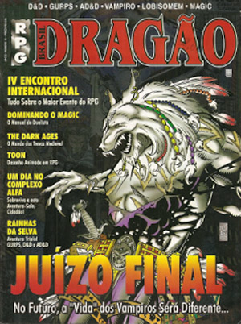

# Exercícios: Classes e Listas

Para cada exercício abaixo crie um repositório no GitHub contendo uma aplicação console com o nome indicado.

Correção no [GitHub](https://github.com/ermogenes/correcoes-dev-cs).

**Temporada 1**

Nenhum exercício disponível.

**Temporada 2**

| Enunciado                                         | Correção   | Extras |
| ------------------------------------------------- | ---------- | ------ |
| [BateriaSurf](#Exercício-BateriaSurf)             | _em breve_ |
| [PersonagemDnD](#Exercício-PersonagemDnD)         | _em breve_ |
| [MaoDeTruco](#Exercício-MaoDeTruco)               | _em breve_ |
| [Fintech](#Exercício-Fintech)                     | _em breve_ |
| [FilaDeNotas](#Exercício-FilaDeNotas)             | _em breve_ |
| [CarrinhoDeCompras](#Exercício-CarrinhoDeCompras) | _em breve_ |
| [Masmorra](#Exercício-Masmorra)                   | _em breve_ |
| [Paranoia](#Exercício-Paranoia)                   | _em breve_ |

---

## Exercício `BateriaSurf`

Faça um programa que calcule a nota de um surfista em uma bateria.

A nota de um surfista em uma onda surfada é dada por 5 juízes, em valores entre 0 e 10 incluindo decimais. A maior e a menor nota são descartadas, e a nota obtida na onda é dada pela média das notas restantes.

Exemplo: Foram dadas as notas ~~5~~, 8.3, 7.0, ~~10~~ e 8.5. Nota da onda = (8.3 + 7.0 + 8.5)/3 = 7.93

Em uma bateria, um surfista pode pegar quantas ondas conseguir. As duas maiores pontuações serão somadas, constituindo a pontuação final.

Exemplo: O surfista obteve as seguintes notas na sua bateria: ~~7.93~~, 10.0, ~~0.0~~ e 10.0. Pontos na bateria = 20.0

A maior pontuação possível em uma bateria é 20 pontos, situação conhecida como _bateria perfeita_ ([feito atingido somente 8 vezes na história](https://pt.wikipedia.org/wiki/Bateria_perfeita)).

Exiba um aviso caso ocorra uma bateria perfeita.

Exemplo:

```
--- Bateria de Surf ---

-- 1ª onda --
Juiz 1: 5
Juiz 2: 8,3
Juiz 3: 7,0
Juiz 4: 10
Juiz 5: 8,5
Nota obtida = 8,93

Mais uma onda (S/N)? S

-- 2ª onda --
Juiz 1: 9,5
Juiz 2: 10
Juiz 3: 10
Juiz 4: 10
Juiz 5: 10
Nota obtida = 10,00

Mais uma onda (S/N)? S

-- 3ª onda --
Juiz 1: 0
Juiz 2: 0
Juiz 3: 0
Juiz 4: 0
Juiz 5: 0
Nota obtida = 0,00

Mais uma onda (S/N)? S

-- 4ª onda --
Juiz 1: 10
Juiz 2: 10
Juiz 3: 10
Juiz 4: 10
Juiz 5: 10
Nota obtida = 10,00

Mais uma onda (S/N)? N

Pontos na bateria = 20,00

BATERIA PERFEITA!
```

---

## Exercício `PersonagemDnD`

No clássico RPG "Dungeons & Dragons" cada personagem possui 6 atributos, com valores iniciais entre 3 e 18:

- Força (STR), mensurando o poder físico;
- Destreza (DEX), mensurando a agilidade;
- Constituição (CON), mensurando a resistência;
- Inteligência (INT), mensurando o raciocínio e a memória;
- Sabedoria (WIS), mensurando percepção e intuição;
- Carisma (CHA), mensurando a força da personalidade.

Os atributos geram modificadores em rolagens durante o jogo, sendo seu modificador calculado subtraindo 10 do valor de habilidade e dividindo o total por 2 (arredondado para baixo).

Em sua atual 5ª edição, uma das maneiras recomendadas para criação de personagens é o método _4d6 drop lowest_, que consiste em rolar 4 dados de 6 faces ("d6"), descartar o menor valor e somar os restantes, gerando assim valores na faixa correta.

Faça um programa que gere os 6 valores de atributos e os exiba juntamente com seus modificadores. Repita a rolagem caso a soma dos valores mantidos não atinja 70. Apresente o maior e o menor atributos.

Exemplo:

```
--- Gerador de Personagem para D&D Quinta Edição ---

Rolagens (método 4d6 drop lowest):
5, 1, 2, 6, descartado o valor 1
3, 3, 5, 4, descartado o valor 3
5, 2, 2, 3, descartado o valor 2
2, 4, 1, 3, descartado o valor 1
1, 2, 4, 3, descartado o valor 1
2, 1, 3, 6, descartado o valor 1

A soma das rolagens mantidas é 64, portanto é necessário re-rolar.

Rolagens (método 4d6 drop lowest):
1, 5, 2, 3, descartado o valor 1
4, 3, 6, 1, descartado o valor 1
1, 4, 2, 6, descartado o valor 1
5, 4, 2, 3, descartado o valor 2
5, 4, 1, 1, descartado o valor 1
6, 6, 5, 3, descartado o valor 3

A soma das rolagens mantidas é 74, portanto é necessário re-rolar.

Rolagens (método 4d6 drop lowest):
5, 6, 6, 1, descartado o valor 1
1, 4, 4, 6, descartado o valor 1
5, 6, 4, 6, descartado o valor 4
1, 1, 4, 5, descartado o valor 1
6, 2, 6, 2, descartado o valor 2
2, 2, 3, 1, descartado o valor 1

A soma das rolagens mantidas é 79, portanto não é necessário re-rolar.

STR: 17 (+3)
DEX: 14 (+2)
CON: 17 (+3)
INT: 10 (+0)
WIS: 14 (+2)
CHA:  7 (-1)

Os maiores atributos são Força e Constituição e o menor atributo é Carisma.
```

---

## Exercício `MaoDeTruco`

Um baralho limpo de truco é formado pelas cartas `A`, `2`, `3`, `Q`, `J` e `K`, nos naipes paus `♣`, copas `♥`, espadas `♠` e ouros `♦`.

Escreva um programa que armazene em uma lista um baralho limpo de truco, carta a carta. Implemente uma funcionalidade de embaralhamento, gerando como resultado uma pilha de compras. Forme quatro conjuntos de 3 cartas cada retiradas do topo da pilha de compras e os exiba. Vire uma carta para ser o indicador das manilhas da mão.

Exemplo:

```
--- Mão de Truco ---

1º jogador: A♣ J♥ 2♥
2º jogador: K♦ K♠ Q♣
3º jogador: A♠ 2♠ 3♣
4º jogador: 3♦ Q♥ J♠

Vira: J♦
```

---

## Exercício `Fintech`

Represente duas contas bancárias utilizando objetos que contenham os nomes do titular e saldos abaixo:

| Titular | Saldo     |
| ------- | --------- |
| João    | R$0,00    |
| Maria   | R$1000,00 |

Crie um menu que permita executar as seguintes operações na conta do João:

- Depositar uma quantia informada pelo usuário;
- Fazer um Pix de quantia informada pelo usuário para a conta da Maria;
- Exibir o extrato da conta (contendo o tipo das operações e seus valores).

Não permita ações com redução de saldo quando o saldo não é suficiente.

A cada ação, exiba o saldo atual das duas contas. Finalize o programa por indicação do usuário.

---

## Exercício `FilaDeNotas`

Receba pares de valores representando uma nota musical (`do`, `re`, `mi`, `fa`, `sol`, `la`, `si`) e um tempo (em millisegundos), armazenando-os em uma fila.

Finalize a entrada de notas ao receber `parar`.

Execute os _beeps_ equivalentes a cada nota pelo tempo especificado, em sequência.

---

## Exercício `CarrinhoDeCompras`

Faça um programa que implemente o carrinho de compras de uma loja virtual. Permita que o usuário veja a lista de produtos, adicione produtos ao carrinho, visualize o estado atual do carrinho, limpe o carrinho e finalize a compra.

Lista de produtos:

| Código | Descrição   | Valor unitário |
| ------ | ----------- | -------------- |
| 1      | Camiseta P  | R$40,00        |
| 2      | Camiseta M  | R$45,00        |
| 3      | Camiseta G  | R$50,00        |
| 4      | Camiseta GG | R$55,00        |

Ao adicionar um produto no carrinho garanta que não há entradas repetidas. Nessa situação, altere a quantidade do produto adicionado anteriomente.

Ao finalizar a compra, somente exiba o valor total.

---

## Exercício `Masmorra`

Faça um programa que implemente o combate no sistema dos livros-jogos da série _Fighting Fantasy_ ([lançados no Brasil pela Jambô](https://jamboeditora.com.br/produto-tag/fighting-fantasy/)).

O herói possuirá valores aleatórios de `habilidade` (1d6+6), `sorte` (2d6+12) e `energia` (1d6+6). As criaturas não possuem sorte, e seus valores de `habilidade` e `energia` são pré-determinados.

Durante uma rodada de combate, calcule a _força de ataque_ de cada oponente, somando 2d6 à sua `habilidade`. O oponente com a menor _força de ataque_ sofre dano, reduzindo 2 pontos de sua `energia` (em caso de empate os dois erram). Repita as rodadas até que o inimigo seja derrotado ou o personagem morra (ficando sem `energia`).

O jogador pode optar por testar a sua sorte para aumentar o dano causado ou reduzir o dano recebido. Ao testar sua sorte, o jogador soma o resultado de 2d6. Caso obtenha um valor igual ou menor do que sua sorte atual, foi _sortudo_ e causa 4 danos em vez de 2, ou sofre 1 dano em vez de 2. Caso contrário, foi _azarado_ e causa 1 dano em vez de 2, ou sofre 3 danos em vez de 2. Após aplicar o resultado, reduza em um ponto sua `sorte`.

Faça com que o usuário enfrente as seguintes criaturas em uma masmorra, em sequência, sem recuperar `energia` ou `sorte` entre combates:

| Criatura | Habilidade | Energia |
| -------- | ---------- | ------- |
| Lobo Cinzento | 3 | 3 |
| Lobo Branco | 3 | 3 |
| Goblin | 5 | 4 |
| Orc Vesgo | 5 | 5 |
| Orc Barbudo | 5 | 5 |
| Zumbi Manco | 6 | 7 |
| Zumbi Balofo | 6 | 7 |
| Troll | 8 | 7 |
| Ogro | 8 | 9 |
| Ogro Furioso | 10 | 9 |
| Necromante Maligno | 12 | 12 |

Ao derrotar todas as criaturas a aventura é finalizada e o jogo termina com a vitória do jogador.

---

## Exercício `Paranoia`

_Um dia no Complexo Alfa_ é uma [aventura-solo](https://pt.wikipedia.org/wiki/Livro-jogo) baseada no RPG [Paranoia](<https://en.wikipedia.org/wiki/Paranoia_(role-playing_game)>) publicada nos anos 90 na [_Revista Dragão Brasil_](<(https://jamboeditora.com.br/tag/dragao-brasil/)>) número 18.



A aventura é modelada como um arranjo de entradas, onde cada uma possui um texto a exibir e uma lista de índices válidos para a próxima entrada.

```csharp
class Entrada
{
    public string? Texto;
    public List<int> Alternativas = new();
}
```

Utilize as seguintes entradas:

```csharp
Entrada[] aventura = new Entrada[41];

aventura[0] = new Entrada
{
    Texto = "Este é o Complexo Alfa. Uma metrópole futurista controlada por um computador louco, que se comporta como um tirano fascista. Totalmente paranoico, o Computador vê traidores em toda parte e zela pela felicidade dos cidadãos - nem que para isso precise matar todos! Você é feliz cidadão? Não?! ZIOUF! Você foi desintegrado, um clone está vindo substituí-lo...\n\nO Complexo Alfa é completamente fechado, sem regiões ao ar livre. Um vasto labirinto de corredores coloridos. As pessoas são classificadas por cores que determinam seus níveis de segurança, de acordo com os critérios do Computador. Desobedecer a um cidadão de Nível de Segurança maior que o seu, é traição. Ser Comunista é traição (embora você nem faça ideia do que seja um Comunista). Pertencer a uma sociedade secreta é traição. Traição é punida com a morte.\n\nO Computador preparou esta aventura-solo para divertir você, cidadão. Tome suas decisões e siga as instruções. Se as instruções levarem você para parte alguma, terá sido uma falha do Computador, mas, como o Computador nunca falha, encontrar falhas é uma traição. Traição é punida com a morte.\n\nTenha uma boa aventura, cidadão. Boa Sorte.\n\nVá para 1.",
    Alternativas = new List<int> { 1 }
};

aventura[1] = new Entrada
{
    Texto = "Você é JOCA CAB-1, cidadão infravermelho, a mais baixa camada social do Complexo Alfa. Trabalha no P&D (Pesquisa e Desenvolvimento), a divisão do Complexo que cria novos inventos para que todos sejam felizes. Lembre-se, a felicidade é obrigatória. Quem não está feliz é um traidor. Você está feliz, cidadão?\n\nSeu trabalho no P&D é simples: realizar trabalho escravo para os cientistas e servir de cobaia para seus experimentos, que geralmente explodem na sua cara. Que felicidade, não é, cidadão?\nHoje, chegando ao local de trabalho, você recebe de seu chefe, ZECA G-JUM 2, um envelope preto (a única cor que você pode manusear - para cidadãos de Nível Infravermelho, tocar em um objeto de qualquer outra cor é traição). Zeca diz que perdeu uma chave ALF e você deve ir buscar outra para ele na Produção, Logística e Comissariado.\n\nVá para 33.",
    Alternativas = new List<int> { 33 }
};

aventura[2] = new Entrada
{
    Texto = "Você entra no banheiro AXK e não encontra o robô ali. Um cidadão está no banheiro, e ele lhe entrega um bilhete. Não há tempo de ler agora, senão o robô pode sumir. Se quiser pegar o papel, anote mentalmente que fez isso. Se não quer, simplesmente jogue fora. Vá para 34.",
    Alternativas = new List<int> { 34 }
};

aventura[3] = new Entrada
{
    Texto = "Um soldado remexe em seus bolsos e acha um bilhete. Ele lê em voz alta:\n\n- \"Todo o poder para os cidadãos infravermelhos.\" - Um texto de Karl Marx. \"Quem é esse cara?\", você pensa...\n\n- Apenas um Comunista tem em sua posse material Comunista - diz o Computador. - Karl Marx é um Comunista, e você tem um bilhete escrito por ele.\n\nO enorme e reluzente canhão aponta em sua direção. É uma pena. Você chegou tão longe, e morreu aqui, seu Comuna! Mas, bem... vamos facilitar um pouco, pois sabemos que você vai roubar mesmo e recomeçar a aventura pela metade, afinal, só mesmo trapaceando se sobrevive no Complexo Alfa.\n\nVá para 17 e finja que não pegou o papel.",
    Alternativas = new List<int> { 17 }
};

aventura[4] = new Entrada
{
    Texto = "O cientista que comanda vocês logo retorna. Você pode contar a ele sobre a atitude suspeita de CHUÁ, mas isto iria colocar seu amigo em grandes apuros. Por outro lado, se surgir algum problema, isso deveria livrar a sua cara.\n\nSe quiser contar, vá para 37. Se achar melhor ficar quieto, vá para 11.",
    Alternativas = new List<int> { 37, 11 }
};

aventura[5] = new Entrada
{
    Texto = "O cientista ordena que você espere aqui. Ele vai até a sala de testes buscar um novo equipamento, algo que não irá transformá-lo em cinzas, você espera. Felizmente você não está sozinho. CHUÁ TIB-1, seu melhor amigo, também fica aqui, e vocês podem ficar conversando enquanto ZECA não chega.\n\nDurante a conversa, CHUÁ pede licença para ir ao banheiro. Mas você nota que ele entra em uma sala que não tem banheiro. Lembra-se também que, antes de sair, ele estava mexendo em uma estranha caixa preta sobre a mesa. Esquisito!\n\nSe quiser seguir seu amigo, vá para 24.\nSe quer ficar esperando, vá para 39.\nSe quer examinar a caixa, vá para 22.",
    Alternativas = new List<int> { 24, 39, 22 }
};

aventura[6] = new Entrada
{
    Texto = "Assim que você entrega o formulário esmeralda, a expressão no rosto do balconista muda de sonolência para o temor e revolta. O que aconteceu? Bem, você tocou num papel esmeralda, e o verde não é para seu Nível de Segurança. \"Entrei bem\", você pensa.\n\n- Traidor!, grita o balconista, apertando um botão de alarme. Em segundos um batalhão de truculentos soldados de Segurança Interna invade a sala, apontando fuzis laser em sua direção. O que você diz aos SegInt?\n\n\"Ali, um traidor! Ele tem um formulário que não é para seu Nível de Segurança!\" Vá para 23.\n\n\"Não é culpa minha! Entregaram isso lá no P&D!\" Vá para 36.\n\n\"Confesso meus crimes! Eu estava com o formulário esmeralda.\" Vá para 10.",
    Alternativas = new List<int> { 23, 36, 10 }
};

aventura[7] = new Entrada
{
    Texto = "\"Oh, não tem problema\", diz o cidadão vermelho. \"Você acha que eu iria dedurar você? Fique tranquilo, pode entrar no corredor vermelho. Ninguém vai ficar sabendo.\"\n\nVocê desconfia, mas não pode desobedecer a um cidadão de nível superior. Quando entra no corredor vermelho e vai até o robô, ouve a gargalhada sádica do cidadão vermelho, enquanto ele aponta uma pistola laser.\n\n- Traidor! Traidor! O Computador vai me recompensar! - e aperta o gatilho, reduzindo você a purê de átomos.\n\nVá para 1...",
    Alternativas = new List<int> { 1 }
};

aventura[8] = new Entrada
{
    Texto = "Você pega a sua senha e espera calmamente a sua vez de ser atendido. Felizmente, não leva muito tempo; em apenas 1 hora chega a sua vez.\n\n- Eu gostaria de saber qual fila devo tomar para pegar uma chave ALF - você pergunta ao balconista.\n\n- Qual o seu Nível de Segurança, cidadão?\n\n- Infravermelho - você responde.\n\n- Desculpe, mas infelizmente esta informação não está disponível para seu Nível de Segurança. Próximo...\n\nFeliz da vida, você abandona a sala. Se quiser pegar a fila da esquerda, vá para 29.\nSe quer quiser pegar a fila da direita, vá para 32.",
    Alternativas = new List<int> { 29, 32 }
};

aventura[9] = new Entrada
{
    Texto = "Você aperta o botão e o robô cessa de funcionar. Ótimo! Você rapidamente mergulha a mão na lata de lixo acoplada e pega a chave ALF, saindo mais rápido do que quando você entrou no corredor vermelho. Bem na hora, pois logo depois você vê um cidadão infravermelho vindo pelo corredor, e ele não hesitaria em denunciá-lo como traidor para cair nas graças do Computador.\n\nEssa foi por pouco. Vá para 14.",
    Alternativas = new List<int> { 14 }
};

aventura[10] = new Entrada
{
    Texto = "Assim que você termina de falar, percebe sorrisos diabólicos nos rostos dos guardas. Suas armas brilham com luz laser, e no mesmo momento, você é transformado em fumaça verde, da mesma cor de sua autorização.\n\nÉ o fim. Recomece com um novo clone. Vá para 1.",
    Alternativas = new List<int> { 1 }
};

aventura[11] = new Entrada
{
    Texto = "O cientista começa a prender você com correias em um aparelho cheio de lâminas, uma máquina de tortura que deverá ser testada (e adivinhe quem será a cobaia), quando um robô invade a sala e começa a quebrar tudo. Alguns guardas da Segurança Interna conseguem explodir o robô louco, e depois são eliminados, porque destruir propriedade do Computador é traição.\n\n- Muito bem. - rosna o cientista - Vocês estavam aqui sozinhos antes que eu saísse. É provável que um de vocês tenha sabotado o robô. Terei que levá-los ao Computador para que isso seja resolvido.\n\nVá para 17.",
    Alternativas = new List<int> { 17 }
};

aventura[12] = new Entrada
{
    Texto = "Você entra no corredor. Seu colega se aproxima de você e sussurra: \"Olá, JOCA CAB-1. Soubemos que alguém no P&D, onde você trabalha, está armando alguma coisa. Verifique e nos informe assim que possível.\"\n\nDepois disso, ele se vira e vai embora. Você continua em seu caminho. Vá para 35.",
    Alternativas = new List<int> { 35 }
};

aventura[13] = new Entrada
{
    Texto = "Você olha para os lados e não vê ninguém. Procura câmeras e também não encontra nenhuma. É, talvez não aconteça nada. Com cuidado, você chega perto do robô, e ele parece não ligar para sua presença. Na cabeça do robô você pode ver um botão.\n\nVocê aperta o botão? Vá para 9.\nEnfia a mão no lixo e pega a chave? Vá para 21.",
    Alternativas = new List<int> { 9, 21 }
};

aventura[14] = new Entrada
{
    Texto = "Finalmente você chega ao P&D com a chave ALF. Sorrindo e contente, você se aproxima do seu chefe.\n\n- Onde você estava? - ele pergunta.\n- Fui buscar a chave ALF que o senhor me pediu. Desculpe pela demora, a fila estava um pouco grande.\n- Ah, agora me lembro... - ele diz, coçando a cabeça. - É verdade, eu te mandei buscar uma chave. Pode colocar em algum canto, não vou mais precisar dela. Achei a minha no meu bolso.\nO que você faz diante desta situação detestável?\n\nPula na garganta do seu chefe e grita: \"Chuba-chuba, eu vou te matar!\" Vá para 25.\nEspera feito bobo pela próxima ordem. Vá para 5.",
    Alternativas = new List<int> { 25, 5 }
};

aventura[15] = new Entrada
{
    Texto = "Você fica na sala onde devia esperar, e logo seu amigo retorna. É melhor não comentar nada.\n\nVá para 4.",
    Alternativas = new List<int> { 4 }
};

aventura[16] = new Entrada
{
    Texto = "Assim que você entra no GHW, vê o robô. Ele joga água na sua cara e depois esfrega com o esfregão. Enquanto você tenta tirar o sabão da sua cara, o robô vai embora pelo corredor.\n\nVá para 26.",
    Alternativas = new List<int> { 26 }
};

aventura[17] = new Entrada
{
    Texto = "Você e seu amigo são levados a uma sala gigantesca, dominada por um imenso monitor de TV, e centenas de câmeras por toda parte. Um olho monstruoso surge na tela: é o Computador.\n\nSem mais nem menos, um canhão surge de uma abertura no teto e dispara em CHUÁ, transformando-o em uma poça de protoplasma fumegante.\n- Ele era suspeito por andar com os cadarços desamarrados - diz o Computador. - Este evento apenas confirmou sua condição de traidor. Qual o seu Nível de Segurança, cidadão?\n- Infravermelho, magnânimo Computador - você responde suando aos litros.\n- Você está feliz cidadão?\n- Muito, generoso Computador...\n- Revistem-no.\n\nVocê tem consigo o papel que recebeu no banheiro AXK? Vá para 3.\nSe não tiver, vá para 40.",
    Alternativas = new List<int> { 3, 40 }
};

aventura[18] = new Entrada
{
    Texto = "Você pega a autorização e passa mais algumas horas relaxantes na outra fila. Finalmente pode pegar a chave.\n\nVá para 30.",
    Alternativas = new List<int> { 30 }
};

aventura[19] = new Entrada
{
    Texto = "Entrando na sala de informações, você descobre que ela está lotada de cidadãos infravermelhos. Você recebe uma senha de número 345, e suspira aliviado, muito menos gente do que há nas filas dos lá fora.\n\nSe quiser ficar com a senha, e esperar sua vez, vá para 8.\nSe quer voltar e pegar a fila da esquerda, vá para 29.\nSe quer a fila da direita, vá para 32.",
    Alternativas = new List<int> { 8, 29, 32 }
};

aventura[20] = new Entrada
{
    Texto = "- Que está fazendo, CHUÁ? - você pergunta.\n\n- Nada - responde ele. - Bem, JOCA, você é meu amigo e acho que posso lhe contar. Descobri que alguém sabotou um robô e estou tentando descobrir quem foi. Sabe como é, se surgir algum problema, os culpados seremos nós. Mas vamos voltar, pois nosso amado chefe deve estar voltando.\n\nVocês voltam para a outra sala. Vá para 4.",
    Alternativas = new List<int> { 4 }
};

aventura[21] = new Entrada
{
    Texto = "É melhor não se arriscar. Você coloca a mão na sua lata de lixo, apenas para descobrir, da pior maneira, que a tampa se fecha assim que alguma coisa é colocada na lata. Sua mão fica presa e o robô recomeça a andar rapidamente, arrastando você pelos corredores. A boa notícia é que vocês saem do corredor vermelho, e a má notícia é que entram num corredor azul.\n\nCalma, talvez nem tudo esteja perdido! Talvez o robô volte ao corredor vermelho antes que você seja pulverizado.\n\nDe repente, o robô entra numa sala esmeralda onde estão umas trinta pessoas vestidas de azul. Há uma faixa onde se lê: \"Reunião Anual dos Agentes Atiradores: Nível de Segurança Azul\".\n\nVocê está com problemas. Mas, segundos depois, todos os seus problemas terminam, já que você foi reduzido a uma pasta melequenta pelas armas dos Agentes Atiradores. Melhor recomeçar com outro clone.\n\nVá para 1.",
    Alternativas = new List<int> { 1 }
};

aventura[22] = new Entrada
{
    Texto = "Você abre a caixa e encontra dentro dela um objeto com um botão. Sobre o botão está escrito: \"Não aperte\".\n\nSe quer apertar o botão, vá para 38.\nSe você é medroso(a), e quer fechar a caixa e deixar como estava, vá para 15.",
    Alternativas = new List<int> { 38, 15 }
};

aventura[23] = new Entrada
{
    Texto = "Assim que você termina de falar, o balconista levanta a mão que segura o papel esmeralda. Esmeralda! O papel também não está disponível para o Nível de Segurança dele, que é vermelho.\n\n- Não é iss... - ele grita, mas não consegue terminar a frase antes de ser transformado em fumaça pelos rifles laser dos guardas.\n\n- Bom trabalho, cidadão - o comandante da SegInt cumprimenta você. - Por denunciar o traidor, sua lealdade será comunicada ao Computador. Continue assim, e receberá um Nível de Segurança mais elevado. Seja feliz.\n\nManobra esperta. Por pouco você não vira fumaça em vez do balconista. Vá para 27.",
    Alternativas = new List<int> { 27 }
};

aventura[24] = new Entrada
{
    Texto = "Você acha suspeito a atitude de seu amigo e o segue. Sem que ele perceba, você observa enquanto ele mexe nas engrenagens de um robô. Estranho. Este não é seu trabalho. E ele não foi ao banheiro.\n\nVocê fala com ele? Vá para 20.\nVolta para a sala? Vá para 15.",
    Alternativas = new List<int> { 20, 15 }
};

aventura[25] = new Entrada
{
    Texto = "FRANCAMENTE!!! Esta é uma aventura-solo baseada no RPG Paranóia. Você acha mesmo que vai sobreviver por muito tempo no Complexo Alfa com atitudes como esta?! Dessa vez sua vida será salva, mas não se descuide de novo. Agora você vai ficar quietinho, parado como um bobo, esperando a próxima instrução do seu chefe.\n\nVá para 5. Sim, isso, bom garoto...",
    Alternativas = new List<int> { 5 }
};

aventura[26] = new Entrada
{
    Texto = "Você persegue o robô até que ele entra num corredor vermelho, onde sua presença não é permitida. O safado pára a poucos metros de você e começa solenemente a limpar o chão.\n\nParece que você está mesmo sem sorte. Não fosse o corredor vermelho, seria só pegar a chave na lata de lixo e ir embora. Bem, você pode arriscar, pode ser que ninguém veja, e que nenhuma das câmeras de vídeo do Computador esteja por aí. Por outro lado, não vai ser possível conseguir outra autorização para pegar uma chave ALF, pois você já recebeu uma. Voltar sem ela significa desobediência a um cidadão de Nível superior ao seu, o que é traição. E traição é punida com a morte.\n\nQuer entrar e pegar a chave? vá para 13.\nQuer ficar esperando um milagre? vá para 31.",
    Alternativas = new List<int> { 13, 31 }
};

aventura[27] = new Entrada
{
    Texto = "Chega um clone do balconista e senta-se no lugar do primeiro. Ele pede a você um formulário OGF43B-5. Como o seu acaba de virar fumaça, ele envia você para a fila da direita para conseguir outro.\n\nVá para 32.",
    Alternativas = new List<int> { 32 }
};

aventura[28] = new Entrada
{
    Texto = "- Eu não vou meter a mão no lixo por você, escória. - diz ele.\n\n- Então - você acusa - você se recusa a colaborar com o Computador?! Isso é traição!\n\n- Ei, eu não disse isso! Não pense que você pode me enganar assim facilmente. Vou trazer o robô aqui para que você mesmo verifique.\n\nEle vai até o robô, desliga, e leva até você. Você pega a chave, agradece o cidadão vermelho e segue o seu caminho.\n\nVá para 14.",
    Alternativas = new List<int> { 14 }
};

aventura[29] = new Entrada
{
    Texto = "Você pega a fila da esquerda e passa algumas horas prazerosas nela, contando seus próprios fios de cabelo para passar o tempo. Perdeu a conta algumas vezes, mas conseguiu contar todos os 68.457 antes que chegasse a sua vez.\n\nO balconista vestido de vermelho (um Nível de Segurança superior ao seu, lembre-se), olha para você e resmunga um sonolento \"quié?!\". Você, muito feliz, porque a felicidade é obrigatória, pede uma chave ALF para disjuntores potenciais.\n\n- Cadê a sua autorização OGF43B-5? - ele pergunta quase dormindo.\n\nAh, claro. Aquele envelope preto tem uma autorização, você pensa. Abre o envelope e encontra um papel verde onde diz: \"Autorização OGF43B-5\". O que você faz?\n\nDiz \"veja, eu tenho esta autorização\", e entrega o papel verde? Vá para 6.\nDiz \"eu não tenho, vou conseguir uma na fila da direita\"? Vá para 32.",
    Alternativas = new List<int> { 6, 32 }
};

aventura[30] = new Entrada
{
    Texto = "Você consegue uma autorização OGF43B-5, pega a chave ALF na outra fila e deixa o PLC, feliz porque cumpriu a função designada por seu superior e, portanto, não será desintegrado por traição.\n\nVocê escuta um \"psiu\" vindo de um corredor mal iluminado. Quando olha, alguém se esconde nas sombras e diz:\n\n- Chuba-chuba prrrprrr hey!\n\nÉ a senha da sua sociedade secreta! Sim, você pertence a um grupo que tenta derrubar o Computador. Claro que pertencer a uma sociedade secreta é traição. Traição é punida com a morte.\n\nVocê entra no corredor escuro para falar com ele? Vá para 12.\nVocê continua andando sem olhar para trás? Vá para 35.",
    Alternativas = new List<int> { 12, 35 }
};

aventura[31] = new Entrada
{
    Texto = "Você espera um pouco e logo aparece um cidadão vermelho. Ele se aproxima e ordena que você beije seus pés. Depois de beijar suas botas fedorentas, porque deixar de obedecer um superior é traição, o que você irá dizer?\n\n\"Senhor, preciso pegar um objeto que está no lixo daquele robô. Você poderia trazer o robô até mim?\" Vá para 7.\n\"Cidadão, o sábio Computador me mandou verificar em todos os lixos se havia chaves ALF. Como aquele robô está em uma área vermelha, onde não posso entrar, você ficaria muito feliz em ajudar o Computador verificando pra mim, não é?\" Vá para 28.",
    Alternativas = new List<int> { 7, 28 }
};

aventura[32] = new Entrada
{
    Texto = "Você pega a fila da direita, e passa 3 longas horas divertidas nela. O único incômodo é que o cidadão que está na frente deve estar sofrendo de alguma disfunção intestinal, tornando o ar muito agradável ao seu olfato.\n\nQuando chega a sua vez de ser atendido, o balconista pede para você esperar um minutinho e abandona a sala. Ele retorna 1 hora depois dizendo:\n\n- Ah, nada como um bom almoço! Muito bem, o que você quer?\n\nSe você quer uma chave ALF, não vai consegui-la aqui e terá que pegar outra fila; vá para 29.\nSe quer uma autorização OGF43B-5, vá para 18.",
    Alternativas = new List<int> { 29, 18 }
};

aventura[33] = new Entrada
{
    Texto = "Você vai até o PLC, o serviço de distribuição de equipamento. Bem antes de chegar lá, você vê 2 filas. Na verdade, você pode ver 2 filas MUITO grandes. Ou melhor, você pode ver 2 filas GIGANTESCAS!\n\nPara melhorar sua situação, você não tem ideia de qual fila deve tomar. Felizmente, há uma porta lateral no local onde diz: \"Informações\".\n\nSe quiser pegar a fila da esquerda, vá para 29.\nSe quiser pegar a da direita, vá para 32.\nE se quer pedir informações, vá para 19.",
    Alternativas = new List<int> { 29, 32, 19 }
};

aventura[34] = new Entrada
{
    Texto = "Decididamente, o robô não está no corredor. É provável que ele esteja no banheiro GHW.\n\nVá para 16.",
    Alternativas = new List<int> { 16 }
};

aventura[35] = new Entrada
{
    Texto = "Você anda calmamente pelo corredor quando vê um robô de limpeza vindo em sua direção, em alta velocidade. O robô possui quatro braços, que carregam um esfregão, um balde, uma vassoura e uma pá de lixo. Além disso, há um cesto de lixo acoplado ao robô.\n\nConhecendo a péssima reputação dos robôs do Complexo Alfa, você tenta sair do caminho, mas não consegue. O robô atropela você, fazendo com que deixe cair a chave ALF. Ela vai parar na pá de lixo do robô, que joga-a em sua lata de lixo e desaparece em uma esquina. Você persegue o maníaco mecânico, mas perde-o de vista.\n\nAqui existem apenas duas portas, por onde ele possa ter entrado: o banheiro AXK (vá para 2), ou o banheiro GHW (vá para 16).",
    Alternativas = new List<int> { 2, 16 }
};

aventura[36] = new Entrada
{
    Texto = "\"Vamos verificar isso\", diz aquele que parece ser um oficial da SegInt, que tem um Nível de Segurança esmeralda. Ele pega o papel e arrasta você até o P&D pela orelha. Lá, pergunta ao cientista se ele realmente entregou aquele papel.\n\n- Não sei do que está falando. - seu chefe responde ao guarda - Na verdade sempre achei esse indivíduo meio estranho.\n\nSob suspeita de ser um traidor, você é \"gentilmente\" levado para uma sala de reprogramação, onde sofre um pouquinho de tortura e uma lavagem cerebral completa. Seja feliz.\n\nVá para 1.",
    Alternativas = new List<int> { 1 }
};

aventura[37] = new Entrada
{
    Texto = "Sem que CHUÁ perceba, você chama seu chefe de lado e conta tudo a ele. O cientista vai até a sala dos robôs e desliga todos. Ele examina um por um e ordena que vocês esperem na outra sala. Depois de algum tempo, ele volta e diz:\n\n- Muito bem, cidadão! Suas suspeitas estavam corretas. Descobri que seu amigo sabotou um robô.\n\nCHUÁ apenas tem tempo de olhar pra você antes de ser pulverizado pela pistola laser do cientista. Você recebe congratulações do Computador e é promovido: agora você pertence ao Nível de Segurança vermelho. Você se torna um Agente Atirador. Sua missão é encontrar traidores e eliminá-los. Infelizmente, pouca gente sobrevive por muito tempo nesse trabalho... mas no Complexo Alfa, as coisas são assim mesmo.\n\nSeja feliz, cidadão.\n\nFIM!\nVá para 99 para sair do jogo.",
    Alternativas = new List<int> { -1 }
};

aventura[38] = new Entrada
{
    Texto = "Uma coisa que este seu clone nunca vai descobrir é que acionou o detonador de uma bomba. Ela explodiu você em 712 pedacinhos antes que tivesse tido tempo de pensar. Tolo! Você não sabe que, no P&D, praticamente qualquer coisa em que se toque explode na sua cara?\n\nÉ uma pena. Você vai ter que começar tudo de novo. \n\nEscolha um destes números e recomece com outro clone: 1, 14, 30, 33, 128 (como o jogo só vai até 40, digite 0).",
    Alternativas = new List<int> { 1, 14, 30, 33, 0 }
};

aventura[39] = new Entrada
{
    Texto = "Depois de algum tempo, seu amigo retorna e vocês recomeçam a conversar.\n\nVá para 15.",
    Alternativas = new List<int> { 15 }
};

aventura[40] = new Entrada
{
    Texto = "O soldado revista você e não encontra nada suspeito.\n\n- Muito bem cidadão. Parece que você não é um traidor. Mas, por via das dúvidas, este episódio será gravado em seus registros para referências futuras. Tenha um bom dia.\n\nA Segurança Interna deixa você livre para voltar para seus alojamentos. Este foi apenas mais um dia tranquilo em sua vida no Complexo Alfa. Agora pode dormir e começar tudo de novo amanhã. Você está feliz, não está?!\n\nFIM!\nVá para 99 para sair do jogo.",
    Alternativas = new List<int> { -1 }
};
```

Faça um programa que implemente a aventura-solo, exibindo os textos e navegando pelas opções do usuário entre as alternativas possíveis.

Comece pela entrada `0`. Ao informar que deseja ir para `99`, o usuário indica que quer desistir. A alternativa `-1` simboliza que o final do jogo foi alcançado.

_Os textos foram adaptados de [vbuaraujo](https://elmord.org/misc/complexo-alfa.html). Todos os direitos sobre o texto da aventura-solo são reservados à [Jambô Editora](https://jamboeditora.com.br/)._

---

## 🏁 Orientações para entrega (alunos do curso presencial)

Confira no Teams o link da tarefa equivalente. Lá você postará o link dos repositórios que você criou, um para cada exercício.

**Repositório de exemplo:**
[Exercício `EtecAB` (Saída em console)](https://github.com/ermogenes/EtecAB)

Exemplo de link a ser postado: `https://github.com/ermogenes/EtecAB`
