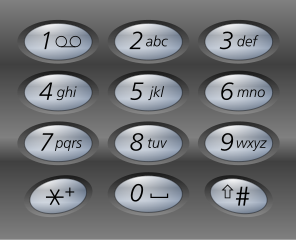

# Exercícios: Entrada de dados e _strings_

Para cada exercício abaixo crie um repositório no GitHub contendo uma aplicação console com o nome indicado.

Revisão e Correção no [YouTube](https://www.youtube.com/watch?v=ngUYtnGJXwI) e no [GitHub](https://github.com/ermogenes/correcoes-dev-cs).

**Temporada 1**

| Enunciado                                   | Correção                                                                                                                                                     | Extras                                     |
| ------------------------------------------- | ------------------------------------------------------------------------------------------------------------------------------------------------------------ | ------------------------------------------ |
| [OlaUsuario](#Exercício-OlaUsuario)         | [YouTube](https://www.youtube.com/watch?v=ngUYtnGJXwI&t=4563s) • [GitHub](https://github.com/ermogenes/correcoes-dev-cs/tree/main/OlaUsuario/Program.cs)     |
| [Gritador](#Exercício-Gritador)             | [YouTube](https://www.youtube.com/watch?v=ngUYtnGJXwI&t=4795s) • [GitHub](https://github.com/ermogenes/correcoes-dev-cs/tree/main/Gritador/Program.cs)       |
| [NomeCompleto](#Exercício-NomeCompleto)     | [YouTube](https://www.youtube.com/watch?v=ngUYtnGJXwI&t=5170s) • [GitHub](https://github.com/ermogenes/correcoes-dev-cs/tree/main/NomeCompleto/Program.cs)   |
| [Cebolinha](#Exercício-Cebolinha)           | [YouTube](https://www.youtube.com/watch?v=ngUYtnGJXwI&t=5499s) • [GitHub](https://github.com/ermogenes/correcoes-dev-cs/tree/main/Cebolinha/Program.cs)      |
| [CriancaEducada](#Exercício-CriancaEducada) | [YouTube](https://www.youtube.com/watch?v=ngUYtnGJXwI&t=5950s) • [GitHub](https://github.com/ermogenes/correcoes-dev-cs/tree/main/CriancaEducada/Program.cs) |
| [MemeToNervoso](#Exercício-MemeToNervoso)   | [YouTube](https://www.youtube.com/watch?v=ngUYtnGJXwI&t=6737s) • [GitHub](https://github.com/ermogenes/correcoes-dev-cs/tree/main/MemeToNervoso/Program.cs)  | [Prof. Neri](https://youtu.be/eE9xymvPlj8) |
| [Leet](#Exercício-Leet)                     | [YouTube](https://www.youtube.com/watch?v=ngUYtnGJXwI&t=7264s) • [GitHub](https://github.com/ermogenes/correcoes-dev-cs/tree/main/Leet/Program.cs)           |

**Temporada 2**

| Enunciado                                           | Correção                                                                                        | Extras |
| --------------------------------------------------- | ----------------------------------------------------------------------------------------------- | ------ |
| [PrimeroCaractere](#exercício-primerocaractere)     | [GitHub](https://github.com/ermogenes/correcoes-dev-cs/tree/main/PrimeroCaractere/Program.cs)   |
| [PhoneWords](#exercício-phonewords)                 | [GitHub](https://github.com/ermogenes/correcoes-dev-cs/tree/main/PhoneWords/Program.cs)         |
| [NomeNinja](#exercício-nomeninja)                   | [GitHub](https://github.com/ermogenes/correcoes-dev-cs/tree/main/NomeNinja/Program.cs)          |
| [TextoVazio](#exercício-textovazio)                 | [GitHub](https://github.com/ermogenes/correcoes-dev-cs/tree/main/TextoVazio/Program.cs)         |
| [AlinhamentoDireita](#exercício-alinhamentodireita) | [GitHub](https://github.com/ermogenes/correcoes-dev-cs/tree/main/AlinhamentoDireita/Program.cs) |
| [Forca](#exercício-forca)                           | [GitHub](https://github.com/ermogenes/correcoes-dev-cs/tree/main/Forca/Program.cs)              |
| [TrocaVariaveis](#exercício-trocavariaveis)         | [GitHub](https://github.com/ermogenes/correcoes-dev-cs/tree/main/TrocaVariaveis/Program.cs)     |
| [ImitandoDory](#exercício-imitandodory)             | [GitHub](https://github.com/ermogenes/correcoes-dev-cs/tree/main/ImitandoDory/Program.cs)       |
| [PetHotel](#exercício-pethotel)                     | [GitHub](https://github.com/ermogenes/correcoes-dev-cs/tree/main/PetHotel/Program.cs)           |
| [RolagemComposta](#exercício-rolagemcomposta)       | [GitHub](https://github.com/ermogenes/correcoes-dev-cs/tree/main/RolagemComposta/Program.cs)    |

---

## Exercício `OlaUsuario`

Faça um programa solicite que o usuário digite seu nome. Exiba `Olá, ___!` (na lacuna `___` exiba o nome digitado).

---

## Exercício `Gritador`

Faça um programa repita exatamente que o usuário digitar, gritando (em CAIXA ALTA).

---

## Exercício `NomeCompleto`

Receba o nome e o sobrenome do usuário separadamente. Exiba o nome completo no formato padrão `Nome Sobrenome` e no formato de catálogo `SOBRENOME, Nome`.

Exemplo:

```
Digite seu primeiro nome: Ermogenes
Digite seu sobrenome: Palacio

Nome completo: Ermogenes Palacio
Nome de catálogo: PALACIO, Ermogenes
```

---

## Exercício `Cebolinha`

Solicite que o usuário digite uma frase. Exiba a frase como se ela fosse dita pelo Cebolinha, da Turma da Mônica.


_Lembre-se que o Cebolinha tem um disturbio na fala chamado dislalia, que o faz trocar o `r` pelo `l`._

Por exemplo, a frase `Eu troco as letras, não falo bem, mas meus amigos não troco por ninguém` será dita pelo Cebolinha como `Eu tloco as letlas, não falo bem, mas meus amigos não tloco pol ninguém`.

---

## Exercício `CriancaEducada`

Solicite que o usuário digite uma frase. Substitua as palavras da lista por uma sequência de símbolos (como `#@$%*!&`, por exemplo).

chato/chata, bobo/boba, feio/feia, boboca, bocó, tonto/tonta, palerma, paspalho/paspalha, tantã, panaca, pentelho/pentelha, burro/burra, besta

Exemplo:

```
Me diga o que você pensa sobre o aluno que não faz a lição de casa: Eu acho que é um bobo, e que vai ficar boboca pra sempre.

Eu sou uma criança educada. No seu lugar eu diria:
Eu acho que é um #@$%*!&, e que vai ficar #@$%*!& pra sempre.
```

---

## Exercício `MemeToNervoso`

Peça ao usuário que ele digite o que pensa sobre esse programa. Exiba uma resposta em versão _meme_ no seguinte formato:

```
Usuário, o que você pensa sobre mim? Você é muito sem graça!

- E sabe o que eu penso de você?
Você é mui... NÃO, PERA.
Tô nervoso
```

Para isso, mantenha somente os 10 primeiros caracteres (remova todos os caracteres do texto digitado após o índice 10) e adicione o texto do _meme_ `... NÃO, PERA.\nTô nervoso`.


---

## Exercício `Leet`

Faça um tradutor simples para a linguagem [Leet Speak](https://pt.wikipedia.org/wiki/Leet).

Para isso, faça as seguintes substituições:

| Entrada                  | Saída |
| ------------------------ | ----- |
| `A` ou `a`               | `4`   |
| `E` ou `e`               | `3`   |
| `I` ou `i` ou `L` ou `l` | `1`   |
| `O` ou `o`               | `0`   |
| `T` ou `t`               | `7`   |
| `S` ou `s`               | `5`   |

Exemplo:

```
Texto a ser traduzido...: Hackers usavam leet antes de virar modinha.
TRADUZIDO: H4ck3r5 u54v4m 1337 4n735 d3 v1r4r m0d1nh4.
```

---

## Exercício `PrimeroCaractere`

Faça um programa que exiba o primeiro caractere digitado, ignorando espaços em branco.

| Digitação     | Resultado esperado |
| ------------- | ------------------ |
| `abc`         | `a`                |
| `!235`        | `!`                |
| `···xyz·····` | `x`                |

---

## Exercício `PhoneWords`

_Phone words_ são palavras ou frases representadas com caracteres alfanuméricos em substituição aos seus números equivalentes em um teclado telefônico. Tem a função de facilitar a memorização.

Exemplo: Um hotel _Holiday Inn_ com o número `1-800-HOLIDAY` (equivalente a `1-800-465-4329`).

Faça um programa que receba um número telefônico. Converta as _phone words_ nos números equivalentes.

Teclado telefônico padrão ITU-T E.161:



Exemplo:

```
--- Conversor de Phone Words ---

Telefone...: 555-PIZZA

O número digitado é 555-74992.
```

---

## Exercício `NomeNinja`

Receba o nome do usuário. Escreva seu nome ninja:


Exemplo:

```
--- Nome Ninja ---

Digite seu nome: Ermogenes

Seu nome ninja é Kushirinmojikutokuari.
```

---

## Exercício `TextoVazio`

Receba um texto via teclado. Avalie se o texto é vazio ou não.

Exemplos:

```--- Texto Vazio ---

Digite um texto qualquer:    um texto qualquer
False
```

```
--- Texto Vazio ---

Digite um texto qualquer:
True
```

---

## Exercício `AlinhamentoDireita`

Receba três palavras via teclado. Exiba uma em cada linha, todas alinhadas à direita no 20 caractere.

Exemplo:

```
--- Alinhamento à direita ---

Digite a primeira palavra...: batata
Digite a segunda palavra....: intransigente
Digite a terceira palavra...: caramelo

              batata
       intransigente
            caramelo
```

---

## Exercício `Forca`

No jogo de Forca uma palavra é mantida secreta e tenta-se adivinhar quais letras compõem a palavra.

Faça um programa que receba a palavra secreta e uma letra. Avalie se a letra existe ou não na palavra secreta.

Exemplos:

```
--- Forca ---

Qual a palavra secreta? Jabuticaba
Qual a letra? j

A letra "j" existe na palavra secreta => True
```

```
--- Forca ---

Qual a palavra secreta? Jabuticaba
Qual a letra? e

A letra "e" existe na palavra secreta => False
```

---

## Exercício `TrocaVariaveis`

Faça um programa que armazene em duas variáveis os nomes de pessoas fornecidos pelo usuário. Troque os nomes contidos nas variáveis (o primeiro nome vira o segundo e _vice-versa_).

Exiba as variáveis na ordem que foram digitadas de forma a mostrar os nomes em ordem inversa.

Exemplo:

```
--- Troca de Valores ---

Nome 1...: Barbie
Nome 2...: Polly

Após trocar os valores temos:

Nome 1 = Polly
Nome 2 = Barbie
```

---

## Exercício `ImitandoDory`

Em [uma cena antológica](https://www.youtube.com/watch?v=UjWFVm1loPQ) de "Procurando Nemo" (Pixar, 2003), a personagem Dory (uma cirurgião-patela) tenta se comunicar com uma baleia falando "_baleiês_".


Faça um programa que traduza o texto digitado pelo usuário em _baleiês_, substituindo cada vogal por 3 cópias dela mesma.

Exemplo:

- Em português: "Procurando Nemo"
- Em _baleiês_: "Prooocuuuraaandooo Neeemooo"

---

## Exercício `PetHotel`

Faça um programa que receba dados de um _pet_ ao dar entrada em um _pet_ hotel. Exiba os dados ao final do cadastro, seguindo o exemplo.

```
+=========================================================+
|                 Pet Hotel "Nem um pio"                  |
+=========================================================+
| Espécie: ............CÃO | Raça: ............INDEFINIDA |
+=========================================================+
| Atende pela alcunha de: ...........................ZECA |
| Idade: 03 ano(s) | Pelagem/cor: ...............CARAMELO |
+=========================================================+
```

Use cores destacadas para o título e para os dados do _pet_, e cores neutras para as bordas.

---

## Exercício `RolagemComposta`

Na pesquisa do Google podemos efetuar rolagens aleatórias de dados usando a sintaxe `NdF+X`, sendo `N` a quantidade de dados a rolar, `F` a quantidade de faces em cada dado e `X` o valor a acrescentar à soma dos dados.

Por exemplo, digite `2d20+3` para [rolar 2 dados de 20 lados, somá-los e acrescentar 3 ao resultado](https://www.google.com/search?q=2d20%2b3).

Faça um programa que receba uma string nesse formato e grave em variáveis a quantidade de dados, de faces e o valor a acrescentar. Exiba os valores ao usuário.

Exemplo:

```
--- Rolagem de Dados ---

Digite a rolagem desejada...: 4d6+1

4 dado(s) de 6 face(s) mais 1
```

---

## 🏁 Orientações para entrega (alunos do curso presencial)

Confira no Teams o link da tarefa equivalente. Lá você postará o link dos repositórios que você criou, um para cada exercício.

**Repositório de exemplo:**
[Exercício `EtecAB` (Saída em console)](https://github.com/ermogenes/EtecAB)

Exemplo de link a ser postado: https://github.com/ermogenes/EtecAB
