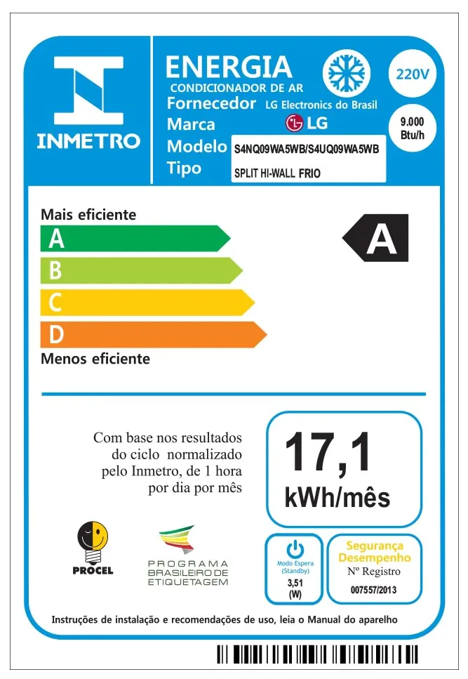

# Exercícios: Números e operadores

Para cada exercício abaixo crie um repositório no GitHub contendo uma aplicação console com o nome indicado.

Revisão e Correção no YouTube ([parte 1](https://youtu.be/AMUjUfan40Q) e [parte 2](https://youtu.be/NfPfIYOdHNs)) e no [GitHub](https://github.com/ermogenes/correcoes-dev-cs).

**Temporada 1**

| Enunciado                                       | Correção                                                                                                                                                       | Extras                                                         |
| ----------------------------------------------- | -------------------------------------------------------------------------------------------------------------------------------------------------------------- | -------------------------------------------------------------- |
| [Soma2Numeros](#Exercício-Soma2Numeros)         | [YouTube](https://www.youtube.com/watch?v=AMUjUfan40Q&t=285s) • [GitHub](https://github.com/ermogenes/correcoes-dev-cs/tree/main/Soma2Numeros/Program.cs)      | [Prof. Neri](https://youtu.be/aOaraq0G1oA)                     |
| [MilhasParaKm](#Exercício-MilhasParaKm)         | [YouTube](https://www.youtube.com/watch?v=AMUjUfan40Q&t=1161s) • [GitHub](https://github.com/ermogenes/correcoes-dev-cs/tree/main/MilhasParaKm/Program.cs)     |
| [Medidas](#Exercício-Medidas)                   | [YouTube](https://www.youtube.com/watch?v=AMUjUfan40Q&t=1645s) • [GitHub](https://github.com/ermogenes/correcoes-dev-cs/tree/main/Medidas/Program.cs)          |
| [AreaTrianguloRet](#Exercício-AreaTrianguloRet) | [YouTube](https://www.youtube.com/watch?v=AMUjUfan40Q&t=2152s) • [GitHub](https://github.com/ermogenes/correcoes-dev-cs/tree/main/AreaTrianguloRet/Program.cs) |
| [Heron](#Exercício-Heron)                       | [YouTube](https://www.youtube.com/watch?v=AMUjUfan40Q&t=2710s) • [GitHub](https://github.com/ermogenes/correcoes-dev-cs/tree/main/Heron/Program.cs)            |
| [GrausCF](#Exercício-GrausCF)                   | [YouTube](https://www.youtube.com/watch?v=NfPfIYOdHNs&t=45s) • [GitHub](https://github.com/ermogenes/correcoes-dev-cs/tree/main/GrausCF/Program.cs)            |
| [GrausFC](#Exercício-GrausFC)                   | [YouTube](https://www.youtube.com/watch?v=NfPfIYOdHNs&t=1005s) • [GitHub](https://github.com/ermogenes/correcoes-dev-cs/tree/main/GrausFC/Program.cs)          |
| [MediaAritmetica](#Exercício-MediaAritmetica)   | [YouTube](https://www.youtube.com/watch?v=NfPfIYOdHNs&t=1415s) • [GitHub](https://github.com/ermogenes/correcoes-dev-cs/tree/main/MediaAritmetica/Program.cs)  |
| [VelocMedia](#Exercício-VelocMedia)             | [YouTube](https://www.youtube.com/watch?v=NfPfIYOdHNs&t=1998s) • [GitHub](https://github.com/ermogenes/correcoes-dev-cs/tree/main/VelocMedia/Program.cs)       |
| [IMC](#Exercício-IMC)                           | [YouTube](https://www.youtube.com/watch?v=NfPfIYOdHNs&t=2536s) • [GitHub](https://github.com/ermogenes/correcoes-dev-cs/tree/main/IMC/Program.cs)              |
| [FGTS](#Exercício-FGTS)                         | [YouTube](https://www.youtube.com/watch?v=NfPfIYOdHNs&t=3075s) • [GitHub](https://github.com/ermogenes/correcoes-dev-cs/tree/main/FGTS/Program.cs)             |
| [JurosSimples](#Exercício-JurosSimples)         | [YouTube](https://www.youtube.com/watch?v=NfPfIYOdHNs&t=3410s) • [GitHub](https://github.com/ermogenes/correcoes-dev-cs/tree/main/JurosSimples/Program.cs)     |
| [Projetil](#Exercício-Projetil)                 | [YouTube](https://www.youtube.com/watch?v=NfPfIYOdHNs&t=3996s) • [GitHub](https://github.com/ermogenes/correcoes-dev-cs/tree/main/Projetil/Program.cs)         | [Versão avançada](https://github.com/ermogenes/ProjetilImagem) |

**Temporada 2**

| Enunciado                                                     | Correção                                                                                             | Extras |
| ------------------------------------------------------------- | ---------------------------------------------------------------------------------------------------- | ------ |
| [InteiroEDecimal](#exercício-inteiroedecimal)                 | [GitHub](https://github.com/ermogenes/correcoes-dev-cs/tree/main/InteiroEDecimal/Program.cs)         |
| [RolagemDeDado](#exercício-rolagemdedado)                     | [GitHub](https://github.com/ermogenes/correcoes-dev-cs/tree/main/RolagemDeDado/Program.cs)           |
| [TempoDownload](#exercício-tempodownload)                     | [GitHub](https://github.com/ermogenes/correcoes-dev-cs/tree/main/TempoDownload/Program.cs)           |
| [Troco](#exercício-troco)                                     | [GitHub](https://github.com/ermogenes/correcoes-dev-cs/tree/main/Troco/Program.cs)                   |
| [DecomposicaoDecimal](#exercício-decomposicaodecimal)         | [GitHub](https://github.com/ermogenes/correcoes-dev-cs/tree/main/DecomposicaoDecimal/Program.cs)                   |
| [IndependenciaFinanceira](#exercício-independenciafinanceira) | [GitHub](https://github.com/ermogenes/correcoes-dev-cs/tree/main/IndependenciaFinanceira/Program.cs) |
| [GinasticaArtistica](#exercício-ginasticaartistica)           | [GitHub](https://github.com/ermogenes/correcoes-dev-cs/tree/main/GinasticaArtistica/Program.cs)      |
| [CustoEnergia](#exercício-custoenergia)                       | [GitHub](https://github.com/ermogenes/correcoes-dev-cs/tree/main/CustoEnergia/Program.cs)            |
| [CreditoRotativo](#exercício-creditorotativo)                 | [GitHub](https://github.com/ermogenes/correcoes-dev-cs/tree/main/CreditoRotativo/Program.cs)         |
| [Churrasco](#exercício-churrasco)                             | [GitHub](https://github.com/ermogenes/correcoes-dev-cs/tree/main/Churrasco/Program.cs)               |
| [HorasDecimais](#exercício-horasdecimais)                     | [GitHub](https://github.com/ermogenes/correcoes-dev-cs/tree/main/HorasDecimais/Program.cs)           |
| [FormulaDoPadeiro](#exercício-formuladopadeiro)               | [GitHub](https://github.com/ermogenes/correcoes-dev-cs/tree/main/FormulaDoPadeiro/Program.cs)        |
| [ColoniaDeBacterias](#exercício-coloniadebacterias)           | [GitHub](https://github.com/ermogenes/correcoes-dev-cs/tree/main/ColoniaDeBacterias/Program.cs)      |

---

## Exercício `Soma2Numeros`

Leia 2 números inteiros e exiba o resultado da soma:

```
Cálculo da soma entre dois números.

Digite o primeiro número: 30
Digite o segundo número: 40

Soma: 70
```

---

## Exercício `MilhasParaKm`

Receba uma medida em milhas e exiba seu equivalente em quilômetros. A medida em km é 1,609 vezes a medida em milhas.

```
Entre com a medida (em milhas): 1
1,609 Km
```

---

## Exercício `Medidas`

Receba uma medida em metros e exiba seus equivalentes em quilômetros e centímetros.

```
Entre com a medida (em metros): 150

--- Equivalência ---
15000 cm
150 m
0,15 Km
```

---

## Exercício `AreaTrianguloRet`

Calcule a área de um triângulo retângulo, dados base (b) e altura (h). A área é dada pela metade do produto da base pela altura.

```
Base..: 3
Altura: 5

Área..: 7.5
```

[Entenda a fórmula](https://youtu.be/1Tk3FLDXb1k)

---

## Exercício `Heron`

Calcule a área de um triângulo qualquer, dadas as medidas dos 3 lados. Exiba o semiperímetro e a área.

Área (A):


Semiperímetro (p): metade da soma dos lados


```
Digite os lados do triângulo desejado.

Lado 1..: 3
Lado 2..: 25
Lado 3..: 26

Semiperímetro..: 27
Área...........: 36
```

Ref.:
[https://pt.wikipedia.org/wiki/Teorema_de_Her%C3%A3o](https://pt.wikipedia.org/wiki/Teorema_de_Her%C3%A3o)
[https://mundoeducacao.bol.uol.com.br/matematica/formula-heron.htm](https://mundoeducacao.bol.uol.com.br/matematica/formula-heron.htm)

---

## Exercício `GrausCF`

Converta uma temperatura digitada pelo usuário em °C para °F.

°F = °C × 1,8 + 32

Ref.: [https://pt.wikipedia.org/wiki/Celsius](https://pt.wikipedia.org/wiki/Celsius)

```
°C = 0
0°C equivalem a 32°F
```

---

## Exercício `GrausFC`

Converta uma temperatura digitada pelo usuário em °F para °C.

°C = (°F − 32) / 1,8

Ref.: [https://pt.wikipedia.org/wiki/Celsius](https://pt.wikipedia.org/wiki/Celsius)

```
°F = 0
0°F equivalem a -17,78°F
```

---

## Exercício `MediaAritmetica`

Calcule a média aritmética entre 3 números reais digitados pelo usuário.

```
Média Aritmética de 3 números

Digite o primeiro número: 7
Digite o segundo número: 9
Digite o terceiro número: 5

Média: 7.0
```

---

## Exercício `VelocMedia`

Calcule a velocidade, a partir da distância (Δd, em metros) e do tempo (Δt, em segundos).

v = Δd / Δt

```
Distância percorrida (m): 100
Tempo gasto (s): 15

Velocidade média: 6 m/s
```

---

## Exercício `IMC`

Calcule o índice de massa corporal de uma pessoa, dados altura (em m) e peso (em kg).

IMC = peso / altura²

```
Altura (m)..: 2
Peso (kg)...: 80

IMC: 20,0 kg/m²
```

---

## Exercício `FGTS`

Calcule a parcela do FGTS sobre o salário de um funcionário (8%).

```
Salário (R$)..: 2000,00

FGTS: R$ 160,00
```

---

## Exercício `JurosSimples`

Calcule o montante final de um investimento a juros simples.

j = c . i . t

m = c + j

```c
Juros simples (j)

Capital [c] (R$).......: 1200,00
Taxa de juros [i] (%)..: 2
Tempo [t] (meses)......: 15

Juros (R$).....: 360,00
Montante (R$)..: 1560,00
```

---

## Exercício `Projetil`

Um projétil é lançado em um ângulo `θ°` (teta graus) a uma velocidade inicial `v0 m/s`. Calcule, em metros, o alcance máximo `xmax` e a altura máxima atingida `hmax`.

Para isso, precisamos:

1. Da constante `π` (pi) = 3,14159 radianos
1. Da constante `g` = 9,80665 m/s²
1. Converter o ângulo de graus para radianos, como no exemplo: 180° × π/180 = 3rad
1. Aplicar a Equação de Torricelli para o alcance, e
1. Aplicar a equação de Torricelli para a altura.


Exemplo:

```c
-- Projétil --

Entre com a velocidade, em m/s..: 30
Entre com o ângulo, em graus....: 30

Alcance........: 79,48 m
Altura máxima..: 11,47 m
```

Ref.: [https://alunosonline.uol.com.br/fisica/lancamento-obliquo.html](https://alunosonline.uol.com.br/fisica/lancamento-obliquo.html)

---

## Exercício `InteiroEDecimal`

Solicite que o usuário digite um valor real. Exiba separadamente os valores dos componentes inteiro e decimal do número digitado.

Exemplos:

```
--- Inteiro e Decimal ---

Digite um número: 4,0

Parte inteira: 4
Parte decimal: 0,0
```

```
--- Inteiro e Decimal ---

Digite um número: 4,5

Parte inteira: 4
Parte decimal: 0,5
```

---

## Exercício `RolagemDeDado`

Um dado comum possui seis faces numeradas de 1 a 6. Existem dados poliédricos com as mais diversas contagens de faces, sendo as mais comuns 4, 6, 8, 10, 12, e 20.

Faça um programa que receba a quantidade de faces do dado e sorteie aleatoriamente um valor entre 1 e a quantidade de faces informada, simulando uma rolagem.

Exemplos:

```
--- Rolagem de Dado ---

Quantas faces? 12

Rolagem: 11
```

```
--- Rolagem de Dado ---

Quantas faces? 12

Rolagem: 3
```

---

## Exercício `TempoDownload`

Calcule o tempo estimado para _download_ de um arquivo. Para isso, receba o tamanho do arquivo em _megabytes_ (MB) e a velocidade da conexão em _megabits_ por segundo (Mbps). Exiba o tempo em minutos.

Lembre-se que 1 byte = 8 bits (e 1MB = 8Mb).

Exemplo:

```
--- Tempo de Download ---

Tamanho do arquivo em MB........: 105
Velocidade da conexão em Mbps...: 4

Tempo estimado de download: 3,5 minutos
```

---

## Exercício `Troco`

Solicite que o usuário digite o valor da compra e o valor pago. Exiba o valor do troco.

---

## Exercício `DecomposicaoDecimal`

Receba um número inteiro informado pelo usuário. Realize a decomposição decimal em unidades, dezenas e centenas.

Exemplo:
```
--- Decomposição Decimal ---

Digite um número inteiro...: 1580

O número 1580 possui:
         0 unidade(s)
         8 dezenas(s)
        15 centena(s).
```

---

## Exercício `IndependenciaFinanceira`

Faça um programa que calcule quanto dinheiro é necessário possuir em um investimento para conseguir sua independência financeira com dividendos (ou seja, os dividendos deverão pagar todos os seus custos). Receba os gastos mensais e o rendimento dos dividendos (_dividend yield_). O valor necessário investido para receber `X` reais de dividendo todo mês com `Y`% de _dividend yield_ é `X ÷ (Y ÷ 100)`.

Valores para teste:
Para receber mensalmente | com _dividend yield_ de | é necessário investir
--- | --- | ---
R$ 1.000,00 | 1,0% | R$ 100.000,00
R$ 1.000,00 | 0,5% | R$ 200.000,00
R$ 3.500,00 | 1,0% | R$ 350.000,00
R$ 3.500,00 | 0,5% | R$ 700.000,00
R$ 5.000,00 | 1,0% | R$ 500.000,00
R$ 5.000,00 | 0,5% | R$ 1.000.000,00

Exemplo:

```
--- Vivendo de dividendos ---

Gastos mensais (em R$)....: 3500
Rendimentos mensais (%)...: 0,5

Para receber R$ 3.500,00 por mês com rendimentos de 0,5% você precisa ter investido R$ 700.000,00.
```

---

## Exercício `GinasticaArtistica`

Em uma competição de ginástica artística a pontuação de um(a) ginasta é dada pela soma de sua nota de partida com a nota de execução dada pela banca de jurados.

Faça um programa que receba o nome do(a) ginasta, a nota de partida e a nota de execução. Exiba a nota final.

Exemplo:

```
--- Ginástica Artística ---

Ginasta............: Rebeca Andrade
Nota de Partida....: 5,7
Nota de Execução...: 8,366

A nota de Rebeca Andrade foi 14,066.
```

---

## Exercício `CustoEnergia`

Um aparelho _Ar Condicionado Split LG DUAL Inverter 9.000 Frio_ consome 17,1 kWh/mês de energia enquanto ligado, [segundo seu fabricante](https://www.lg.com/br/ar-condicionado-residencial/lg-S4-Q09WA5WB#).



Isso significa que, se utilizado 8h por dia, consome 136,8 kWh/mês. Considerando o custo por kWh de R$0,62258, teríamos um custo estimado de R$85,168944.

Faça um programa que estime o custo de consumo de energia de um aparelho elétrico dado o seu consumo em kWh/mês e o uso diário (em horas).

- `Tempo de uso diário (h)` x `Consumo do aparelho (kWh/mês)` x `Custo da energia (R$/kWh)` = `Custo de um mês de uso (R$)`

```
--- Custo de Energia ---

Consumo do aparelho (em kWh/mês)...: 17,1
Horas de uso por dia...............: 8
Custo da energia (em R$/kWh).......: 0,62258

Custo estimado: R$85,17
```

¹ NeoEnergia, B1-Residencial, Consumo Ativo, sem considerar bandeira tarifária e impostos ([acessado em 04/07/2022](https://www.neoenergiaelektro.com.br/Media/Default/pdf/ELEKTRO_TARIFAS_ENERGIA_ELETRICA_GRUPO_B_27_AGOSTO_2021_REH_N%C2%BA_2.927.pdf)).

---

## Exercício `CreditoRotativo`

Em uma fatura de cartão de crédito a operadora oferta um crédito rotativo, permitindo que o cliente efetue um pagamento inferior ao valor total, mas cobrando o restante na próxima fatura com juros.

Faça um programa que receba o valor total da fatura, o percentual para o pagamento mínimo e a taxa de juros mensais. Exiba o valor do pagamento mínimo, o valor não pago, os juros sobre o rotativo, o valor a ser pago na próxima fatura e o custo do crédito rotativo (valor excedente em relação ao pagamento na fatura corrente). Considere os custos de IOF (Imposto sobre Operações Financeiras) de 0,38% ao mês e 0,0082% ao dia (use 30 dias).

Exemplo:

```
--- Crédito Rotativo de Cartão de Crédito ---

Valor total da fatura (R$)...: 1000
Pagamento mínimo (%).........: 15
Taxa de juros mensais (%)....: 9

Pagamento mínimo..................: R$150,00

Caso seja pago o valor mínimo:

Valor não pago....................: R$850,00
Juros.............................: R$76,50
IOF mensal........................: R$3,23
IOF diário........................: R$2,09

Valor a pagar na próxima fatura...: R$931,82
Custo do crédito rotativo.........: R$81,82
```

---

## Exercício `Churrasco`

Faça um programa que calcule a quantidade de itens necessários para um churrasco a partir da quantidade de adultos (que consomem e que não consomem bebidas alcoólicas) e de crianças.

| Item            | Por adulto | Por criança |
| --------------- | ---------- | ----------- |
| Carne           | 400g       | 200g        |
| Acompanhamentos | 200g       | 200g        |
| Cerveja         | 2l         | --          |
| Refrigerante    | 500ml      | 500ml       |
| Água            | 400ml      | 400ml       |

Estime cerveja e refrigerantes de acordo com a indicação de consumo dos adultos. Estime refrigerante para todas as crianças. Estime água para todos.

Exemplo:

```
--- Churrasco ---

Adultos (que consomem bebidas alcoólicas).......: 5
Adultos (que não consomem bebidas alcoólicas)...: 3
Crianças........................................: 6

Carne.............: 4,4kg
Acompanhamentos...: 2,8kg
Cerveja...........: 10,0l
Refrigerante......: 4,5l
Água..............: 5,6l
```

Fonte: [Sociedade da Carne](https://www.sociedadedacarne.com.br/blog/como-calcular-quantidade-de-carne-para-churrasco/)

---

## Exercício `HorasDecimais`

Faça um programa que receba um valor decimal de horas e exiba a quantidade de horas, minutos e segundos.

Uma hora possui 60 minutos, e um minuto possui 60 segundos. Exiba os segundos na forma decimal, sem subdividir.

Exemplos:
Horas (com decimais) | Saída
--- | ---
1 | 1h 0min 0,00s
0,5 | 0h 30min 0,00s
2,75 | 2h 45min 0,00s
0,9 | 0h 54min 0,00s
1,51 | 1h 30min 36,00s
1,3253 | 1h 19min 31,24s

Cálculo:

- `Horas Inteiras` = parte inteira de `Entrada`
- `Minutos Restantes` = (parte decimal da `Entrada`) \* 60
- `Minutos Inteiros` = parte inteira de `Minutos Restantes`
- `Segundos Restantes` = (parte decimal de `Minutos Restantes`) \* 60

---

## Exercício `FormulaDoPadeiro`

Em panificação, as receitas são geralmente formuladas em razão da quantidade de farinha (chamada de _cem porcento_).

Considere, por exemplo, a seguinte receita de pão italiano:

| Ingrediente | Quantidade (em gramas) | Fórmula do Padeiro |
| ----------- | ---------------------- | ------------------ |
| Farinha     | 500 g                  | 100%               |
| Água        | 350 g                  | 70%                |
| Fermento    | 200 g                  | 40%                |
| Sal         | 10 g                   | 2%                 |

Faça um programa que calcule a quantidade de ingredientes necessários para a confecção de um pão italiano (a partir da receita acima) para que o peso obtido ao final coincida com o peso desejado.

- `Percentual do pão em relação ao peso da farinha` = soma dos percentuais da receita (no exemplo, 1 + 0,7 + 0,4 + 0,02 = 2,12)
- `Quantidade de farinha` (o chamado _cem porcento_) = `Peso desejado` / `Percentual do pão em relação ao peso da farinha`
- Demais quantidades = `Quantidade de farinha` x `Percentual do ingrediente na receita`

Exemplos:

```
--- Padaria ---

Peso desejado de pão italiano (em gramas)...: 5000

Ingredientes:
Farinha....: 2.358 g
Água.......: 1.651 g
Fermento...: 943 g
Sal........: 47 g
```

```
--- Padaria ---

Peso desejado de pão italiano (em gramas)...: 1060

Ingredientes:
Farinha....: 500 g
Água.......: 350 g
Fermento...: 200 g
Sal........: 10 g
```

---

## Exercício `ColoniaDeBacterias`

Um grupo de biólogos está estudando o desenvolvimento de uma determinada colônia de bactérias e descobriu que, sob condições ideais, o número de bactérias `n` existente na colônia, considerando uma população inicial de 2000 indivíduos, pode ser encontrado através da expressão `n = 2000 . 2^(0,5t)`, com `t` em horas.

Busca-se saber em quanto tempo a colônia atinge um certo número de indivíduos `n`. Isolando a variável `t`, obtemos a relação `t = 2 . log2( n / 2000 )`.

Faça um programa que receba `n` e exiba `t`.

Exemplo:

```
--- Colônia de Bactérias ---

Qual o número de indivíduos? 8192000

A colônia atingirá 8.192.000 indivíduos em 24,0 horas.
```

---

## 🏁 Orientações para entrega (alunos do curso presencial)

Confira no Teams o link da tarefa equivalente. Lá você postará o link dos repositórios que você criou, um para cada exercício.

**Repositório de exemplo:**
[Exercício `EtecAB` (Saída em console)](https://github.com/ermogenes/EtecAB)

Exemplo de link a ser postado: https://github.com/ermogenes/EtecAB
